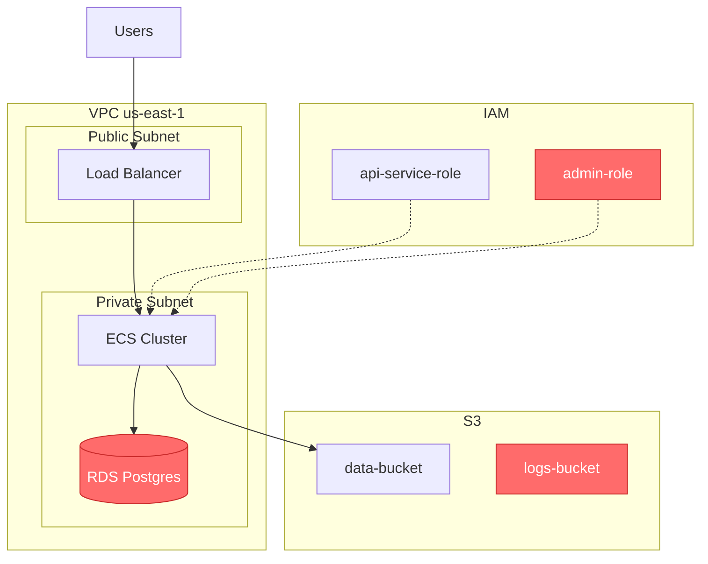
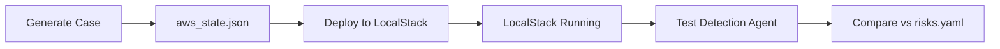

# AWS Risk Case Generator

## Goal

Generate realistic AWS infrastructure state snapshots with embedded technical risks. Each case can be deployed to LocalStack for agent testing.

---

## 15 Risk Categories

| Code | Category | AWS Resources Affected |

|------|----------|------------------------|

| tr1 | IAM Overprivilege | IAM roles, policies with wildcards |

| tr2 | Secrets Exposure | Lambda env vars, SSM params |

| tr3 | Storage Misconfiguration | S3 buckets, EBS snapshots |

| tr4 | Network Exposure | Security groups, public subnets |

| tr5 | Multi-Account Sprawl | Organizations, cross-account roles |

| tr6 | Scaling Limits | ASG configs, EKS node groups |

| tr7 | Single Points of Failure | Single-AZ RDS, no redundancy |

| tr8 | Capacity Gaps | Under-provisioned resources |

| tr9 | Low SLA | No backups, no DR |

| tr10 | Performance Issues | Missing caching, wrong instance types |

| tr11 | K8s Misconfig | EKS RBAC, no network policies |

| tr12 | Container Security | Privileged pods, no limits |

| tr13 | Outdated Stack | Old AMIs, EOL runtimes |

| tr14 | Observability Gaps | No CloudTrail, missing metrics |

| tr15 | Resource Hygiene | Orphaned resources, no tags |

---

## Simple Company Profile

```python
class CompanyProfile(BaseModel):
    name: str
    domain: str           # fintech, healthtech, saas, ecommerce
    size: Literal["small", "medium", "large"]  # 50/150/300+ engineers
    aws_accounts: int     # 3-20
    has_kubernetes: bool
```

**Presets:**

- `small_fintech`: 50 eng, 3 accounts, no k8s
- `medium_saas`: 150 eng, 8 accounts, k8s
- `large_healthtech`: 300 eng, 15 accounts, k8s

---

## Case Structure

```
cases/case_{id}/
├── profile.yaml        # Company context
├── aws_state.json      # Full AWS state snapshot
├── risks.yaml          # Ground truth labels
├── narrative.md        # Why these issues exist
└── diagram.md          # Mermaid architecture diagram
```

### aws_state.json

```json
{
  "iam": {
    "roles": [...],
    "policies": [...],
    "users": [...]
  },
  "s3": {
    "buckets": [...]
  },
  "ec2": {
    "instances": [...],
    "security_groups": [...],
    "vpcs": [...]
  },
  "rds": {
    "instances": [...]
  },
  "lambda": {
    "functions": [...]
  },
  "eks": {
    "clusters": [...],
    "node_groups": [...]
  }
}
```

### risks.yaml

```yaml
- category: tr1
  resource: arn:aws:iam::123:policy/admin-full
  issue: "Action: * on Resource: *"
  severity: critical
  why: "Created during incident, never scoped down"

- category: tr7
  resource: arn:aws:rds:us-east-1:123:db:main
  issue: "multi_az: false"
  severity: high
  why: "Disabled for cost savings"
```

### diagram.md (Mermaid)

Generated diagram shows infrastructure with risks highlighted:

~~~markdown

# Infrastructure Diagram



## Risks Highlighted

| Resource | Risk | Severity |

|----------|------|----------|

| RDS Postgres | Single-AZ (tr7) | HIGH |

| admin-role | Wildcard policy (tr1) | CRITICAL |

| logs-bucket | Public access (tr3) | HIGH |

~~~

---

## Claude Code Generator

```python
from claude_agent_sdk import query, ClaudeAgentOptions

PROMPT = """
Generate a realistic AWS infrastructure state for PE due diligence.

Company: {profile}
Risks to inject: {risks}

Create aws_state.json with realistic AWS resources.
Include the specified risks but make them look organic - 
things that happen in real companies, not obviously broken.

Write these files:
1. aws_state.json - Full AWS state snapshot
2. risks.yaml - Ground truth with why each issue exists
3. narrative.md - Business context explaining how company got here
4. diagram.md - Mermaid flowchart showing infrastructure with risks highlighted in red

For the Mermaid diagram:
- Use flowchart TB (top to bottom)
- Group resources in subgraphs (VPC, IAM, S3, etc.)
- Use classDef risk fill:#ff6b6b for risky resources
- Add a table at the bottom listing all risks
"""

async def generate_case(profile: str, risks: list[str], output: str):
    async for msg in query(
        prompt=PROMPT.format(profile=profile, risks=risks),
        options=ClaudeAgentOptions(
            allowed_tools=["Write"],
            working_directory=output
        )
    ):
        print(msg)
```

---

## Directory Structure

```
blog-posts/agent-tech-risk/
├── pyproject.toml
├── src/risk_generator/
│   ├── models.py         # CompanyProfile, RiskItem
│   ├── categories.py     # 15 categories
│   ├── generator.py      # Claude Code integration
│   └── cli.py
└── cases/                # Generated cases
```

---

## CLI

```bash
# Generate case
python -m risk_generator generate \
    --profile medium_saas \
    --risks tr1,tr7,tr13

# Batch generate
python -m risk_generator batch --count 20
```

---

## Deploy to LocalStack

### docker-compose.yaml

```yaml
services:
  localstack:
    image: localstack/localstack:latest
    ports:
      - "4566:4566"
    environment:
      - SERVICES=iam,s3,ec2,rds,lambda,eks,ssm,secretsmanager
      - DEBUG=1
    volumes:
      - "./localstack-data:/var/lib/localstack"
```

### Deployer Script

```python
# src/risk_generator/deployer.py
import boto3
import json

def get_localstack_client(service: str):
    return boto3.client(
        service,
        endpoint_url="http://localhost:4566",
        region_name="us-east-1",
        aws_access_key_id="test",
        aws_secret_access_key="test"
    )

def deploy_case(case_dir: str):
    with open(f"{case_dir}/aws_state.json") as f:
        state = json.load(f)
    
    # Deploy IAM
    iam = get_localstack_client("iam")
    for role in state.get("iam", {}).get("roles", []):
        iam.create_role(
            RoleName=role["name"],
            AssumeRolePolicyDocument=json.dumps(role["assume_policy"])
        )
    
    # Deploy S3
    s3 = get_localstack_client("s3")
    for bucket in state.get("s3", {}).get("buckets", []):
        s3.create_bucket(Bucket=bucket["name"])
        if bucket.get("public"):
            s3.put_public_access_block(...)  # Configure as per state
    
    # Deploy Security Groups, RDS, Lambda, etc.
    # ... similar pattern for each service
```

### CLI Commands

```bash
# Start LocalStack
docker-compose up -d

# Deploy a case to LocalStack
python -m risk_generator deploy --case cases/case_001

# Deploy and verify
python -m risk_generator deploy --case cases/case_001 --verify

# Reset LocalStack (clean slate)
python -m risk_generator reset
```

### Workflow



---

## Directory Structure (Updated)

```


blog-posts/agent-tech-risk/
├── pyproject.toml
├── docker-compose.yaml      # LocalStack setup
├── src/risk_generator/
│   ├── models.py            # CompanyProfile, RiskItem
│   ├── categories.py        # 15 categories
│   ├── generator.py         # Claude Code integration
│   ├── deployer.py          # Deploy to LocalStack
│   └── cli.py
└── cases/                   # Generated cases
```

---

## Dependencies

```toml
[project]
name = "risk-generator"
dependencies = [
    "pydantic>=2.0",
    "pyyaml>=6.0", 
    "typer>=0.12",
    "rich>=13.0",
    "boto3>=1.35",
]

[project.optional-dependencies]
agent = ["claude-agent-sdk>=0.1"]
dev = ["localstack>=4.0"]
```