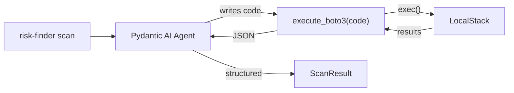

# Risk Finder Agent Implementation

A Python package using **Pydantic AI** where the agent dynamically writes boto3 code to query any AWS service and analyze for technical risks.

## Architecture



## Key Files

| File | Purpose |

|------|---------|

| [`src/risk_finder/models.py`](blog-posts/agent-tech-risk/src/risk_finder/models.py) | `RiskFinding`, `ScanResult` Pydantic models |

| [`src/risk_finder/agent.py`](blog-posts/agent-tech-risk/src/risk_finder/agent.py) | Pydantic AI agent with `execute_boto3` tool |

| [`src/risk_finder/cli.py`](blog-posts/agent-tech-risk/src/risk_finder/cli.py) | Typer CLI: `risk-finder scan` |

## The Core Tool

```python
@risk_agent.tool_plain
def execute_boto3(code: str) -> str:
    """Execute boto3 code against AWS. Assign result to `output` variable.
    
    Example: output = boto3.client('s3').list_buckets()['Buckets']
    """
    import boto3, json, os
    local_vars = {"boto3": boto3, "json": json, "os": os}
    exec(code, {"__builtins__": {"str": str, "list": list, "dict": dict, "len": len}}, local_vars)
    return json.dumps(local_vars.get("output"), default=str)
```

## Agent Definition

```python
from pydantic_ai import Agent
from .models import ScanResult

risk_agent = Agent(
    'anthropic:claude-sonnet-4-20250514',
    output_type=ScanResult,
    system_prompt="""You are an AWS security analyst. Your task is to find technical risks.

Use execute_boto3 to query AWS services. Start with:
1. List S3 buckets and check for public access
2. List IAM roles and check for overprivileged policies  
3. List security groups and check for 0.0.0.0/0 rules
4. List RDS instances and check backup/encryption settings

Analyze results and report all risks found."""
)
```

## Models

```python
class RiskFinding(BaseModel):
    category: str  # e.g., "tr1", "tr3", "tr4"
    severity: Literal["critical", "high", "medium", "low"]
    title: str
    resource_arn: str
    description: str
    recommendation: str

class ScanResult(BaseModel):
    findings: list[RiskFinding]
    resources_scanned: int
    summary: str
```

## CLI

```bash
# Set AWS env vars for LocalStack
export AWS_ENDPOINT_URL=http://localhost:4566
export AWS_ACCESS_KEY_ID=test
export AWS_SECRET_ACCESS_KEY=test
export AWS_DEFAULT_REGION=us-east-1
export ANTHROPIC_API_KEY=sk-...

# Run scan
uv run risk-finder scan
```

## Updates to pyproject.toml

- Add `pydantic-ai[anthropic]>=0.2` dependency
- Add `src/risk_finder` to hatch packages
- Add script entry: `risk-finder = "risk_finder.cli:main"`