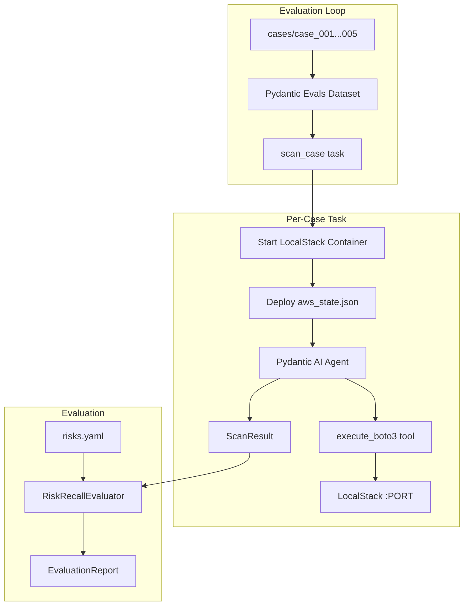

# Risk Finder Agent with Evaluation System

## Architecture



## Project Structure

```
src/risk_finder/
  __init__.py
  models.py       # RiskFinding, ScanResult
  agent.py        # Pydantic AI agent with execute_boto3 tool
  cli.py          # risk-finder scan / risk-finder eval
  eval/
    __init__.py
    runner.py     # Docker container management, case deployment
    evaluators.py # RiskRecallEvaluator, RiskPrecisionEvaluator
    dataset.py    # Build Pydantic Evals Dataset from cases/
```

## Key Components

### 1. Models ([`models.py`](blog-posts/agent-tech-risk/src/risk_finder/models.py))

```python
class RiskFinding(BaseModel):
    category: str           # tr1, tr3, tr4, etc.
    resource_arn: str       # arn:aws:...
    severity: Literal["critical", "high", "medium", "low"]
    title: str
    description: str

class ScanResult(BaseModel):
    findings: list[RiskFinding]
    resources_scanned: int
```

### 2. Agent ([`agent.py`](blog-posts/agent-tech-risk/src/risk_finder/agent.py))

```python
from pydantic_ai import Agent

risk_agent = Agent(
    'anthropic:claude-sonnet-4-20250514',
    output_type=ScanResult,
    system_prompt="You are an AWS security analyst..."
)

@risk_agent.tool_plain
def execute_boto3(code: str) -> str:
    """Execute boto3 code. Assign result to `output`."""
    # Uses AWS_ENDPOINT_URL env var for LocalStack
    ...
```

### 3. Evaluation Runner ([`eval/runner.py`](blog-posts/agent-tech-risk/src/risk_finder/eval/runner.py))

Key function that runs per-case with isolated Docker:

```python
import docker

def run_case_in_container(case_path: Path) -> ScanResult:
    client = docker.from_env()
    
    # 1. Start isolated LocalStack container
    container = client.containers.run(
        "localstack/localstack",
        detach=True,
        ports={"4566/tcp": None},  # Random port
        environment={"SERVICES": "s3,iam,ec2,rds,lambda"}
    )
    
    try:
        port = container.ports["4566/tcp"][0]["HostPort"]
        
        # 2. Deploy aws_state.json to this container
        deploy_case(case_path, endpoint=f"http://localhost:{port}")
        
        # 3. Run agent with this endpoint
        os.environ["AWS_ENDPOINT_URL"] = f"http://localhost:{port}"
        result = risk_agent.run_sync("Scan this AWS environment for technical risks")
        return result.output
    finally:
        container.stop()
        container.remove()
```

### 4. Evaluators ([`eval/evaluators.py`](blog-posts/agent-tech-risk/src/risk_finder/eval/evaluators.py))

Using Pydantic Evals pattern:

```python
from dataclasses import dataclass
from pydantic_evals.evaluators import Evaluator, EvaluatorContext

@dataclass
class RiskRecallEvaluator(Evaluator):
    """Check if agent found expected risks (by category + resource)."""
    
    def evaluate(self, ctx: EvaluatorContext) -> float:
        expected = ctx.expected_output  # List[RiskFinding] from risks.yaml
        found = ctx.output              # ScanResult from agent
        
        matched = 0
        for exp in expected:
            for f in found.findings:
                if exp.category == f.category and exp.resource_arn in f.resource_arn:
                    matched += 1
                    break
        
        return matched / len(expected) if expected else 1.0

@dataclass  
class SeverityAccuracyEvaluator(Evaluator):
    """Check if severity matches for found risks."""
    ...
```

### 5. Dataset Builder ([`eval/dataset.py`](blog-posts/agent-tech-risk/src/risk_finder/eval/dataset.py))

```python
from pydantic_evals import Case, Dataset

def build_dataset(cases_dir: Path) -> Dataset:
    cases = []
    for case_path in cases_dir.iterdir():
        if not case_path.is_dir():
            continue
        
        # Load expected risks from risks.yaml
        expected = load_risks_yaml(case_path / "risks.yaml")
        
        cases.append(Case(
            name=case_path.name,
            inputs={"case_path": str(case_path)},
            expected_output=expected,
        ))
    
    return Dataset(
        name="risk_finder_eval",
        cases=cases,
        evaluators=[RiskRecallEvaluator(), SeverityAccuracyEvaluator()],
    )
```

### 6. CLI ([`cli.py`](blog-posts/agent-tech-risk/src/risk_finder/cli.py))

```bash
# Single scan (uses AWS_ENDPOINT_URL env var)
risk-finder scan

# Run evaluation against all cases
risk-finder eval --cases ./cases

# Run single case evaluation
risk-finder eval --cases ./cases/case_001
```

## Evaluation Flow

```
1. Load cases/ directory
2. For each case:
   a. Start LocalStack container (isolated, random port)
   b. Deploy aws_state.json
   c. Run risk_agent.run_sync()
   d. Compare output vs risks.yaml
   e. Stop container
3. Print EvaluationReport with recall/precision metrics
```

## Dependencies Update

```toml
[project]
dependencies = [
    "pydantic>=2.0",
    "pydantic-ai[anthropic]>=0.2",
    "pydantic-evals>=0.2",
    "boto3>=1.35",
    "docker>=7.0",  # For container management
    "typer>=0.12",
    "rich>=13.0",
    "pyyaml>=6.0",
]
```

## Output Example

```
   Evaluation Summary: risk_finder
┏━━━━━━━━━━━━┳━━━━━━━━━━┳━━━━━━━━━━━━┳━━━━━━━━━━┓
┃ Case       ┃ Recall   ┃ Precision  ┃ Duration ┃
┡━━━━━━━━━━━━╇━━━━━━━━━━╇━━━━━━━━━━━━╇━━━━━━━━━━┩
│ case_001   │ 85.7%    │ 75.0%      │    45s   │
│ case_002   │ 91.6%    │ 80.0%      │    52s   │
│ case_003   │ 78.5%    │ 70.0%      │    38s   │
│ case_004   │ 100%     │ 85.0%      │    41s   │
│ case_005   │ 66.6%    │ 60.0%      │    35s   │
├────────────┼──────────┼────────────┼──────────┤
│ Average    │ 84.5%    │ 74.0%      │    42s   │
└────────────┴──────────┴────────────┴──────────┘
```