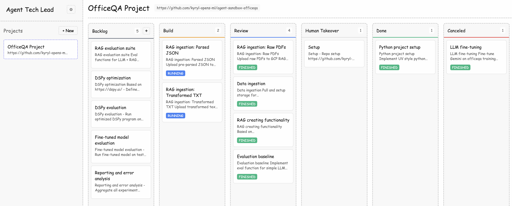
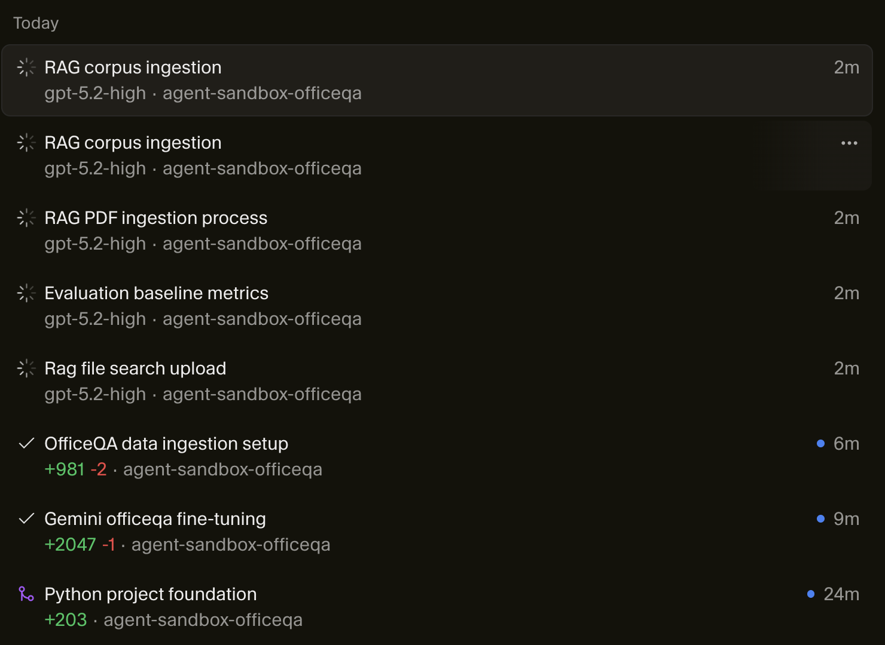
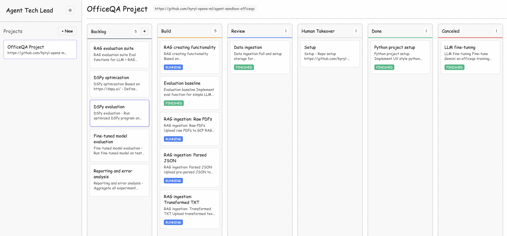
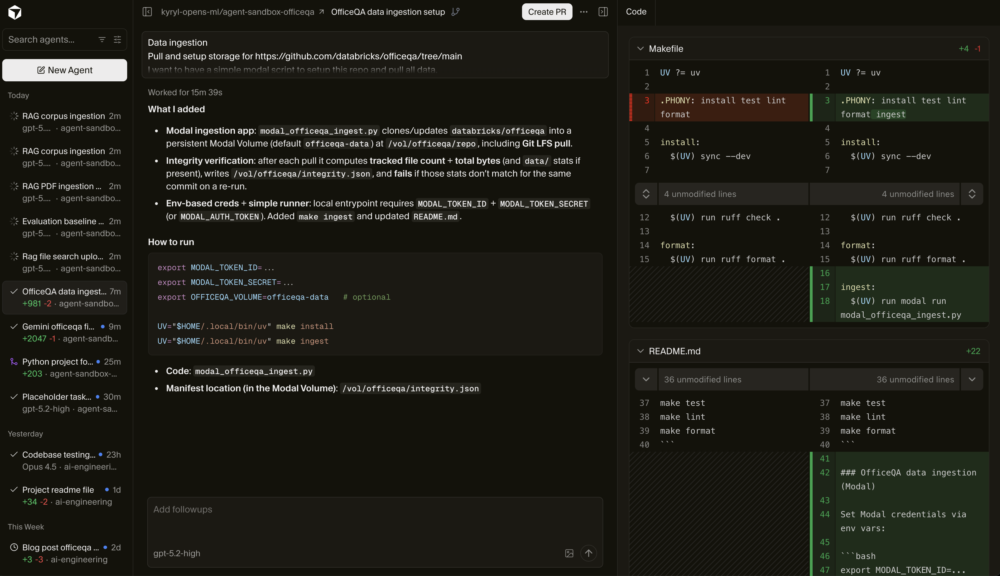
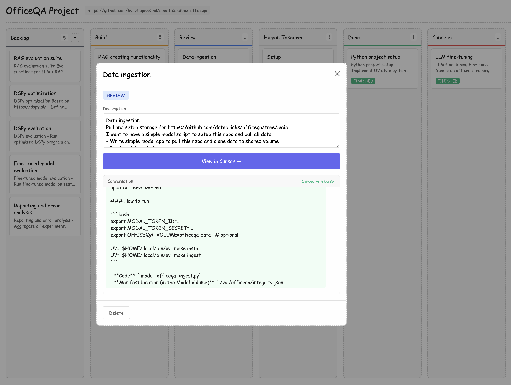
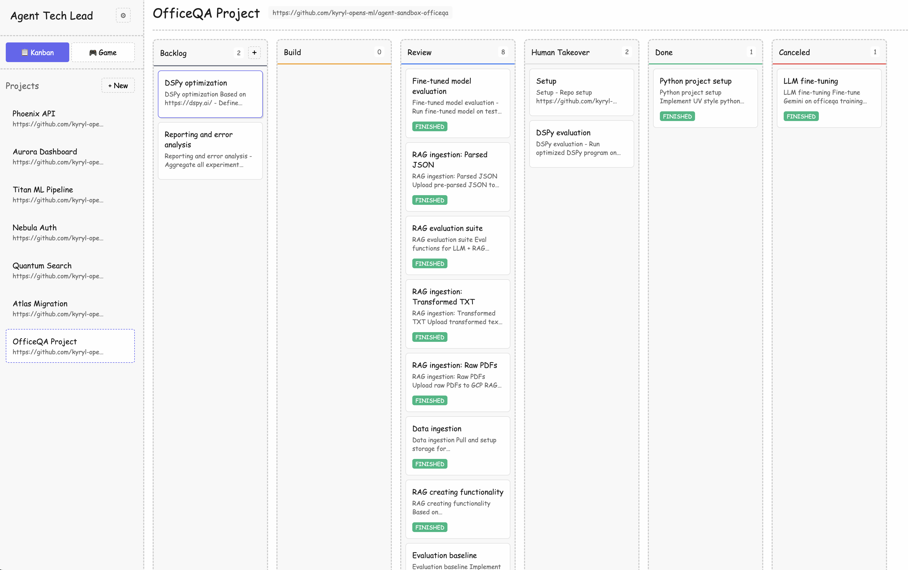

# Becoming an Agent Tech Lead!

## Motivation: 

I was a tech lead for a long time, and also built a roadmap for becoming one in https://kyrylai.com/2024/08/21/data-scientist-to-ml-tech-lead/. It's generally a good position - you can do more, deliver more, and own more. If you play your cards well, compensation comes with this automatically.

There are also many other amazing resources and books:

https://github.com/kuchin/awesome-cto
https://github.com/kdeldycke/awesome-engineering-team-management

The previous consensus was that you can grow to senior and stay at that level for a while in your career. Well - this is not true anymore. 

Now the default expectation is that you must become a tech lead, but maybe not for people - for AI agents for sure. Luckily, when we are talking about technical leadership, there is a lot of commonality, so if you're getting better at one, it makes you better at another!

## Tech Lead Job

At core you need to keep shit together! Whatever this means, for me it's usually:

- understand my team's strengths and weaknesses 
- have tech roadmap for short, mid and long term 
- architecture and tradeoff definitions
- establish eng culture: testing, style, planning 
- predictable delivery of sizable progress
- task slicing, defining expected outcome and assigning people

Many many more but simplified is: 

roadmap/tech plan -> list of tasks -> sequence of execution -> steering teammates -> verification.

While keeping same level of tech culture and unblocking people where possible. 
Some tasks as tech lead you are going to do yourself, maybe most boring and unpleasant. 

## Meet your new subordinates!

Do you see where I am coming from? This is basically everyone's responsibility now. But instead of people you are going to use coding agents. And don't do tasks yourself but spend most time on verification and steering coding agents. 

Your new team is very good! It's a combination of LLM + Agent & Configuration on top of it. 
I used Cursor Cloud API [https://cursor.com/docs/cloud-agent/api/endpoints] for this blog post with the option to select from 5 LLMs. 

- claude-4.5-opus-high-thinking
- gpt-5.2
- gpt-5.2-high
- gemini-3-pro
- gemini-3-flash

As of now, publicly you can build this on top of Cursor Cloud API [https://cursor.com/docs/cloud-agent/api/endpoints] or Jules API [https://developers.google.com/jules/api]. 

I chose Cursor Cloud API because (a) I'm a heavy Cursor user (b) Cursor handles GitHub integration for me already. But there are many more options and they all at some point in time are going to have cloud API - OpenAI Codex, Claude Code, RooCode [https://roocode.com/] etc.

## Agent Tech Lead Job!

The technical side of your new job is very similar to the usual tech lead job - you just need to spend more time setting the right engineering course, since your subordinates never sleep, never get tired, and sometimes fail incredibly! 

I wrote a simple desktop app to show how the future job would look like: 

We have the following columns: 

- Backlog - column to add big features / sizable chunk of work - think about it as something that would take you personally days 
- Design** - column I wish I would have, but I don't - I have built this on top of Cursor Cloud API and it does not have plan mode in cloud agent, but eventually will come there. 
- Build - column where Cursor actually starts a coding agent and implements it, this pulls conversation from actual Cursor's cloud agent - and is in sync with it. 

<table>
  <tr>
    <td></td>
    <td></td>
  </tr>
</table>

- Review - column where I review outcome manually - aka wait for human input and verification. Main point - make this fast and straightforward with end-to-end and integration tests.

<table>
  <tr>
    <td></td>
    <td></td>
  </tr>
</table>

- Done - I successfully integrated agent work into project - good example 
- Canceled - I gave up on this agent - bad example 

Critical to have Done & Canceled to have feedback loops for your coding agents.

- Human Takeover - something human must take over or required access granted. 

Each task is a separate agent and you can run hundreds of them in parallel.
And now your job is to: 

1. plan their work & global architecture 
2. handle corner cases & hard cases
3. make sure system is optimized for multiple agents: access, verification, sequence. 

For a practical example - you can try to import my "integration test" for this blog post - project to solve OfficeQA challenge: https://github.com/kyryl-opens-ml/ai-engineering/blob/main/blog-posts/agent-tech-lead/scripts/sample-tasks.txt

## Future of the Job 

Long story short - each engineer who wants to keep their job has to become an agent tech lead. 
Code for the agent tech lead desktop app is here: https://github.com/kyryl-opens-ml/ai-engineering/tree/main/blog-posts/agent-tech-lead

Feel free to modify and change it for your own needs and your own unique workflows.

Also, the job description for this role: https://github.com/kyryl-opens-ml/ai-engineering/blob/main/blog-posts/agent-tech-lead/JobDescription.md - feel free to reuse it! 

And now the main punch: software engineering will become a strategy game! If you've ever played WARHAMMER 40,000, StarCraft, Warcraft, or Rome Total War: your company becomes your map, your coding agents become units, and your job is to place them, unblock them, and intervene at a local scale when someone gets stuck! 

From Kanban, you are going to move to this! 

This is such an exciting future! 
