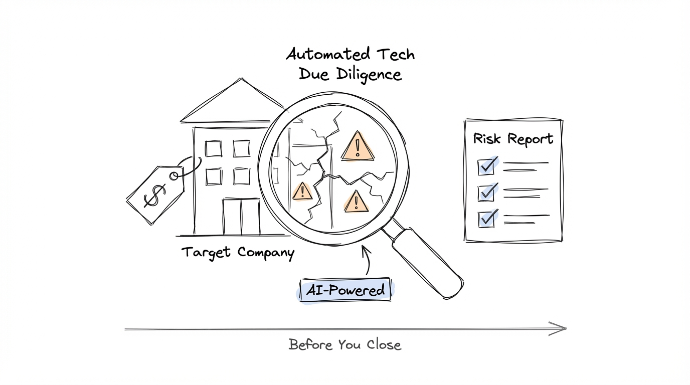

### Managing Technology Risk for Asset Managers

## Story: 



### Non-Tech Part!

You buy a new company! Exciting! Numbers are good, growth is strong, but it dies and your asset is close to 0. Turns out tech risks were miscalculated. How would you catch this earlier?

Hire a full engineering team? Some PE/VC firms already do this: [Georgian](https://www.georgian.io/), [HG Capital](https://www.hgcapital.com/), [Insight Partners](https://www.insightpartners.com/), [Vista Equity](https://www.vistaequitypartners.com/), [SignalFire](https://www.signalfire.com/), [Primary VC](https://www.primary.vc/), [Summit Partners](https://www.summitpartners.com/)

Hire an agency? Contract a specialized tech DD firm: [Crosslake](https://crosslaketech.com/), [Code & Co.](https://www.codeandco.com/), [West Monroe](https://www.westmonroe.com/industries/private-equity), [Quandary Peak](https://quandarypeak.com/software-technical-due-diligence/), [Palladium Digital](https://palladiumdigital.co.uk/), [ISG](https://isg-one.com/industries/private-equity-and-m-a)

Ask a friendly CTO to take a look? Use expert networks: [AlphaSights](https://www.alphasights.com/), [GLG](https://www.glg.it/), [Guidepoint](https://www.guidepoint.com/), [Third Bridge](https://www.thirdbridge.com/), [Tegus](https://www.tegus.com/), [Toptal](https://www.toptal.com/)

In many cases, you could automatically detect it with the full power of agents! If you are a private investor, as you review the data room to build your case, you should also review the "technical" data room before the transaction!

Two main points today:

- If you are a private asset manager and want to do this, reach out to me!
- If you are an engineer at a VC/PE firm, read further on how to build this!


### Tech Part & Dimensions

First, how to start? So many dimensions to slice tech risk:

- code level - ask a coding agent to review the full codebase? [Greptile](https://www.greptile.com/), [CodeRabbit](https://www.coderabbit.ai/), [CodeScene](https://codescene.com/), [SonarQube](https://www.sonarsource.com/products/sonarqube/), [Kodus AI](https://github.com/kodustech/kodus-ai)
- security - ask a specialized agent to find all security risks. [CodeMender](https://deepmind.google/blog/introducing-codemender-an-ai-agent-for-code-security/), [Aardvark](https://openai.com/index/introducing-aardvark/), [Strix](https://github.com/usestrix/strix), [Snyk](https://snyk.io/), [Qwiet AI](https://qwiet.ai/)
- documentation - ask for documentation and wiki quality. [Vale](https://vale.sh), [Swimm](https://swimm.io), [Doctave](https://www.doctave.com), [Mintlify](https://www.mintlify.com)
- hyperscalers (aws/gcp/etc) - take a look at infrastructure state. [Prowler](https://github.com/prowler-cloud/prowler), [Wiz](https://www.wiz.io), [ScoutSuite](https://github.com/nccgroup/ScoutSuite), [Steampipe](https://steampipe.io)
- observability dashboards (datadog, grafana, etc). [Nobl9](https://www.nobl9.com/), [Open Policy Agent](https://www.openpolicyagent.org/), [Checkov](https://www.checkov.io/)

The complete answer is to do all of those, but we have to get started somewhere and what I found in practice - there is no better place to start than the actual state of infrastructure! Docs and code are stale, presentations are out of date, but actual infrastructure never lies!
So after slicing and dicing, the most valuable and trusted dimension is AWS account state! Let's target this for a practical example!

### Evaluation

Anyone can build an agent, but the value is in how good your agent is. The answer is evaluation. Where do we stand? 
To do this, we are going to generate a dataset with LocalStack: https://github.com/localstack/localstack

Note: What is LocalStack? It's a cloud service emulator that runs locally and allows you to test AWS accounts without needing a real AWS account, perfect if you want to test costly cloud architecture without spending actual money on those resources.


Each case is generated by Claude Code CDK https://github.com/anthropics/claude-agent-sdk-python (yes, you can build apps on top of the agent SDK - crazy times).
Claude produces:

- profile - company high-level description
- aws state - actual AWS state of resources
- diagram - visualization of infra architecture
- narrative - how the company got into this state
- risks - actual structural technical risks


After human review and filtering, you get a dataset to benchmark against! On a side note - make sure to keep track of those in your portfolio and friendly companies to benchmark against! **This is a competitive edge nobody else has!**

So to repeat, the full cycle looks like this:

1. load case
2. run Docker with active LocalStack
3. load case there in AWS
4. ask agent to review AWS infra
5. compare with ground truth


To generate new cases use: 

```
uv add risk-generator
uv run risk-generator create
```

In this post, for illustrative purposes, we generate 10 cases and upload them to HF as a public dataset: https://huggingface.co/datasets/koml/agent-tech-risk-cases
 
But what about the Agent? Glad you asked!

### Agent:

Is it just a for loop? Yes, same as a database is just a file! Jokes aside, for building this agent I am using the

Pydantic AI framework! https://ai.pydantic.dev/

Why? First: The philosophy of FastAPI and Pydantic Validation is so well adopted in Python, I love the same simplicity in my agent development. Second: https://ai.pydantic.dev/evals/#data-flow - Pydantic Evals is the most straightforward way to test your agent!

Full agent code: 

```python
"""Risk discovery agent using Pydantic AI."""

import json
import os
from dataclasses import dataclass

import boto3
from dotenv import load_dotenv
from pydantic_ai import Agent, RunContext

from risk_discovery.models import ScanResult

load_dotenv()


SYSTEM_PROMPT = """\
You are an AWS security analyst performing technical due diligence for a PE acquisition.
Scan the AWS environment thoroughly and identify ALL technical risks.

Use the execute_boto3 tool to query AWS services. Write Python code that:
1. Calls get_client(service_name) to get a boto3 client
2. Assigns the final result to a variable called `output`

Scan ALL of these services systematically:

1. IAM - list_policies(Scope='Local'), list_roles(), list_users(). For each policy,
   get_policy_version to read the document. Check for:
   - Wildcard (*) in Action or Resource
   - Cross-account trust with Principal: * or AWS: *
   - Overprivileged policies attached to roles/users

2. S3 - list_buckets(). For each bucket check:
   - get_public_access_block (disabled = risk)
   - get_bucket_versioning (not Enabled = risk)
   - No encryption configured

3. EC2 - describe_security_groups(). Check for:
   - Ingress from 0.0.0.0/0 on sensitive ports (22, 3306, 5432, 6379, 27017)
   - All ports open (FromPort=0, ToPort=65535)
   - Overly permissive rules

4. Lambda - list_functions(). For each function check:
   - Outdated runtimes (python3.8, python3.7, nodejs14.x, nodejs12.x)
   - Secrets/credentials in environment variables (look for PASSWORD, KEY, SECRET, TOKEN)
   - Under-provisioned memory (128MB)

5. DynamoDB - list_tables(), describe_table(). Check for:
   - No SSE encryption (SSEDescription missing or not enabled)
   - No point-in-time recovery (describe_continuous_backups)

6. SecretsManager - list_secrets(). Check for:
   - No rotation configured (RotationEnabled=false)

7. SQS - list_queues(), get_queue_attributes(). Check for:
   - No encryption
   - No dead letter queue (RedrivePolicy missing)

Risk categories:
- tr1: IAM Overprivilege (wildcards, cross-account trust, admin policies)
- tr2: Secrets Exposure (plaintext credentials in env vars, no rotation)
- tr3: Storage Misconfiguration (public buckets, no encryption, no versioning)
- tr4: Network Exposure (open security groups, 0.0.0.0/0 ingress)
- tr5: Multi-Account Sprawl (cross-account trust issues)
- tr8: Capacity Gaps (under-provisioned Lambda, wrong instance types)
- tr9: Low SLA (no backups, no DR, no PITR)
- tr13: Outdated Stack (EOL runtimes)
- tr14: Observability Gaps (no alarms, no logging)
- tr15: Resource Hygiene (orphaned resources, missing tags)

Be thorough. Scan every service. Report every issue as a separate finding.
Use the exact resource name (policy name, bucket name, sg name, function name) in each finding."""


@dataclass
class Deps:
    endpoint_url: str


agent = Agent(
    "bedrock:us.anthropic.claude-sonnet-4-5-20250929-v1:0",
    deps_type=Deps,
    output_type=ScanResult,
    system_prompt=SYSTEM_PROMPT,
)


@agent.tool
def execute_boto3(ctx: RunContext[Deps], code: str) -> str:
    """Execute boto3 code against AWS. Use get_client(service) to get a client.
    Assign result to `output`.

    Example: output = get_client('s3').list_buckets()['Buckets']
    """

    def get_client(service: str):
        return boto3.client(
            service,
            endpoint_url=ctx.deps.endpoint_url,
            region_name="us-east-1",
            aws_access_key_id="test",
            aws_secret_access_key="test",
        )

    local_vars = {"get_client": get_client, "json": json}
    safe_builtins = {
        "str": str,
        "list": list,
        "dict": dict,
        "len": len,
        "int": int,
        "bool": bool,
        "True": True,
        "False": False,
        "None": None,
        "print": print,
        "range": range,
        "enumerate": enumerate,
        "sorted": sorted,
        "isinstance": isinstance,
        "set": set,
        "tuple": tuple,
        "zip": zip,
        "map": map,
        "filter": filter,
        "any": any,
        "all": all,
        "min": min,
        "max": max,
        "sum": sum,
        "type": type,
        "hasattr": hasattr,
        "getattr": getattr,
    }

    try:
        exec(code, {"__builtins__": safe_builtins}, local_vars)
        output = local_vars.get("output")
        return json.dumps(output, default=str, indent=2)
    except Exception as e:
        return f"Error: {type(e).__name__}: {e}"


def discover_risks(model: str, endpoint_url: str) -> ScanResult:
    """Run the agent to discover risks at the given endpoint."""
    result = agent.run_sync(
        "Scan this AWS environment for all technical risks. Be thorough - check every service.",
        model=model,
        deps=Deps(endpoint_url=endpoint_url),
    )
    return result.output

```

with just one tool - execute boto3 code against your instance of LocalStack. Whatever can be done with boto3 - and that's pretty much everything - this agent should be capable of doing!


Is it the best way? Well - this is why we have evaluation to find out! Let's run this agent with several LLMs against our benchmarks!


| Model | Precision | Recall | F1 | Errors | Avg Time |
|-------|-----------|--------|------|--------|----------|
| opus-4-5 | 27.7% | 95.2% | 42.5% | 0 | 78s |
| haiku-4-5 | 25.9% | 82.5% | 39.0% | 1 | 109s |
| opus-4-6 | 21.2% | 94.7% | 34.5% | 0 | 112s |
| sonnet-4-5 | 16.2% | 56.1% | 24.9% | 4 | 297s |

```bash
uv add risk-discovery
uv run risk-discovery infer http://localhost:4566                   # scan single endpoint
uv run risk-discovery eval                                          # all 4 models
uv run risk-discovery eval -m opus-4-5                              # single model
uv run python scripts/run_eval.py --output results.json             # reproducible script
```


### Outcome:

Technical risks are as important as go-to-market—make sure to track and find them before they find you!

If you are an engineer, the dataset and code are open source.
If you are a private asset owner, feel free to contact me to get help and set this up for your specific context!

Cheers!


## Development:

#### Quick Start: Generate, Deploy, Scan

```bash
# 1. Generate a new case
uv run risk-generator create

# 2. Deploy to LocalStack (keeps container running)
uv run risk-generator deploy cases/case_XXXX --keep
# → Endpoint: http://localhost:PORT

# 3. Run agent inference against it
uv run risk-discovery infer http://localhost:PORT

# 4. Cleanup
docker rm -f localstack-risk-PORT
```

#### Commands

```bash
# Generator
uv run risk-generator create                             # Generate single case
uv run risk-generator batch --count 10                   # Generate 10 cases
uv run risk-generator batch --count 10 -v                # Generate + validate on LocalStack
uv run risk-generator deploy cases/case_payflow --keep   # Deploy single case
uv run risk-generator export-hf cases/                   # Export to HuggingFace JSONL
uv run risk-generator config                             # Show profiles, categories, backend

# Discovery
uv run risk-discovery infer http://localhost:4566         # Scan single endpoint
uv run risk-discovery eval                                # Eval all 4 models
uv run risk-discovery eval -m opus-4-5                    # Eval single model
uv run python scripts/run_eval.py --output results.json   # Reproducible eval script
```

#### Generated Cases

| Case | Company | Domain | Size | Risks | Categories | Severity |
|------|---------|--------|------|-------|------------|----------|
| payflow | PayFlow | fintech | small | 7 | tr1, tr4 | 3C, 3H, 1M |
| cloudsync | CloudSync | SaaS | medium | 12 | tr1, tr3, tr14 | 3C, 6H, 3M |
| meddata | MedData | healthtech | large | 14 | tr1, tr2, tr4 | 3C, 7H, 4M |
| shipfast | ShipFast | ecommerce | small | 8 | tr3, tr4, tr15 | 2C, 3H, 2M, 1L |
| devpipe | DevPipe | devtools | small | 8 | tr1, tr2, tr13 | 3C, 3H, 2M |
| insurenet | InsureNet | fintech | medium | 11 | tr1, tr4, tr5 | 2C, 6H, 3M |
| datavault | DataVault | SaaS | medium | 11 | tr2, tr3, tr9 | 2C, 6H, 3M |
| quickcart | QuickCart | ecommerce | large | 15 | tr1, tr4, tr8, tr15 | 2C, 6H, 5M, 2L |
| healthbridge | HealthBridge | healthtech | medium | 12 | tr1, tr2, tr3 | 3C, 6H, 3M |
| codeforge | CodeForge | devtools | large | 15 | tr1, tr13, tr15 | 3C, 4H, 6M, 2L |

113 risks across 10 cases. All LocalStack free tier (iam, s3, ec2, lambda, dynamodb, secretsmanager, sqs). 100% risk-resource correlation.