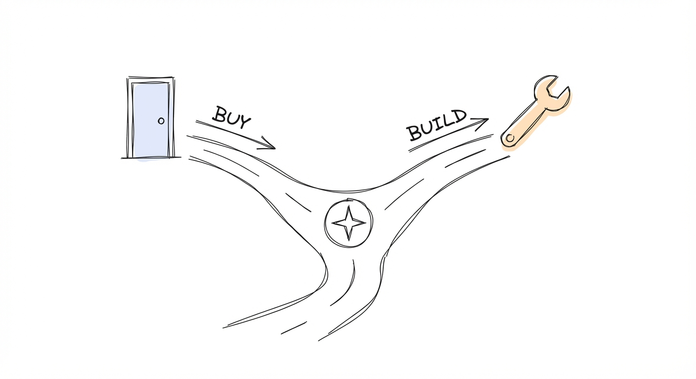
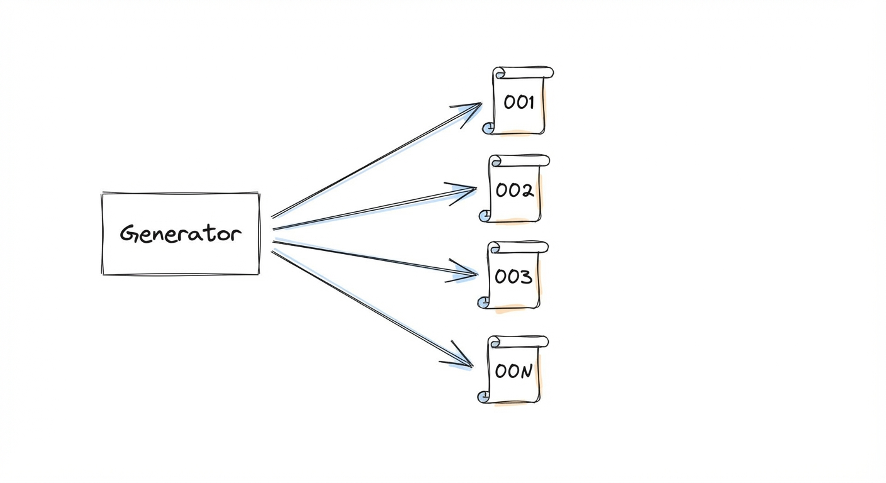
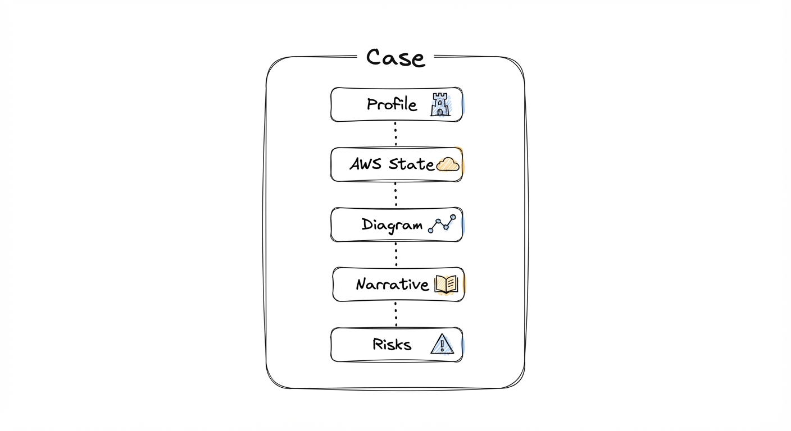
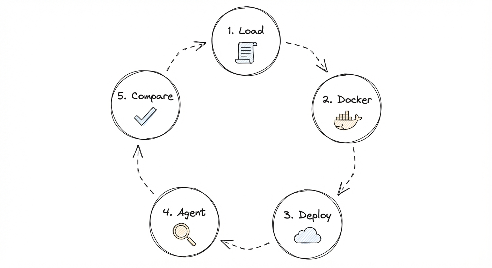
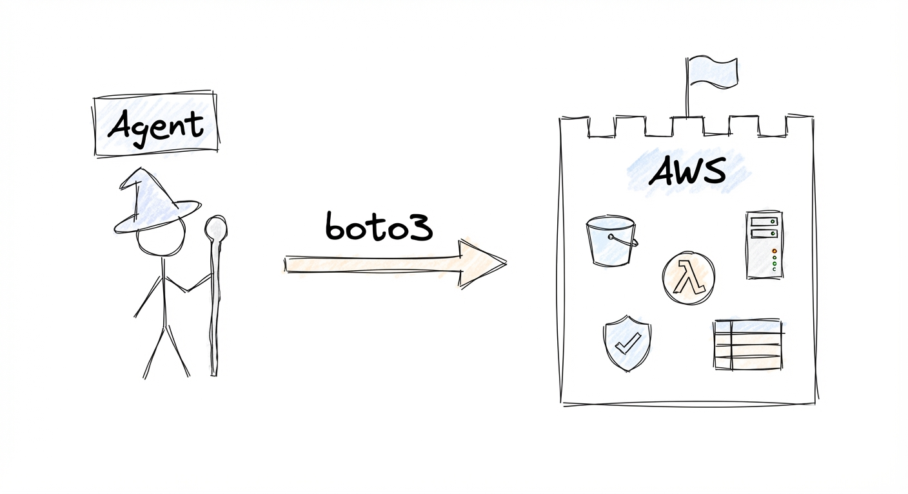

### Managing Technology Risk for Asset Managers

### Non-Tech Part!

You buy a new company! Exciting! Numbers are good, growth is strong, but it dies and your asset is close to 0. Turns out tech risks were miscalculated. How would you catch this earlier? Hiring a full engineering team [example]? Hire an agency [example]? Ask a friendly CTO to take a look [example]?

In many cases - you could automatically detect it with the full power of agents! If you are a private investor - as you review the data room to build your case, the same way you should review the "technical" data room before the transaction!

2 main points today:

- If you are a private asset manager and want to do this - reach out to me!
- If you are an engineer at a VC/PE firm - read further on how to build this!



### Tech Part & Dimensions

First, how to start? So many dimensions to slice tech risk:

- code level
- security (https://deepmind.google/blog/introducing-codemender-an-ai-agent-for-code-security/)
- hyperscalers (aws/gcp/etc)
- documentation

We have to get started somewhere and what I found in practice - there is no better place to start than the actual state of infrastructure! Docs and code are stale, presentations are out of date, but actual infrastructure never lies!

So after slicing and dicing - the most valuable and trusted dimension is AWS account state! Let's target this for a practical example!

### Evaluation


Anyone can build an agent, the value is - how good is your agent? Answer - evaluation. Aka where are we standing? 
To do this we are going to generate a dataset with localstack: https://github.com/localstack/localstack


case generator ->

-- case 001
-- case 002
-- case 003
....
-- case 00n



Each case is generated by Claude code CDK (yes you can build apps on top of agent SDK - crazy times).
Claude produces:

- profile - company high level description
- aws state - actual AWS state of resources
- diagram - visualization of infra architecture
- narrative - how does the company get into this state
- risks - actual structural technical risks



https://github.com/anthropics/claude-agent-sdk-demos
https://github.com/anthropics/claude-agent-sdk-python
https://github.com/affaan-m/everything-claude-code
https://platform.claude.com/docs/en/agent-sdk/overview#agent-sdk-vs-claude-code-cli
https://www.anthropic.com/engineering/building-agents-with-the-claude-agent-sdk
https://github.com/anthropics/claude-agent-sdk-python

After human review and filtering you get a dataset to benchmark against! On the side note - make sure to keep track of those in your portfolio and friendly companies to benchmark against! **This is a competitive edge nobody else has!**

So to repease the full cycle looks like this:

1. load case
2. run docker with active localstack
3. load case there in AWS
4. ask agent to review AWS infra
5. compare with ground truth



To generate new cases use: 

```
uv add risk-generator
uv run risk-generator creat
```

But what about the Agent? Glad you asked!

### Agent:

Is it just a for loop? Yes, same as a database is just a file! Joke aside, for building this agent I am using

Pydantic AI framework! https://ai.pydantic.dev/

Why? First: Philosophy of FastAPI and Pydantic Validation are so well adopted in Python, I love the same simplicity in my agent development. Second: https://ai.pydantic.dev/evals/#data-flow - Pydantic Evals is the most straightforward way to test your agent!

Full agent code: 

<from agent.py>

with just one tool - execute boto3 code against your instance of localstack. Whatever can be done from boto3 with probably pretty much everything - this agent should be capable of doing!



Is it the best way? Well - this is why we have evaluation to find out! Let's run this agent with several LLMs against our benchmarks!


<Table>

```
uv add risk_discovery
uv run risk_discovery -m "gateway/openai:gpt-5-mini-2025-08-07" -aws ""
```


### Outcome:

Technical risks are as important as go-to-market, make sure to track and find them before they find you!

If you are an engineer - dataset and code are open source
If you are a private asset owner - feel free to contact me to get help and set this up for your specific context!

Cheers!

_____________

Structure:
- Hook: Real-world failure story.
- Non-Tech: Problem + Solutions (including your service).
- Tech: Dimensions → AWS Focus → Dataset Gen → Agent Build → Eval Cycle → Results.
- CTA: Open-source links + Contact page.


### List of small posts:


- Agent to find risks
- Localstack
- ClaudCDK

---

### Dev

#### Commands

```bash
uv run risk-generator batch --count 10            # Generate 10 cases
uv run risk-generator batch --count 10 -v         # Generate + validate on LocalStack
uv run risk-generator deploy cases/case_payflow --keep  # Deploy single case
uv run risk-generator export-hf cases/            # Export to HuggingFace JSONL
uv run risk-generator config                      # Show profiles, categories, backend
```

#### Generated Cases

| Case | Company | Domain | Size | Risks | Categories | Severity |
|------|---------|--------|------|-------|------------|----------|
| payflow | PayFlow | fintech | small | 7 | tr1, tr4 | 3C, 3H, 1M |
| cloudsync | CloudSync | SaaS | medium | 12 | tr1, tr3, tr14 | 3C, 6H, 3M |
| meddata | MedData | healthtech | large | 14 | tr1, tr2, tr4 | 3C, 7H, 4M |
| shipfast | ShipFast | ecommerce | small | 8 | tr3, tr4, tr15 | 2C, 3H, 2M, 1L |
| devpipe | DevPipe | devtools | small | 8 | tr1, tr2, tr13 | 3C, 3H, 2M |
| insurenet | InsureNet | fintech | medium | 11 | tr1, tr4, tr5 | 2C, 6H, 3M |
| datavault | DataVault | SaaS | medium | 11 | tr2, tr3, tr9 | 2C, 6H, 3M |
| quickcart | QuickCart | ecommerce | large | 15 | tr1, tr4, tr8, tr15 | 2C, 6H, 5M, 2L |
| healthbridge | HealthBridge | healthtech | medium | 12 | tr1, tr2, tr3 | 3C, 6H, 3M |
| codeforge | CodeForge | devtools | large | 15 | tr1, tr13, tr15 | 3C, 4H, 6M, 2L |

113 risks across 10 cases. All LocalStack free tier (iam, s3, ec2, lambda, dynamodb, secretsmanager, sqs). 100% risk-resource correlation.