# PayFlow AWS Infrastructure Architecture

## Infrastructure Diagram

```mermaid
flowchart TB
    subgraph Internet
        Users[End Users]
        PaymentGW[Payment Gateway APIs<br/>Stripe, etc]
    end

    subgraph "AWS Account: Production (123456789012)"
        subgraph "IAM"
            DevOpsRole[DevOpsFullAccess Policy]:::risk
            DataSciRole[DataSciencePolicy]:::risk
            PaymentRole[PaymentProcessorRole]
            DeployBot[deploy-bot User]
            CTOUser[john.smith - AdministratorAccess]
        end

        subgraph "VPC: payflow-production-vpc (10.0.0.0/16)"
            subgraph "AZ: us-east-1a"
                PublicSubnet1a[Public Subnet 10.0.2.0/24]
                PrivateSubnet1a[Private Subnet 10.0.1.0/24]

                NATGateway[NAT Gateway]:::risk
                Bastion[Bastion Host<br/>t3.medium]

                API1[API Server 01<br/>t3.large<br/>DevOpsFullAccess Role]:::risk
                MLWorkstation[ML Workstation<br/>t3.xlarge<br/>DataScienceRole]:::risk

                ProdDB[payflow-prod-db<br/>PostgreSQL 15.4<br/>db.t3.large<br/>Single-AZ]:::risk
                AnalyticsDB[payflow-analytics-db<br/>PostgreSQL 15.4<br/>db.t3.medium<br/>Single-AZ<br/>3-day backup]:::risk
            end

            subgraph "AZ: us-east-1b"
                PublicSubnet1b[Public Subnet 10.0.4.0/24]
                PrivateSubnet1b[Private Subnet 10.0.3.0/24]

                API2[API Server 02<br/>t3.large<br/>DevOpsFullAccess Role]:::risk
            end

            ALB[Application Load Balancer]
        end

        subgraph "Lambda Functions"
            PaymentFunc[payflow-payment-processor<br/>PaymentProcessorRole]
            FraudFunc[payflow-fraud-detector<br/>PaymentProcessorRole]
            NotifyFunc[payflow-notification-sender<br/>PaymentProcessorRole]
        end

        subgraph "S3 Buckets"
            TxnLogs[payflow-transaction-logs<br/>Encrypted, Versioned]
            CustomerData[payflow-customer-data<br/>KMS Encrypted, PII]
            MLModels[payflow-ml-models<br/>Model Artifacts]
            DevSandbox[payflow-dev-sandbox<br/>No Encryption]
            Backups[payflow-backups<br/>Encrypted, Versioned]
        end

        subgraph "DynamoDB"
            TxnTable[Transactions Table<br/>KMS Encrypted<br/>PITR Enabled]
        end
    end

    subgraph "AWS Account: Audit (123456789013)"
        AuditorRole[CrossAccountAuditorRole<br/>Trust: Principal AWS: *<br/>ExternalId: payflow-audit-2024]:::risk
    end

    Users -->|HTTPS| ALB
    ALB --> API1
    ALB --> API2

    API1 --> ProdDB
    API2 --> ProdDB
    API1 -->|Via NAT in 1a| PaymentGW
    API2 -->|Via NAT in 1a| PaymentGW

    PaymentFunc --> TxnTable
    PaymentFunc --> TxnLogs
    PaymentFunc --> ProdDB

    FraudFunc --> MLModels
    FraudFunc --> ProdDB

    MLWorkstation --> AnalyticsDB
    MLWorkstation --> MLModels
    MLWorkstation --> CustomerData

    API1 -.->|Uses| DevOpsRole
    API2 -.->|Uses| DevOpsRole
    MLWorkstation -.->|Uses| DataSciRole
    DeployBot -.->|Uses| DevOpsRole

    AuditorRole -.->|Can Assume<br/>with ExternalId| Internet

    PrivateSubnet1a -->|Internet via| NATGateway
    PrivateSubnet1b -->|Internet via| NATGateway
    NATGateway --> PublicSubnet1a

    classDef risk fill:#ff6b6b,stroke:#c92a2a,color:#fff,stroke-width:3px
    classDef db fill:#4dabf7,stroke:#1971c2,color:#fff
    classDef lambda fill:#51cf66,stroke:#2f9e44,color:#fff
    classDef storage fill:#ffd43b,stroke:#f59f00,color:#000

    class ProdDB,AnalyticsDB db
    class PaymentFunc,FraudFunc,NotifyFunc lambda
    class TxnLogs,CustomerData,MLModels,DevSandbox,Backups,TxnTable storage
```

## Risk Summary

| Risk ID | Category | Resource | Severity | Issue |
|---------|----------|----------|----------|-------|
| R1 | tr1: IAM Overprivilege | DevOpsFullAccess Policy | Critical | Wildcard Action: * and Resource: * grants unlimited AWS access to EC2 instances, CI/CD pipeline, and deploy-bot user |
| R2 | tr1: IAM Overprivilege | DataSciencePolicy | High | Wildcard s3:*, sagemaker:*, athena:* on all resources allows unrestricted access to all S3 buckets and ML infrastructure |
| R3 | tr1: IAM Overprivilege | CrossAccountAuditorRole | High | Trust policy allows any AWS principal (Principal: "*") to assume role with only ExternalId protection (documented in wiki) |
| R4 | tr7: Single Point of Failure | payflow-prod-db | Critical | Production database is single-AZ with no high availability failover (multi_az: false) |
| R5 | tr7: Single Point of Failure | payflow-analytics-db | Medium | Analytics database is single-AZ with only 3-day backup retention |
| R6 | tr7: Single Point of Failure | NAT Gateway | High | Single NAT Gateway in us-east-1a serves all private subnets including us-east-1b |

## Architecture Notes

### Network Design
- **VPC**: Single production VPC with dual-AZ deployment for compute but not for data layer
- **Subnets**: Public and private subnets in us-east-1a and us-east-1b
- **NAT Gateway**: Only one NAT Gateway in us-east-1a (cost optimization)
- **Bastion**: Single bastion host for SSH access

### Compute Resources
- **EC2**: API servers distributed across two AZs behind ALB
- **Lambda**: Three Lambda functions for payment processing, fraud detection, and notifications
- **ML Infrastructure**: Dedicated EC2 instance for data science work

### Data Layer
- **RDS**: Two PostgreSQL instances, both single-AZ
  - Production DB: Transaction data (critical)
  - Analytics DB: Reporting and ML training data (non-critical)
- **DynamoDB**: Transactions table with KMS encryption and point-in-time recovery
- **S3**: Five buckets for different data types and purposes

### IAM Structure
- **Roles**:
  - DevOpsRole with overprivileged access attached to EC2 instances
  - DataScienceRole with wildcard S3/SageMaker access
  - PaymentProcessorRole with least-privilege Lambda permissions (properly scoped)
- **Users**:
  - CTO with AdministratorAccess
  - Developers with read-mostly access
  - deploy-bot service account with full DevOps access
- **Cross-Account**: Auditor role in separate account with overly permissive trust policy

### Cost Optimization Decisions
- Single NAT Gateway saves ~$384/year
- Single-AZ RDS saves ~$5,000/year
- t3 instance family for burstable performance
