# CloudSync AWS Infrastructure Diagram

```mermaid
flowchart TB
    subgraph Internet ["Public Internet"]
        Users["End Users"]
        Mobile["Mobile Apps"]
        External["External Partners"]
    end

    subgraph Account_Prod ["Production Account (123456789012)"]
        subgraph VPC_Prod ["VPC: 10.0.0.0/16"]
            subgraph PublicSubnets ["Public Subnets"]
                Bastion["EC2: bastion-host<br/>SSH: 0.0.0.0/0"]:::risk
                DBSubnet1["Subnet: 10.0.10.0/24<br/>DB Subnet 1A"]:::risk
                DBSubnet2["Subnet: 10.0.11.0/24<br/>DB Subnet 1B"]:::risk
            end

            subgraph PrivateSubnets ["Private Subnets"]
                Jenkins["EC2: jenkins-controller"]
                EKSNodes["EKS Node Groups<br/>m5.xlarge + c5.2xlarge"]
            end

            RDSProd["RDS: cloudsync-prod-main<br/>Publicly Accessible<br/>Port 5432: 0.0.0.0/0"]:::risk
        end

        EKSCluster["EKS: cloudsync-prod<br/>v1.28"]

        S3Uploads["S3: cloudsync-uploads-prod<br/>Encrypted, Private<br/>1.2M objects"]

        S3Exports["S3: cloudsync-customer-exports<br/>PUBLIC BUCKET<br/>No Encryption<br/>No Logging"]:::risk

        S3Backups["S3: cloudsync-backups-prod<br/>KMS Encrypted<br/>Versioned"]

        S3Terraform["S3: cloudsync-terraform-state<br/>KMS Encrypted"]

        Lambda1["Lambda: image-processor"]
        Lambda2["Lambda: export-generator"]
        Lambda3["Lambda: webhook-processor"]

        CloudTrailProd["CloudTrail: org-trail<br/>Multi-region: YES<br/>Logging: ACTIVE"]

        CWAlarms["CloudWatch Alarms<br/>EKS CPU, RDS Connections"]
    end

    subgraph Account_Staging ["Staging Account (234567890123)"]
        VPCStaging["VPC: 10.1.0.0/16"]
        EKSStaging["EKS: cloudsync-staging<br/>v1.27<br/>Limited Logging"]:::risk
        RDSStaging["RDS: staging-db<br/>Private Access"]
        AppServers["EC2: staging-app-servers"]
    end

    subgraph Account_Analytics ["Analytics Account (456789012345)"]
        S3Analytics["S3: cloudsync-analytics-data<br/>NO ENCRYPTION<br/>No Logging<br/>3.5TB"]:::risk

        RDSAnalytics["RDS: analytics-replica<br/>NO ENCRYPTION<br/>1-day backups"]:::risk

        CloudTrailAnalytics["CloudTrail: analytics-trail<br/>LOGGING: DISABLED<br/>Single Region"]:::risk

        NoAlarms["CloudWatch Alarms:<br/>NONE CONFIGURED"]:::risk

        GlueJobs["AWS Glue ETL Jobs"]

        EBSSnapshot["EBS Snapshot<br/>PUBLIC PERMISSIONS<br/>1TB Unencrypted"]:::risk
    end

    subgraph Account_Dev ["Development Account (345678901234)"]
        VPCDev["VPC: 10.2.0.0/16"]
        S3DevScratch["S3: dev-scratch<br/>AES256 encryption"]
    end

    subgraph Account_Legacy ["Legacy Account (890123456789)"]
        LegacyUser["IAM User: legacy-deployment<br/>No MFA<br/>PowerUserAccess"]
    end

    subgraph IAM_Resources ["IAM (Cross-Account)"]
        AdminUser["User: john.smith<br/>AdministratorAccess"]
        DevUser["User: sarah.connor<br/>DeveloperAccess"]

        EKSRole["Role: EKSClusterRole"]
        NodeRole["Role: EKSNodeRole"]
        LambdaRole["Role: LambdaExecutionRole"]
        ETLRole["Role: AnalyticsETLRole"]
    end

    %% Connections
    Users --> Bastion
    Users --> EKSCluster
    Mobile --> RDSProd
    External --> EBSSnapshot

    Bastion --> Jenkins
    Bastion --> RDSProd

    EKSCluster --> EKSNodes
    EKSNodes --> RDSProd
    EKSNodes --> S3Uploads

    Lambda1 --> S3Uploads
    Lambda2 --> S3Exports
    Lambda2 --> RDSProd

    GlueJobs --> S3Analytics
    GlueJobs --> RDSAnalytics
    ETLRole --> S3Analytics
    ETLRole --> S3Exports

    RDSAnalytics -.->|Read Replica| RDSProd

    CloudTrailProd --> S3Backups

    %% Styling
    classDef risk fill:#ff6b6b,stroke:#c92a2a,color:#fff,stroke-width:3px
    classDef secure fill:#51cf66,stroke:#2f9e44,color:#000
    classDef warning fill:#ffd43b,stroke:#fab005,color:#000
```

## Risk Summary Table

| # | Category | Resource | Severity | Issue |
|---|----------|----------|----------|-------|
| 1 | **TR3** | `cloudsync-customer-exports` | Critical | S3 bucket publicly accessible with customer data exports |
| 2 | **TR3** | `cloudsync-analytics-data` | High | Unencrypted S3 bucket with 3.5TB of analytics data |
| 3 | **TR3** | `snap-0fedcba9876543210` | Critical | EBS snapshot shared publicly with customer data |
| 4 | **TR3** | `cloudsync-analytics-replica` | High | RDS instance with no encryption and minimal backups |
| 5 | **TR4** | `sg-0a1b2c3d4e5f6g7h8` (bastion) | High | Security group allows SSH from 0.0.0.0/0 |
| 6 | **TR4** | `sg-0123456789abcdefg` (RDS) | Critical | RDS security group allows PostgreSQL from 0.0.0.0/0 |
| 7 | **TR4** | `cloudsync-prod-main` | Critical | Production RDS instance publicly accessible |
| 8 | **TR14** | `analytics-account-trail` | High | CloudTrail disabled in analytics account for 8 months |
| 9 | **TR14** | Analytics Account | Medium | No CloudWatch alarms configured |
| 10 | **TR14** | Staging Account | Medium | EKS cluster with minimal logging configuration |
| 11 | **TR14** | `cloudsync-customer-exports` | High | No access logging on public bucket |
| 12 | **TR14** | `cloudsync-analytics-data` | Medium | No logging or monitoring on 3.5TB bucket |

## Legend

- **Red (Critical Risk)**: Resources with severe security vulnerabilities requiring immediate remediation
- **Yellow (Warning)**: Resources with security gaps or partial misconfigurations
- **Green (Secure)**: Resources following security best practices

## Key Infrastructure Findings

### Storage Misconfigurations (TR3)
- **2 public/exposed S3 buckets** containing sensitive customer and analytics data
- **2 unencrypted resources** (S3 bucket, RDS replica) storing production data
- **1 public EBS snapshot** accessible to anyone on the internet

### Network Exposure (TR4)
- **Production database** accessible from public internet (0.0.0.0/0 on port 5432)
- **Bastion host** accepting SSH from anywhere (0.0.0.0/0 on port 22)
- **Database subnets** configured as public with auto-assign public IP

### Observability Gaps (TR14)
- **CloudTrail disabled** in analytics account (8-month audit gap)
- **No CloudWatch alarms** in analytics account despite critical resources
- **Missing access logs** on public S3 buckets (compliance violation)
- **Incomplete logging** on staging EKS cluster

## Architecture Notes

**Multi-Account Structure**: CloudSync uses 8 AWS accounts for environment and team isolation. However, security controls are inconsistent across accounts, with analytics and legacy accounts showing significant gaps.

**Production Account**: Generally well-configured with encryption, logging, and monitoring. Key exception is the publicly accessible RDS instance and bastion host - both have business justifications but represent critical attack surface.

**Analytics Account**: Most concerning account with multiple high-severity findings. Operates semi-independently with different security standards and disabled audit logging.

**Cross-Account Access**: Analytics ETL role has access to production data and export buckets. With CloudTrail disabled, this access is unmonitored.
