# MedData AWS Infrastructure Architecture

```mermaid
flowchart TB
    subgraph Internet["Internet"]
        Hospitals[Hospital EMR Systems]
        Users[Clinical Users]
    end

    subgraph VPC_PROD["VPC: meddata-prod-vpc (10.0.0.0/16) - us-east-1"]
        subgraph PublicSubnets["Public Subnets"]
            Bastion[EC2: bastion-host-prod]:::risk
            NAT[NAT Gateway]
        end

        subgraph PrivateSubnets["Private Subnets (10.0.1.0/24, 10.0.2.0/24, 10.0.3.0/24)"]
            subgraph EKS["EKS Cluster: meddata-prod-eks"]
                EKSControl[EKS Control Plane v1.27]:::risk

                subgraph Namespaces["Kubernetes Namespaces"]
                    NSDefault[default namespace]:::risk
                    NSAPI[meddata-api<br/>8 replicas]
                    NSWorkers[meddata-workers<br/>12 replicas]
                    NSML[meddata-ml<br/>3 GPU replicas]
                end

                subgraph K8sIssues["K8s Configuration Issues"]
                    RBAC[cluster-admin → default SA]:::risk
                    DeprecatedAPI[Deprecated APIs:<br/>batch/v1beta1 CronJob<br/>policy/v1beta1 PSP]:::risk
                    NoNetPol[No NetworkPolicies]:::risk
                end
            end

            Jenkins[EC2: jenkins-master<br/>m5.xlarge]

            subgraph RDS["RDS Instances"]
                RDSProd[meddata-prod-postgres<br/>db.r5.2xlarge<br/>Multi-AZ: Yes<br/>Backups: 7 days]
                RDSAnalytics[meddata-analytics-readonly<br/>db.r5.xlarge<br/>Multi-AZ: No<br/>Backups: 0 days]:::risk
                RDSLegacy[meddata-legacy-mysql<br/>db.t3.large<br/>MySQL 5.7]
            end
        end
    end

    subgraph VPC_ML["VPC: meddata-ml-vpc (10.1.0.0/16) - us-west-2"]
        SageMaker[SageMaker Notebooks<br/>Data Science Team]
    end

    subgraph Lambda["Lambda Functions - us-east-1"]
        LambdaHL7[meddata-hl7-processor<br/>Env: DB_PASSWORD<br/>Env: ENCRYPTION_KEY<br/>Env: FHIR_API_KEY]:::risk
        LambdaSync[meddata-data-sync<br/>Env: LEGACY_DB_CONNECTION]:::risk
        LambdaRisk[meddata-patient-risk-scorer]
        LambdaAudit[meddata-audit-logger]
    end

    subgraph S3["S3 Buckets"]
        S3Patient[meddata-patient-records-prod<br/>Versioning: Yes<br/>Encryption: AES256<br/>Replication: None]:::risk
        S3Analytics[meddata-analytics-data<br/>Versioning: Suspended<br/>Replication: None]:::risk
        S3Models[meddata-ml-models<br/>us-west-2]
        S3Terraform[meddata-terraform-state<br/>KMS encrypted]
        S3Logs[meddata-logs-archive]
    end

    subgraph IAM["IAM Resources"]
        subgraph Users["IAM Users"]
            UserJenkins[jenkins-ci<br/>Key Age: 1011 days]:::risk
            UserDataSync[data-sync-service<br/>Key Age: 521 days]:::risk
        end

        subgraph Roles["IAM Roles"]
            RoleEKS[EKSClusterRole]
            RoleNode[EKSNodeRole]
            RoleLambda[LambdaDataProcessingRole]
        end
    end

    subgraph Secrets["Secrets Management"]
        SSMEpic[SSM: /epic-api-key<br/>Type: String]:::risk
        SSMDatadog[SSM: /datadog-api-key<br/>Type: String]:::risk
        SSMSecure[SSM: /database/master-password<br/>Type: SecureString]
        SecretsManager[Secrets Manager:<br/>RDS Master Credentials<br/>Rotation: Enabled]
        KMS[KMS: Primary Key<br/>Rotation: Enabled]
    end

    subgraph Monitoring["Monitoring & Logging"]
        CloudWatch[CloudWatch Logs]
        Datadog[Datadog APM]
    end

    %% Connections
    Hospitals -->|HL7/FHIR Messages| LambdaHL7
    Users -->|HTTPS| NSAPI

    LambdaHL7 -->|Read/Write| S3Patient
    LambdaHL7 -->|Query| RDSProd
    LambdaSync -->|Sync Data| RDSLegacy
    LambdaSync -->|Write| RDSProd

    NSAPI -->|Query| RDSProd
    NSWorkers -->|Background Jobs| RDSProd
    NSML -->|Load Models| S3Models
    NSML -->|Inference| LambdaRisk

    RDSProd -.->|Read Replica| RDSAnalytics
    RDSAnalytics -->|Analytics Queries| NSWorkers

    Jenkins -->|Deploy| EKSControl
    UserJenkins -.->|Access Key| Jenkins
    UserDataSync -.->|Access Key| LambdaSync

    EKSControl -->|Uses| RoleEKS
    NSAPI -.->|RBAC Issue| NSDefault

    LambdaHL7 -.->|Reads Plaintext| SSMEpic
    Datadog -.->|API Key| SSMDatadog

    RDSProd -->|Encrypted| KMS
    S3Terraform -->|Encrypted| KMS
    SSMSecure -->|Encrypted| KMS

    EKSControl -->|Logs| CloudWatch
    NSAPI -->|Metrics| Datadog
    LambdaAudit -->|Audit Events| CloudWatch

    classDef risk fill:#ff6b6b,stroke:#c92a2a,color:#fff,stroke-width:3px
    classDef secure fill:#51cf66,stroke:#2f9e44,color:#000
    classDef warning fill:#ffd43b,stroke:#fab005,color:#000
```

## Risk Summary Table

| Category | Risk ID | Resource | Severity | Issue Summary |
|----------|---------|----------|----------|---------------|
| **Secrets Exposure (tr2)** | R1 | `meddata-hl7-processor` Lambda | Critical | Database password in plaintext environment variable |
| **Secrets Exposure (tr2)** | R2 | `meddata-hl7-processor` Lambda | Critical | Encryption key in plaintext environment variable |
| **Secrets Exposure (tr2)** | R3 | `meddata-hl7-processor` Lambda | High | FHIR API key in plaintext environment variable |
| **Secrets Exposure (tr2)** | R4 | `meddata-data-sync` Lambda | Critical | MySQL connection string with embedded credentials |
| **Secrets Exposure (tr2)** | R5 | SSM Parameter `/epic-api-key` | High | API key stored as String instead of SecureString |
| **Secrets Exposure (tr2)** | R6 | SSM Parameter `/datadog-api-key` | Medium | API key stored as String instead of SecureString |
| **Secrets Exposure (tr2)** | R7 | IAM User `jenkins-ci` | High | Access key not rotated for 1011 days |
| **Secrets Exposure (tr2)** | R8 | IAM User `data-sync-service` | High | Access key not rotated for 521 days |
| **Low SLA (tr9)** | R9 | RDS `meddata-analytics-readonly` | High | Backup retention period set to 0 (no backups) |
| **Low SLA (tr9)** | R10 | RDS `meddata-analytics-readonly` | Medium | Single-AZ deployment, no Multi-AZ redundancy |
| **Low SLA (tr9)** | R11 | S3 `meddata-patient-records-prod` | High | No cross-region replication for disaster recovery |
| **Low SLA (tr9)** | R12 | S3 `meddata-analytics-data` | Medium | No replication and versioning suspended |
| **K8s Misconfig (tr11)** | R13 | EKS Cluster `meddata-prod-eks` | Critical | cluster-admin ClusterRole bound to default ServiceAccount |
| **K8s Misconfig (tr11)** | R14 | EKS Cluster `meddata-prod-eks` | Medium | Using deprecated API batch/v1beta1 for CronJob |
| **K8s Misconfig (tr11)** | R15 | EKS Cluster `meddata-prod-eks` | Medium | Using deprecated API policy/v1beta1 for PSP |
| **K8s Misconfig (tr11)** | R16 | EKS Cluster `meddata-prod-eks` | High | No NetworkPolicies - unrestricted pod-to-pod communication |

## Architecture Notes

### Infrastructure Highlights
- **Multi-region setup**: Primary workloads in us-east-1, ML workloads in us-west-2
- **EKS-based microservices**: 47 microservices running across 3 main namespaces
- **Mixed database strategy**: PostgreSQL for main app, legacy MySQL being migrated
- **Serverless integration layer**: Lambda functions for EMR integrations and data processing

### Security Posture
- ✅ **Good practices**: KMS encryption, VPC isolation, private subnets, encrypted RDS
- ⚠️ **Moderate risks**: Some plaintext secrets, aging IAM keys, missing NetworkPolicies
- ❌ **Critical issues**: Overprivileged K8s RBAC, Lambda secrets in env vars, no DR replication

### Operational Concerns
- **Backup strategy**: Inconsistent across services (prod DB: 7 days, analytics DB: 0 days)
- **Disaster recovery**: No cross-region replication despite HIPAA requirements
- **Access management**: Long-lived IAM access keys, Kubernetes RBAC needs redesign
- **Technical debt**: Deprecated Kubernetes APIs, legacy database migration pending
