# PayFlow AWS Infrastructure Diagram

```mermaid
flowchart TB
    subgraph ORG["AWS Organization (o-abc123def456)"]
        direction TB

        subgraph PROD["Production Account (123456789012)"]
            direction TB

            subgraph PROD_IAM["IAM Resources"]
                PR1["PaymentProcessorRole<br/>Lambda + EC2 Role"]
                PR2["CrossAccountAdminRole<br/>Wildcard Trust + Admin Access"]:::risk
                PP1["PaymentAPIAccess Policy<br/>Wildcard Actions"]
                PU1["john.doe User<br/>AdministratorAccess"]
            end

            subgraph PROD_VPC["VPC (10.0.0.0/16)"]
                PE1["payment-api-1<br/>t3.large"]
                PE2["payment-api-2<br/>t3.large"]
                PDB["payflow-transactions-db<br/>PostgreSQL RDS<br/>Multi-AZ"]
                PECS["ECS: payment-gateway<br/>Fargate Service"]
            end

            PS1["payflow-transactions-prod<br/>S3 Bucket<br/>Encrypted"]
            PS2["payflow-backups-2024<br/>S3 Bucket<br/>No Tags"]:::risk

            PV1["vol-orphan001<br/>100GB Unattached"]:::risk
            PV2["vol-orphan002<br/>50GB Unattached"]:::risk
            PV3["vol-orphan003<br/>200GB Unattached"]:::risk

            PL1["Lambda: process-payment"]
            PL2["Lambda: fraud-detection"]

            PDT["PaymentTransactions<br/>DynamoDB Table"]
        end

        subgraph DEV["Development Account (123456789013)"]
            direction TB

            subgraph DEV_IAM["IAM Resources"]
                DR1["DevOpsRole<br/>Cross-Account Trust (3 Accounts)"]:::risk
                DU1["deploy-bot User<br/>No Tags<br/>Old Access Key"]:::risk
            end

            subgraph DEV_VPC["VPC (10.1.0.0/16)"]
                DE1["legacy-test-server<br/>Stopped Instance<br/>No Tags"]:::risk
                DECS["ECS: dev-api<br/>Privileged + Root"]:::risk
            end

            DS1["payflow-dev-assets<br/>S3 Bucket<br/>Public Access Possible"]

            DV1["vol-orphan004<br/>75GB Unattached"]:::risk
            DV2["vol-orphan005<br/>30GB Unattached"]:::risk

            DDB["dev-test-db<br/>PostgreSQL RDS"]

            DDT["DevTestData<br/>DynamoDB<br/>No Encryption/Tags"]:::risk
        end

        subgraph STAGING["Staging Account (123456789014)"]
            direction TB

            subgraph STAGING_IAM["IAM Resources"]
                SR1["DataAnalyticsRole<br/>EC2 Role"]
            end

            subgraph STAGING_VPC["VPC (10.2.0.0/16)"]
                SE1["analytics-worker<br/>r5.xlarge"]
                SECS["ECS: analytics-processor<br/>Privileged + Root<br/>No Resource Limits"]:::risk
            end

            SS1["payflow-analytics-staging<br/>S3 Bucket<br/>Encrypted"]

            SV1["vol-orphan006<br/>100GB Unattached"]:::risk

            SDB["staging-analytics-db<br/>PostgreSQL RDS"]
        end

        NOSCP["No Service Control Policies"]:::risk
    end

    PR2 -.->|"Wildcard Trust Policy"| DR1
    PR2 -.->|"Can Assume From Anywhere"| SR1

    DECS -->|"Runs As Root"| DS1
    SECS -->|"Runs As Root"| SS1

    classDef risk fill:#ff6b6b,stroke:#c92a2a,color:#fff,stroke-width:3px
    classDef account fill:#e3f2fd,stroke:#1976d2,stroke-width:2px
    classDef vpc fill:#f3e5f5,stroke:#7b1fa2,stroke-width:2px

    class PROD,DEV,STAGING account
    class PROD_VPC,DEV_VPC,STAGING_VPC vpc
```

## Risk Summary Table

| Risk ID | Category | Severity | Resource | Issue |
|---------|----------|----------|----------|-------|
| TR5-1 | Multi-Account Sprawl | HIGH | AWS Organization | No Service Control Policies configured across 3 accounts |
| TR5-2 | Multi-Account Sprawl | CRITICAL | CrossAccountAdminRole | Wildcard trust policy (`*`) with AdministratorAccess |
| TR5-3 | Multi-Account Sprawl | HIGH | DevOpsRole | Trusts all 3 accounts with PowerUserAccess, no conditions |
| TR12-1 | Container Security | HIGH | dev-api task definition | Privileged mode + root user + no CPU/memory limits |
| TR12-2 | Container Security | HIGH | analytics-processor task | Privileged mode + root user + no resource limits |
| TR15-1 | Resource Hygiene | MEDIUM | vol-orphan001 (prod) | 100GB unattached volume since June 2024, no tags |
| TR15-2 | Resource Hygiene | MEDIUM | vol-orphan002 (prod) | 50GB unattached volume since August 2024, no tags |
| TR15-3 | Resource Hygiene | MEDIUM | vol-orphan003 (prod) | 200GB unattached volume since September 2024 |
| TR15-4 | Resource Hygiene | LOW | vol-orphan004 (dev) | 75GB unattached volume since December 2023, no tags |
| TR15-5 | Resource Hygiene | LOW | vol-orphan005 (dev) | 30GB unattached volume since February 2024, no tags |
| TR15-6 | Resource Hygiene | MEDIUM | vol-orphan006 (staging) | 100GB unattached volume since April 2024, no tags |
| TR15-7 | Resource Hygiene | LOW | payflow-backups-2024 | S3 bucket missing required tags |
| TR15-8 | Resource Hygiene | LOW | deploy-bot user | Service account with no tags, old access key |
| TR15-9 | Resource Hygiene | MEDIUM | legacy-test-server | Stopped instance with minimal tags, unknown purpose |
| TR15-10 | Resource Hygiene | LOW | dev-api task definition | No tags for ownership tracking |
| TR15-11 | Resource Hygiene | MEDIUM | DevTestData DynamoDB | No tags and no encryption |
| TR15-12 | Resource Hygiene | LOW | CrossAccountAdminRole | No tags for ownership documentation |

## Risk Distribution

**By Severity:**
- Critical: 1
- High: 4
- Medium: 6
- Low: 6

**By Category:**
- TR5 (Multi-Account Sprawl): 3 issues
- TR12 (Container Security): 2 issues
- TR15 (Resource Hygiene): 12 issues

**By Account:**
- Production (123456789012): 7 issues
- Development (123456789013): 8 issues
- Staging (123456789014): 2 issues
- Organization-wide: 1 issue

## Key Architectural Patterns

1. **Multi-Account Structure**: 3 accounts (Prod, Dev, Staging) under AWS Organization
2. **Network Isolation**: Separate VPCs per account (10.0.0.0/16, 10.1.0.0/16, 10.2.0.0/16)
3. **Compute Mix**: EC2 instances, ECS Fargate, and Lambda functions
4. **Data Stores**: RDS PostgreSQL, DynamoDB, and S3
5. **Cross-Account Access**: IAM roles for cross-account operations (some misconfigured)

## Most Critical Issues

1. **CrossAccountAdminRole with wildcard trust** - Allows any AWS account to assume admin access
2. **No Service Control Policies** - Organization lacks preventive controls
3. **Privileged containers in dev/staging** - Security boundary violations that could spread to production
4. **6 orphaned EBS volumes** - Wasted resources and potential data exposure
