# PayFlow AWS Infrastructure Diagram

```mermaid
flowchart TB
    subgraph "AWS Account 567890123456"

        subgraph "IAM"
            role1[PayFlowAPIRole]
            role2[PayFlowDevRole]:::risk
            role3[PayFlowLambdaRole]
            role4[PayFlowDataRole]

            policy1[PayFlowAPIPolicy]
            policy2[DeveloperFullAccess]:::risk
            policy3[LambdaExecutionPolicy]:::risk
            policy4[DataProcessingPolicy]:::risk

            user1[john.doe]
            user2[sarah.chen]
            user3[mike.wilson]
        end

        subgraph "Production VPC (vpc-12345678)"
            subgraph "Public Subnet"
                ec2-1[PayFlow-API-Server<br/>i-0123456789abcdef0]
                ec2-2[PayFlow-Web-Server<br/>i-0fedcba987654321]
                rds-1[payflow-prod-db]:::risk
            end

            sg1[payflow-api-sg<br/>sg-12345678]
            sg2[payflow-web-sg<br/>sg-87654321]
            sg4[payflow-rds-sg<br/>sg-rds12345]:::risk
        end

        subgraph "Development VPC (vpc-87654321)"
            subgraph "Dev Subnet"
                ec2-3[PayFlow-Dev-Server<br/>i-0abcd1234efgh567]
                rds-2[payflow-dev-db]
            end

            sg3[payflow-dev-sg<br/>sg-dev12345]:::risk
        end

        subgraph "S3 Buckets"
            s3-1[payflow-api-data<br/>🔒 Encrypted]
            s3-2[payflow-backups<br/>🔒 Encrypted]
            s3-3[payflow-logs<br/>⚠️ Unencrypted]
            s3-4[payflow-static-assets<br/>🌐 Public Access]
        end

        subgraph "Lambda Functions"
            lambda1[payflow-payment-processor]
            lambda2[payflow-data-sync]
            lambda3[payflow-webhook-handler]
        end

    end

    subgraph "Internet"
        users[End Users]
        external[External Analytics Tools]
        devs[Remote Developers]
    end

    %% Connections
    users --> ec2-2
    users --> ec2-1
    devs --> ec2-3
    external --> rds-1

    ec2-1 --> rds-1
    ec2-1 --> s3-1
    lambda1 --> rds-1
    lambda1 --> s3-1
    lambda2 --> s3-1
    lambda2 --> s3-2

    %% IAM associations
    role1 -.-> ec2-1
    role3 -.-> lambda1
    role3 -.-> lambda2
    role3 -.-> lambda3
    role4 -.-> lambda2

    policy1 -.-> role1
    policy2 -.-> role2
    policy2 -.-> user2
    policy3 -.-> role3
    policy4 -.-> role4

    %% Style risky resources
    classDef risk fill:#ff6b6b,stroke:#c92a2a,color:#fff
```

## Risk Summary Table

| Risk ID | Resource | Category | Severity | Issue |
|---------|----------|----------|----------|-------|
| R1 | DeveloperFullAccess | tr1 (IAM Overprivilege) | Critical | Wildcard permissions (*:*) |
| R2 | PayFlowDevRole | tr1 (IAM Overprivilege) | High | Cross-account trust with Principal: * |
| R3 | LambdaExecutionPolicy | tr1 (IAM Overprivilege) | High | s3:* on all resources |
| R4 | DataProcessingPolicy | tr1 (IAM Overprivilege) | High | Excessive permissions on all resources |
| R5 | payflow-dev-sg | tr4 (Network Exposure) | Medium | SSH from 0.0.0.0/0 |
| R6 | payflow-rds-sg | tr4 (Network Exposure) | Critical | PostgreSQL from 0.0.0.0/0 |
| R7 | payflow-prod-db | tr4 (Network Exposure) | Critical | Publicly accessible RDS instance |

**Total Risks**: 7 (2 Critical, 3 High, 1 Medium, 1 Low)

**Key Risk Areas**:
- 57% IAM overprivilege issues
- 43% Network exposure issues
- Production database is publicly accessible with open security group
- Development environment allows unrestricted SSH access