# CloudSync AWS Infrastructure Diagram

```mermaid
flowchart TB
    subgraph "VPC Infrastructure"
        VPC1[cloudsync-main-vpc<br/>10.0.0.0/16]
        VPC2[cloudsync-dev-vpc<br/>10.1.0.0/16]
    end

    subgraph "IAM Access Control"
        LegacyRole[cloudsync-legacy-admin-role<br/>Trust Policy: *]:::risk
        AllAccessPolicy[cloudsync-all-access-policy<br/>Action: *, Resource: *]:::risk
        DevPolicy[cloudsync-dev-policy<br/>Full Admin Access]:::risk
        DeployUser[cloudsync-deployment-user<br/>Admin Privileges]:::risk
        LambdaRole[cloudsync-lambda-execution-role]
        EC2Role[cloudsync-ec2-role]
    end

    subgraph "Compute Resources"
        API[cloudsync-api-server-01<br/>t3.large]
        Worker[cloudsync-worker-node-01<br/>t3.xlarge]
        Monitor[cloudsync-monitoring-server<br/>t3.medium]
        Staging[cloudsync-staging-api<br/>t3.large]
    end

    subgraph "Lambda Functions"
        DataProcessor[cloudsync-data-processor<br/>No Monitoring]:::risk
        WebhookHandler[cloudsync-webhook-handler]
        SyncEngine[cloudsync-sync-engine<br/>No Error Alerts]:::risk
        ReportGen[cloudsync-report-generator]
        AlertProcessor[cloudsync-alert-processor<br/>No Self-Monitoring]:::risk
    end

    subgraph "Storage Layer"
        CustomerBucket[cloudsync-customer-data-prod<br/>Public + No Encryption]:::risk
        LogBucket[cloudsync-application-logs<br/>Encrypted]
        BackupBucket[cloudsync-backup-storage<br/>No Versioning]:::risk
        StaticBucket[cloudsync-static-assets]
        DevBucket[cloudsync-dev-sandbox<br/>Public Access]:::risk
    end

    subgraph "Database Layer"
        UserTable[cloudsync-user-data<br/>No Encryption]:::risk
        JobTable[cloudsync-sync-jobs<br/>Encrypted]
        SessionTable[cloudsync-session-store<br/>Encrypted]
        AuditTable[cloudsync-audit-logs<br/>No Encryption/Recovery]:::risk
    end

    subgraph "Security Groups"
        WebSG[cloudsync-web-sg<br/>HTTPS/HTTP]
        DatabaseSG[cloudsync-database-sg<br/>Port 5432 Open]:::risk
        AdminSG[cloudsync-admin-sg<br/>SSH/RDP Open]:::risk
        InternalSG[cloudsync-internal-sg]
    end

    subgraph "Messaging"
        SyncQueue[cloudsync-sync-queue]
        NotifyQueue[cloudsync-notification-queue]
        DeadLetterQueue[cloudsync-deadletter-queue]
    end

    subgraph "Secrets Management"
        DBSecret[cloudsync/database/credentials]
        APISecret[cloudsync/api/keys]
        OAuthSecret[cloudsync/oauth/client-secret]
    end

    %% Relationships
    LegacyRole -.-> AllAccessPolicy
    DeployUser -.-> AllAccessPolicy
    DevPolicy -.-> AllAccessPolicy

    DataProcessor --> UserTable
    DataProcessor --> CustomerBucket
    SyncEngine --> JobTable
    SyncEngine --> SyncQueue

    API --> WebSG
    Worker --> InternalSG

    LambdaRole --> DataProcessor
    LambdaRole --> WebhookHandler
    LambdaRole --> SyncEngine
    LambdaRole --> ReportGen
    LambdaRole --> AlertProcessor

    %% Style risky resources
    classDef risk fill:#ff6b6b,stroke:#c92a2a,color:#fff
```

## Risk Summary

| **Risk Category** | **Resource** | **Severity** | **Issue** |
|------------------|--------------|--------------|-----------|
| **IAM Overprivilege** | cloudsync-legacy-admin-role | Critical | Trust policy allows any AWS account (*) |
| **IAM Overprivilege** | cloudsync-all-access-policy | Critical | Grants full access (*:*) to all resources |
| **IAM Overprivilege** | cloudsync-dev-policy | High | Development team has full admin access |
| **IAM Overprivilege** | cloudsync-deployment-user | High | CI/CD user with admin privileges |
| **Storage Misconfiguration** | cloudsync-customer-data-prod | Critical | Public bucket with customer data, no encryption |
| **Storage Misconfiguration** | cloudsync-backup-storage | High | Critical backups without versioning |
| **Storage Misconfiguration** | cloudsync-user-data | High | User data table without encryption |
| **Storage Misconfiguration** | cloudsync-dev-sandbox | Medium | Dev bucket with public access |
| **Storage Misconfiguration** | cloudsync-audit-logs | Medium | Audit logs without encryption/recovery |
| **Observability Gaps** | cloudsync-data-processor | High | Critical function without monitoring |
| **Observability Gaps** | cloudsync-sync-engine | High | Core sync function lacks error alerts |
| **Observability Gaps** | cloudsync-alert-processor | Medium | Alert system has no self-monitoring |

### Critical Findings:
- **3 Critical Risks:** Immediate remediation required
- **6 High Risks:** Address within 30-60 days
- **3 Medium Risks:** Address within 90 days

### Business Impact:
- **Customer Data Exposure:** Public S3 bucket with unencrypted customer data
- **Blast Radius:** Overprivileged access could compromise entire AWS infrastructure
- **Operational Blindness:** Core business functions lack proper monitoring