# CodeForge AWS Infrastructure Architecture

```mermaid
flowchart TB
    subgraph "IAM & Access Management"
        IAM1[CodeForge-DevOps-AdminPolicy]:::risk
        IAM2[CodeForge-DevOps-AdminRole]:::risk
        IAM3[CodeForge-BuildAgent-Policy]:::risk
        IAM4[codeforge-service-account]:::risk
        IAM5[CodeForge-Analytics-Policy]:::risk
    end

    subgraph "VPC & Networking"
        VPC1[codeforge-vpc-prod<br/>10.0.0.0/16]
        VPC2[codeforge-vpc-staging<br/>10.1.0.0/16]

        subgraph "Security Groups"
            SG1[codeforge-web-sg<br/>HTTP/HTTPS public]
            SG2[codeforge-api-sg<br/>SSH + API public]:::risk
            SG3[codeforge-build-sg<br/>SSH internal only]
            SG4[codeforge-debug-sg<br/>All ports public]:::risk
        end
    end

    subgraph "Compute Resources"
        EC21[codeforge-web-prod-1<br/>t3.large - running]
        EC22[codeforge-api-prod-1<br/>m5.xlarge - running]
        EC23[codeforge-build-agent-1<br/>c5.2xlarge - running]:::risk
        EC24[codeforge-staging-legacy<br/>t3.medium - stopped]:::risk
        EC25[temp-debug-instance<br/>t2.micro - stopped]:::risk
    end

    subgraph "Serverless Functions"
        LAMBDA1[codeforge-auth-handler<br/>Python 3.11]:::risk
        LAMBDA2[codeforge-webhook-processor<br/>Node.js 18.x]
        LAMBDA3[codeforge-analytics-etl<br/>Python 3.8 EOL]:::risk
        LAMBDA4[codeforge-legacy-migrator<br/>Node.js 14.x EOL]:::risk
        LAMBDA5[codeforge-unused-function<br/>90+ days inactive]:::risk
    end

    subgraph "Data Storage"
        subgraph "S3 Buckets"
            S3_1[codeforge-artifacts-prod<br/>Encrypted, Versioned]
            S3_2[codeforge-user-uploads<br/>Public access enabled]:::risk
            S3_3[codeforge-logs-archive<br/>Encrypted]
            S3_4[codeforge-backup-staging<br/>No encryption]:::risk
            S3_5[codeforge-analytics-data<br/>Encrypted]
        end

        subgraph "DynamoDB Tables"
            DDB1[CodeForge-Users<br/>Encrypted, PITR enabled]
            DDB2[CodeForge-Sessions<br/>No encryption]:::risk
            DDB3[CodeForge-Analytics<br/>Encrypted, no PITR]
            DDB4[CodeForge-TempData<br/>No encryption, no tags]:::risk
        end
    end

    subgraph "Secrets & Configuration"
        SEC1[codeforge/prod/database<br/>Proper JSON format]
        SEC2[codeforge/prod/api-keys<br/>Multiple service keys]
        SEC3[codeforge/legacy/credentials<br/>Plain text format]:::risk
    end

    subgraph "Messaging"
        SQS1[codeforge-webhook-queue]
        SQS2[codeforge-analytics-queue]
        SQS3[codeforge-deadletter-queue]
    end

    %% Connections
    IAM1 -.-> EC23
    IAM2 -.-> EC24
    IAM3 -.-> EC23
    IAM4 -.-> LAMBDA1
    IAM5 -.-> LAMBDA3

    EC21 --> SG1
    EC22 --> SG2
    EC23 --> SG3
    EC24 --> SG4
    EC25 --> SG4

    LAMBDA1 --> DDB1
    LAMBDA1 --> DDB2
    LAMBDA3 --> S3_5
    LAMBDA3 --> DDB3
    LAMBDA4 --> DDB4

    LAMBDA2 --> SQS1
    LAMBDA3 --> SQS2

    EC22 --> SEC1
    LAMBDA1 --> SEC2
    LAMBDA4 --> SEC3

    classDef risk fill:#ff6b6b,stroke:#c92a2a,color:#fff
```

## Risk Summary

| Risk Category | Count | Critical | High | Medium | Low |
|--------------|-------|----------|------|--------|-----|
| **tr1: IAM Overprivilege** | 6 | 3 | 2 | 1 | 0 |
| **tr13: Outdated Stack** | 4 | 0 | 2 | 2 | 0 |
| **tr15: Resource Hygiene** | 5 | 0 | 0 | 4 | 1 |
| **Total** | **15** | **3** | **4** | **7** | **1** |

### High-Risk Resources (Marked in Red)

**Critical IAM Issues:**
- `CodeForge-DevOps-AdminPolicy`: Wildcard permissions on all resources
- `CodeForge-DevOps-AdminRole`: Cross-account access from any AWS principal
- `codeforge-auth-handler`: Hardcoded secrets in environment variables

**Legacy Runtime Vulnerabilities:**
- `codeforge-analytics-etl`: Python 3.8 end-of-life
- `codeforge-legacy-migrator`: Node.js 14.x deprecated

**Network Security Gaps:**
- `codeforge-api-sg`: SSH access from internet (0.0.0.0/0)
- `codeforge-debug-sg`: All ports open to internet

**Resource Management Issues:**
- `codeforge-staging-legacy`: Stopped instance with orphaned resources
- `codeforge-backup-staging`: Unencrypted, unused S3 bucket
- `CodeForge-TempData`: Unencrypted DynamoDB table without tags

### Architecture Notes

This infrastructure reflects typical patterns of a fast-growing SaaS company:
- **Hybrid deployment model**: Mix of EC2 instances and Lambda functions
- **Multi-environment setup**: Separate VPCs for production and staging
- **Service-oriented architecture**: Multiple specialized Lambda functions
- **Data segregation**: Separate DynamoDB tables for different domains
- **Legacy debt**: Stopped instances and unused resources from rapid scaling

The red-marked resources represent the highest priority remediation targets for a PE acquisition due diligence process.