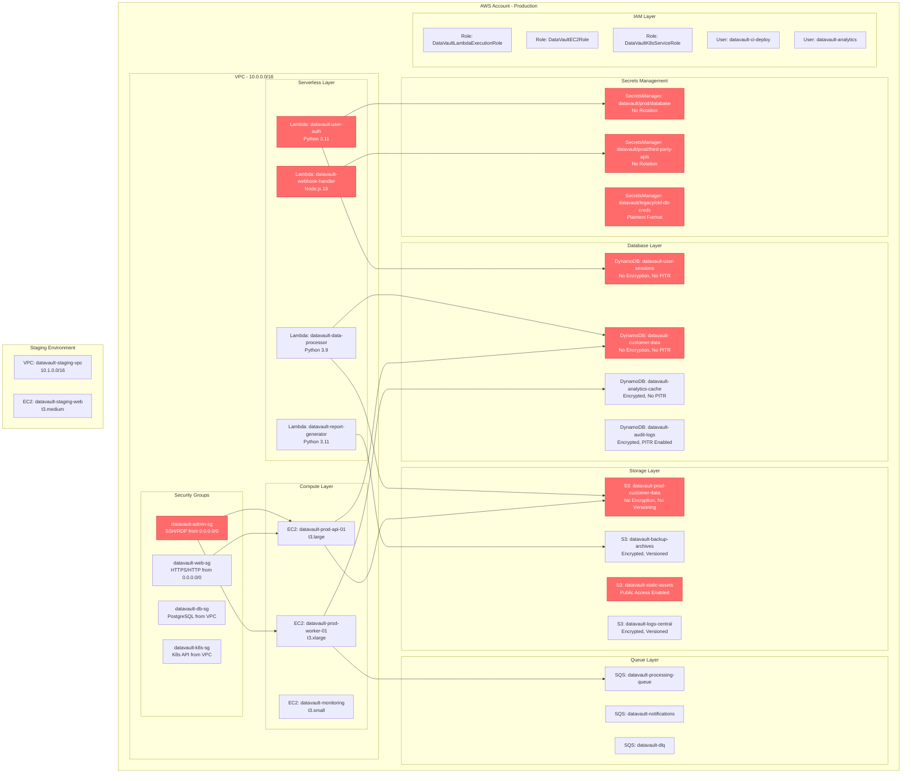

# DataVault Infrastructure Architecture

## Risk Summary

| **Risk Category** | **Resource** | **Severity** | **Issue** |
|-------------------|--------------|--------------|-----------|
| **Secrets Exposure (tr2)** | datavault-user-auth | Critical | DB password, JWT secret, API key in plaintext env vars |
| **Secrets Exposure (tr2)** | datavault-webhook-handler | High | Stripe secrets exposed in Lambda environment |
| **Secrets Exposure (tr2)** | datavault/prod/database | Medium | SecretsManager without rotation enabled |
| **Secrets Exposure (tr2)** | datavault/legacy/old-db-creds | Medium | Legacy credentials in plaintext format |
| **Storage Misconfiguration (tr3)** | datavault-prod-customer-data | Critical | No encryption, versioning suspended |
| **Storage Misconfiguration (tr3)** | datavault-static-assets | High | Public access permissions enabled |
| **Storage Misconfiguration (tr3)** | datavault-user-sessions | High | DynamoDB table lacks encryption |
| **Storage Misconfiguration (tr3)** | datavault-customer-data | High | No encryption, no point-in-time recovery |
| **Low SLA (tr9)** | datavault-prod-customer-data | High | Versioning suspended, no backup protection |
| **Low SLA (tr9)** | datavault-user-sessions | Medium | No point-in-time recovery backup |
| **Low SLA (tr9)** | datavault-customer-data | High | No PITR backup protection |

## Architecture Notes

- **Production VPC**: Core infrastructure isolated in 10.0.0.0/16 network
- **Multi-tier Architecture**: Web, application, and data layers with appropriate security groups
- **Serverless Integration**: Lambda functions handle authentication, webhooks, and data processing
- **Storage Strategy**: Mix of S3 and DynamoDB with inconsistent encryption and backup policies
- **Access Control**: IAM roles and policies with some overly permissive configurations
- **Monitoring**: Dedicated monitoring instance but limited security observability