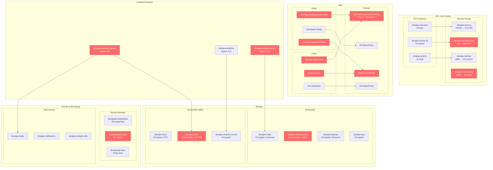

# DevPipe AWS Infrastructure Architecture

## Risk Summary

| Risk Category | Resource | Severity | Issue |
|---------------|----------|----------|-------|
| **IAM Overprivilege** | DevPipeComprehensivePolicy | 🔴 Critical | Wildcard permissions (*:*) |
| **IAM Overprivilege** | DevPipeLegacyAdminRole | 🔴 Critical | Cross-account trust with Principal: * |
| **IAM Overprivilege** | devpipe-database-sg | 🔴 Critical | Database port open to 0.0.0.0/0 |
| **IAM Overprivilege** | devpipe-ssh-wide-open | 🟠 High | SSH access from any IP |
| **Secrets Exposure** | devpipe-webhook-handler | 🟠 High | Plaintext credentials in Lambda env vars |
| **Secrets Exposure** | devpipe/github-token | 🟡 Medium | No automatic rotation configured |
| **Outdated Stack** | devpipe-webhook-handler | 🟠 High | Python 3.8 (EOL runtime) |
| **Outdated Stack** | devpipe-build-processor | 🟡 Medium | Node.js 14.x (deprecated) |

### Key Architectural Concerns

1. **Excessive Permissions**: Core Lambda execution role has administrative privileges across entire AWS environment
2. **Network Security**: Critical services exposed to internet without IP restrictions
3. **Data Protection**: Mixed encryption posture with some resources unprotected
4. **Legacy Debt**: Outdated runtimes and unused admin roles from acquisition integration
5. **Secrets Management**: Inconsistent use of Secrets Manager vs environment variables

### Business Impact
- **Compliance Risk**: Current setup violates SOC 2 requirements for enterprise customers
- **Blast Radius**: Overprivileged roles could amplify security incident impact
- **Operational Risk**: EOL runtimes may face unexpected deprecation by AWS