# HealthBridge AWS Infrastructure Diagram

```mermaid
flowchart TB
    subgraph VPC["VPC: healthbridge-main-vpc (10.0.0.0/16)"]
        subgraph Compute["Compute Layer"]
            EC2_WEB["`EC2: healthbridge-web-prod-1
            t3.large`"]
            EC2_API["`EC2: healthbridge-api-prod-1
            t3.xlarge`"]
            EC2_WORKER["`EC2: healthbridge-worker-prod-1
            t3.medium`"]
        end

        subgraph Lambda["Lambda Functions"]
            LAMBDA_PATIENT["`healthbridge-patient-processor
            Contains: DB credentials in env vars`"]:::risk
            LAMBDA_AUTH["`healthbridge-auth-handler
            Contains: JWT secrets in env vars`"]:::risk
            LAMBDA_NOTIFY["`healthbridge-notification-service
            Contains: Email/Slack creds in env vars`"]:::risk
            LAMBDA_SYNC["healthbridge-data-sync"]
        end

        subgraph Security["Security Groups"]
            SG_WEB["healthbridge-web-sg<br/>Port 80/443 from 0.0.0.0/0"]
            SG_API["healthbridge-api-sg<br/>Port 8080 from VPC, 443 from 0.0.0.0/0"]
            SG_LEGACY["`healthbridge-legacy-admin-sg
            SSH/RDP from 0.0.0.0/0`"]:::risk
            SG_DB["healthbridge-database-sg<br/>Port 5432 from VPC"]
        end
    end

    subgraph IAM["Identity & Access Management"]
        ROLE_LAMBDA["HealthBridge-Lambda-Execution<br/>Basic permissions"]
        ROLE_CROSS["`HealthBridge-DevOps-CrossAccount
        Trust: ANY AWS Principal (*)`"]:::risk
        ROLE_DATA["`HealthBridge-DataProcessing-Role
        Permissions: s3:*, dynamodb:*, secretsmanager:*`"]:::risk
        ROLE_LEGACY["`HealthBridge-Legacy-Admin-Role
        Full admin access (unused)`"]:::risk

        POLICY_ADMIN["`HealthBridge-DevOps-Admin-Policy
        Action: *, Resource: *`"]:::risk
        POLICY_DATA["`HealthBridge-Data-Processing-Policy
        Broad wildcard permissions`"]:::risk
        POLICY_LEGACY["`HealthBridge-Legacy-Admin-Policy
        Full admin (orphaned)`"]:::risk

        USER_CI["`healthbridge-ci-user
        Attached: Admin Policy`"]:::risk
        USER_BACKUP["healthbridge-backup-user<br/>Data processing permissions"]
    end

    subgraph Storage["Storage Layer"]
        S3_PATIENT["`healthbridge-patient-data-prod
        PHI Data - No Encryption, No Versioning`"]:::risk
        S3_ASSETS["`healthbridge-app-assets
        Public Access Enabled`"]:::risk
        S3_BACKUP["healthbridge-backups-secure<br/>Encrypted, Versioned"]
        S3_ANALYTICS["healthbridge-analytics-data<br/>Encrypted, Versioned"]
        S3_LOGS["healthbridge-logs-archive<br/>Encrypted, Versioned"]
    end

    subgraph Data["Data Layer"]
        DDB_PATIENT["`healthbridge-patients
        PHI Data - No Encryption, No PITR`"]:::risk
        DDB_SESSIONS["healthbridge-sessions<br/>Encrypted, PITR enabled"]
        DDB_ANALYTICS["healthbridge-analytics<br/>Encrypted, PITR enabled"]
        DDB_AUDIT["healthbridge-audit-logs<br/>Encrypted, PITR enabled"]
    end

    subgraph Secrets["Secrets Management"]
        SECRET_DB["healthbridge/prod/database<br/>Standard rotation"]
        SECRET_LEGACY["`healthbridge/legacy/api-keys
        No rotation since 2021`"]:::risk
        SECRET_INTEGRATIONS["healthbridge/prod/third-party-integrations<br/>Standard rotation"]
    end

    subgraph Queues["Message Queues"]
        SQS_PATIENT["healthbridge-patient-processing-queue"]
        SQS_NOTIFY["healthbridge-notifications-queue"]
        SQS_AUDIT["healthbridge-audit-queue"]
    end

    %% Connections
    EC2_WEB -.-> SG_WEB
    EC2_API -.-> SG_API
    EC2_WORKER -.-> SG_DB

    LAMBDA_PATIENT --> DDB_PATIENT
    LAMBDA_PATIENT --> S3_PATIENT
    LAMBDA_AUTH --> DDB_SESSIONS
    LAMBDA_NOTIFY --> SQS_NOTIFY
    LAMBDA_SYNC --> S3_ANALYTICS

    ROLE_LAMBDA -.-> LAMBDA_PATIENT
    ROLE_LAMBDA -.-> LAMBDA_AUTH
    ROLE_LAMBDA -.-> LAMBDA_NOTIFY
    ROLE_DATA -.-> LAMBDA_SYNC

    POLICY_ADMIN -.-> ROLE_CROSS
    POLICY_ADMIN -.-> USER_CI
    POLICY_DATA -.-> ROLE_DATA
    POLICY_LEGACY -.-> ROLE_LEGACY

    classDef risk fill:#ff6b6b,stroke:#c92a2a,color:#fff
    classDef secure fill:#51cf66,stroke:#37b24d,color:#000
    classDef warning fill:#ffd43b,stroke:#fab005,color:#000
```

## Risk Summary

| **Risk Category** | **Resource** | **Severity** | **Issue** |
|-------------------|--------------|--------------|-----------|
| **TR1: IAM Overprivilege** | HealthBridge-DevOps-Admin-Policy | 🔴 Critical | Wildcard permissions (*:*) on all AWS resources |
| **TR1: IAM Overprivilege** | HealthBridge-DevOps-CrossAccount | 🔴 Critical | Cross-account trust allows any AWS principal (*) |
| **TR1: IAM Overprivilege** | HealthBridge-Data-Processing-Policy | 🟡 High | Overly broad s3:*, dynamodb:*, secretsmanager:* permissions |
| **TR1: IAM Overprivilege** | HealthBridge-Legacy-Admin-Policy | 🟠 Medium | Unused admin policy from legacy infrastructure |
| **TR2: Secrets Exposure** | healthbridge-patient-processor | 🟡 High | Database credentials in plaintext environment variables |
| **TR2: Secrets Exposure** | healthbridge-auth-handler | 🟡 High | JWT signing secret hardcoded in environment |
| **TR2: Secrets Exposure** | healthbridge-notification-service | 🟠 Medium | Email/Slack credentials in plaintext environment |
| **TR2: Secrets Exposure** | healthbridge/legacy/api-keys | 🟠 Medium | No rotation policy, unchanged since 2021 |
| **TR3: Storage Misconfiguration** | healthbridge-patient-data-prod | 🔴 Critical | PHI data lacks encryption and versioning |
| **TR3: Storage Misconfiguration** | healthbridge-app-assets | 🟡 High | Public access enabled with disabled access blocks |
| **TR3: Storage Misconfiguration** | healthbridge-legacy-admin-sg | 🟡 High | SSH/RDP access from any IP (0.0.0.0/0) |
| **TR3: Storage Misconfiguration** | healthbridge-patients | 🟡 High | DynamoDB PHI table lacks encryption and PITR |

### Legend
- 🔴 **Critical**: Immediate security risk requiring urgent remediation
- 🟡 **High**: Significant risk requiring remediation within 30 days
- 🟠 **Medium**: Moderate risk requiring remediation within 90 days
- 🟢 **Low**: Minor risk for future improvement

### Key Infrastructure Stats
- **Total Resources**: 28 AWS resources across 7 services
- **Risk Density**: 42% of resources have security issues (12/28)
- **PHI Impact**: 3 resources storing PHI data have critical security gaps
- **Compliance Gap**: 67% of identified risks relate to HIPAA compliance requirements