# InsureNet AWS Infrastructure Architecture

```mermaid
flowchart TB
    subgraph "Identity & Access Management"
        IAM1[InsureNet-FullAccess Policy]:::risk
        IAM2[InsureNet-CrossAccountAccess Role]:::risk
        IAM3[InsureNet-ReadOnlyAccess Policy]:::risk
        IAM4[insurenet-deployer User]:::risk
        IAM5[InsureNet-LambdaExecution Role]
    end

    subgraph "Production VPC (10.0.0.0/16)"
        subgraph "Web Tier"
            WEB1[insurenet-web-prod-01<br/>t3.large]
            WEBSG[insurenet-web-sg<br/>SSH open to 0.0.0.0/0]:::risk
        end

        subgraph "API Tier"
            API1[insurenet-api-prod-01<br/>t3.medium]
            APISG[insurenet-api-sg<br/>Port 8080 public]:::risk
        end

        subgraph "Worker Tier"
            WORKER1[insurenet-worker-prod-01<br/>t3.small]
        end

        subgraph "Data Layer"
            DBSG[insurenet-database-sg<br/>PostgreSQL 5432 public]:::risk
            DDB1[(insurenet-policies<br/>DynamoDB)]
            DDB2[(insurenet-claims<br/>No encryption)]:::risk
            DDB3[(insurenet-users<br/>DynamoDB)]
            DDB4[(insurenet-analytics<br/>No encryption)]:::risk
        end
    end

    subgraph "Development VPC (10.1.0.0/16)"
        DEV1[insurenet-dev-sandbox<br/>t3.medium]
        DEVSG[insurenet-dev-all-open<br/>All ports 0-65535]:::risk
    end

    subgraph "Serverless Compute"
        LAMBDA1[insurenet-quote-processor<br/>Plaintext secrets in env]:::risk
        LAMBDA2[insurenet-claims-validator<br/>DB creds in env vars]:::risk
        LAMBDA3[insurenet-risk-calculator]
        LAMBDA4[insurenet-document-processor]
    end

    subgraph "Storage"
        S31[insurenet-prod-data<br/>Encrypted, Versioned]
        S32[insurenet-customer-documents<br/>Public access enabled]:::risk
        S33[insurenet-dev-assets<br/>Encrypted]
        S34[insurenet-backups<br/>Encrypted, Versioned]
        S35[insurenet-analytics-raw]
    end

    subgraph "Secrets & Configuration"
        SEC1[insurenet/prod/database<br/>Encrypted secrets]
        SEC2[insurenet/shared/api-keys<br/>Shared across environments]:::risk
        SEC3[insurenet/prod/stripe<br/>Encrypted secrets]
    end

    subgraph "Messaging"
        SQS1[insurenet-quote-processing]
        SQS2[insurenet-claims-queue]
        SQS3[insurenet-notifications]
    end

    subgraph "Cross-Account Access"
        CROSS1[Account 2: Staging]
        CROSS2[Account 3: Analytics]
        CROSS3[Account 4: Vendor Integrations]
        CROSS4[Account 5: Sandbox]
        CROSS5[Account 6: Acquired Company]
    end

    %% Connections
    WEB1 -.-> WEBSG
    API1 -.-> APISG
    DEV1 -.-> DEVSG

    LAMBDA1 --> DDB1
    LAMBDA1 --> DDB2
    LAMBDA2 --> DDB2
    LAMBDA3 --> DDB1
    LAMBDA4 --> S32

    LAMBDA1 -.-> IAM5
    LAMBDA2 -.-> IAM5
    LAMBDA3 -.-> IAM5
    LAMBDA4 -.-> IAM5

    API1 --> SQS1
    WORKER1 --> SQS1
    WORKER1 --> SQS2

    IAM2 -.-> CROSS1
    IAM2 -.-> CROSS2
    IAM2 -.-> CROSS3
    IAM2 -.-> CROSS4
    IAM2 -.-> CROSS5

    %% Risk styling
    classDef risk fill:#ff6b6b,stroke:#c92a2a,color:#fff
```

## Risk Summary

| Category | Resource | Risk Level | Impact |
|----------|----------|------------|---------|
| **tr1** | InsureNet-FullAccess | 🔴 Critical | Wildcard permissions across all AWS services |
| **tr4** | insurenet-database-sg | 🔴 Critical | PostgreSQL exposed to internet with customer PII |
| **tr1** | insurenet-quote-processor | 🔴 High | Database credentials in plaintext environment vars |
| **tr1** | insurenet-claims-validator | 🔴 High | Connection strings with embedded credentials |
| **tr4** | insurenet-web-sg | 🔴 High | SSH access open to entire internet |
| **tr4** | insurenet-api-sg | 🔴 High | API endpoints publicly accessible without auth |
| **tr1** | InsureNet-CrossAccountAccess | 🔴 High | Cross-account role trusts any AWS account |
| **tr1** | InsureNet-ReadOnlyAccess | 🔴 High | "Read-only" policy grants write permissions |
| **tr4** | insurenet-dev-all-open | 🟡 Medium | All ports open in development environment |
| **tr5** | insurenet/shared/api-keys | 🟡 Medium | Single API key shared across all environments |
| **tr1** | insurenet-deployer | 🟡 Medium | Service account with unnecessary admin privileges |

## Key Infrastructure Observations

- **6 AWS accounts** with inconsistent security policies and no centralized governance
- **Mixed encryption state**: Production DynamoDB tables have inconsistent encryption settings
- **Network segmentation gaps**: Development and production environments lack proper isolation
- **Secrets management inconsistency**: Mix of SecretsManager and plaintext environment variables
- **Legacy IAM policies**: Overprivileged roles and policies from early startup days still active
- **Cross-account complexity**: Acquisition-driven account sprawl with unsafe trust relationships