# MedData AWS Infrastructure Diagram

```mermaid
flowchart TB
    subgraph "IAM & Access Management"
        MedDataFullAccess["MedDataFullAccess Policy"]:::risk
        MedDataDevOpsAdmin["MedDataDevOpsAdmin Role"]:::risk
        FounderUser["meddata-founder User"]:::risk
        CIUser["meddata-ci-user"]:::risk
        MedDataWildcardPolicy["MedDataWildcardPolicy"]:::risk
        MedDataLegacyETLRole["MedDataLegacyETLRole"]
        MedDataLambdaExecution["MedDataLambdaExecution"]
    end

    subgraph "Network Security"
        ProdVPC["Production VPC<br/>10.0.0.0/16"]
        StagingVPC["Staging VPC<br/>10.1.0.0/16"]

        subgraph "Security Groups"
            WebPublicSG["meddata-web-public<br/>HTTPS/HTTP: 0.0.0.0/0"]
            SSHAdminSG["meddata-ssh-admin<br/>SSH: 0.0.0.0/0"]:::risk
            DatabaseSG["meddata-database-legacy<br/>5432: 0.0.0.0/0"]:::risk
            DevOpenSG["meddata-dev-wide-open<br/>All ports: 0.0.0.0/0"]:::risk
            K8sSG["meddata-k8s-cluster<br/>Internal only"]
            InternalSG["meddata-internal-services<br/>VPC only"]
        end
    end

    subgraph "Compute Resources"
        K8sMaster["Kubernetes Master<br/>t3.large"]
        K8sWorker1["K8s Worker 1<br/>t3.xlarge"]
        K8sWorker2["K8s Worker 2<br/>t3.xlarge"]
        LegacyETL["Legacy ETL Server<br/>t3.medium"]
        Monitoring["Monitoring<br/>t3.small"]
        StagingApp["Staging App<br/>t3.medium"]
        DevTest["Dev Test<br/>t2.micro"]
    end

    subgraph "Lambda Functions"
        PatientProcessor["meddata-patient-processor"]:::risk
        ClaimsETL["meddata-claims-etl"]:::risk
        AnalyticsAgg["meddata-analytics-aggregator"]
        WebhookHandler["meddata-webhook-handler"]:::risk
        BackupScheduler["meddata-backup-scheduler"]
    end

    subgraph "Data Storage"
        subgraph "DynamoDB Tables"
            PatientsTable["MedDataPatients<br/>(Encrypted)"]
            ClaimsTable["MedDataClaims<br/>(Encrypted)"]
            AnalyticsTable["MedDataAnalytics<br/>(Not Encrypted)"]:::risk
            SessionsTable["MedDataSessions<br/>(Encrypted)"]
            AuditTable["MedDataAuditLogs<br/>(Encrypted)"]
        end

        subgraph "S3 Buckets"
            PatientDataBucket["meddata-patient-data-prod<br/>(Encrypted)"]
            BackupsBucket["meddata-backups<br/>(Encrypted)"]
            AnalyticsBucket["meddata-analytics<br/>(Encrypted)"]
            DevBucket["meddata-dev-testing<br/>(No encryption, Public)"]:::risk
            StaticBucket["meddata-static-assets"]
        end
    end

    subgraph "Secrets Management"
        ProdDBSecret["meddata/prod/database<br/>(Stored securely)"]
        LegacyAPISecret["meddata/legacy/api-keys<br/>(No rotation)"]:::risk
        JWTSecret["meddata/prod/jwt-secret<br/>(No rotation)"]:::risk
        StripeSecret["meddata/third-party/stripe<br/>(Stored securely)"]
    end

    subgraph "Message Queues"
        PatientUpdatesQueue["meddata-patient-updates"]
        ClaimsQueue["meddata-claims-processing"]
        AnalyticsQueue["meddata-analytics-events"]
        NotificationsDLQ["meddata-notifications-dlq"]
    end

    %% Connections
    MedDataDevOpsAdmin --> MedDataFullAccess
    FounderUser --> MedDataFullAccess
    CIUser --> MedDataFullAccess
    MedDataLegacyETLRole --> MedDataWildcardPolicy

    PatientProcessor --> ProdVPC
    ClaimsETL --> ProdVPC
    PatientProcessor --> PatientsTable
    ClaimsETL --> ClaimsTable
    AnalyticsAgg --> AnalyticsTable

    K8sMaster --> K8sSG
    K8sWorker1 --> K8sSG
    K8sWorker2 --> K8sSG
    LegacyETL --> DatabaseSG

    PatientProcessor --> PatientDataBucket
    ClaimsETL --> BackupsBucket
    BackupScheduler --> BackupsBucket

    PatientProcessor --> PatientUpdatesQueue
    ClaimsETL --> ClaimsQueue
    AnalyticsAgg --> AnalyticsQueue

    classDef risk fill:#ff6b6b,stroke:#c92a2a,color:#fff
    classDef secure fill:#51cf66,stroke:#37b24d,color:#000
    classDef warning fill:#ffd43b,stroke:#fab005,color:#000
```

## Risk Summary

| Risk Category | Count | Critical | High | Medium | Low |
|---------------|-------|----------|------|--------|-----|
| **IAM Overprivilege (tr1)** | 6 | 2 | 3 | 1 | 0 |
| **Secrets Exposure (tr2)** | 5 | 1 | 2 | 2 | 0 |
| **Network Exposure (tr4)** | 3 | 0 | 2 | 1 | 0 |
| **TOTAL** | **14** | **3** | **7** | **4** | **0** |

### High-Risk Resources Requiring Immediate Attention

1. **MedDataFullAccess Policy** - Grants unrestricted AWS access (*:*)
2. **MedDataDevOpsAdmin Role** - Allows assumption by any AWS principal (*)
3. **meddata-patient-processor Lambda** - Database credentials in plaintext environment variables
4. **meddata-ssh-admin Security Group** - SSH access from any IP (0.0.0.0/0)
5. **meddata-database-legacy Security Group** - Database port exposed to internet
6. **meddata-claims-etl Lambda** - Multiple hardcoded secrets in environment

### Architecture Strengths

- **Data Encryption**: Most DynamoDB tables and S3 buckets properly encrypted
- **VPC Segmentation**: Production and staging environments properly separated
- **Service Architecture**: Modern microservices with Kubernetes orchestration
- **Compliance Foundation**: SOC 2 Type I achieved, HITRUST in progress

### Remediation Priority

1. **Phase 1** (0-30 days): Address critical IAM policies and Lambda secrets
2. **Phase 2** (30-90 days): Remediate network security groups and implement least privilege
3. **Phase 3** (90-180 days): Complete secrets migration and enable comprehensive monitoring