# PayFlow AWS Infrastructure Diagram

```mermaid
flowchart TB
    subgraph "AWS Account - Production"
        subgraph "Network (VPC: 10.0.0.0/16)"
            subgraph "Security Groups"
                SG1[payflow-web-sg<br/>HTTPS: 443, HTTP: 80]
                SG2[payflow-admin-sg<br/>SSH: 22 from 0.0.0.0/0]:::risk
                SG3[payflow-database-sg<br/>PostgreSQL: 5432 from 0.0.0.0/0]:::risk
                SG4[payflow-dev-all-open<br/>All ports: 0-65535 from 0.0.0.0/0]:::risk
                SG5[payflow-internal-sg<br/>App: 8080 internal only]
            end

            subgraph "EC2 Instances"
                EC2_1[payflow-api-server-prod<br/>t3.large]
                EC2_2[payflow-worker-node<br/>t3.medium]
                EC2_3[payflow-dev-server<br/>t3.small]
            end
        end

        subgraph "IAM"
            subgraph "Users"
                USER1[sarah-founder]:::risk
                USER2[payflow-ci-cd]
                USER3[mike-devops]
            end

            subgraph "Roles"
                ROLE1[PayFlow-Lambda-Execution-Role]
                ROLE2[PayFlow-API-Lambda-Role]:::risk
                ROLE3[PayFlow-EC2-Role]
                ROLE4[PayFlow-Legacy-Admin-Role]:::risk
            end

            subgraph "Policies"
                POL1[PayFlow-Lambda-Basic-Policy]
                POL2[PayFlow-API-Overprivileged-Policy<br/>Action: *, Resource: *]:::risk
                POL3[PayFlow-EC2-Access-Policy]
                POL4[PayFlow-Admin-Everything-Policy<br/>Action: *, Resource: *]:::risk
            end
        end

        subgraph "Compute"
            subgraph "Lambda Functions"
                LAM1[payflow-transaction-processor]
                LAM2[payflow-api-gateway]:::risk
                LAM3[payflow-webhook-handler<br/>Hardcoded secrets in env vars]:::risk
                LAM4[payflow-fraud-detector]
            end
        end

        subgraph "Storage"
            subgraph "S3 Buckets"
                S3_1[payflow-documents<br/>Encrypted, Versioned]
                S3_2[payflow-transaction-logs<br/>Encrypted]
                S3_3[payflow-backup-storage<br/>No encryption]
            end
        end

        subgraph "Data"
            subgraph "DynamoDB Tables"
                DDB1[payflow-transactions<br/>Encrypted, PITR enabled]
                DDB2[payflow-users<br/>No encryption, No PITR]
                DDB3[payflow-audit-logs<br/>Encrypted, PITR enabled]
            end
        end

        subgraph "Secrets"
            SEC1[payflow-db-credentials]
            SEC2[payflow-third-party-keys]
        end

        subgraph "Messaging"
            SQS1[payflow-transaction-queue]
            SQS2[payflow-notification-queue]
        end
    end

    subgraph "Internet"
        INT[Public Internet<br/>0.0.0.0/0]:::risk
    end

    %% Connections
    INT --> SG2
    INT --> SG3
    INT --> SG4
    INT --> SG1

    EC2_1 -.-> SG1
    EC2_1 -.-> SG2
    EC2_2 -.-> SG5
    EC2_3 -.-> SG4

    LAM1 --> ROLE1
    LAM2 --> ROLE2
    LAM3 --> ROLE1
    LAM4 --> ROLE1

    ROLE1 --> POL1
    ROLE2 --> POL2
    ROLE3 --> POL3
    ROLE4 --> POL4

    USER1 --> POL4
    USER2 --> POL1
    USER3 --> POL3

    LAM1 --> DDB1
    LAM2 --> DDB1
    LAM3 --> DDB2
    LAM4 --> DDB1

    EC2_1 --> S3_1
    EC2_2 --> S3_2

    LAM1 --> SQS1
    LAM3 --> SQS2

    EC2_1 --> SEC1
    LAM3 --> SEC2

    classDef risk fill:#ff6b6b,stroke:#c92a2a,color:#fff
```

## Risk Summary

| Risk Category | Resource | Severity | Issue |
|---------------|----------|----------|-------|
| **IAM Overprivilege** | PayFlow-API-Overprivileged-Policy | Critical | Wildcard permissions on all actions and resources |
| **IAM Overprivilege** | PayFlow-Legacy-Admin-Role | Critical | Cross-account trust allows any AWS principal (*) to assume role |
| **IAM Overprivilege** | PayFlow-Admin-Everything-Policy | High | Unrestricted access to all AWS services attached to founder's user |
| **IAM Overprivilege** | payflow-webhook-handler | High | Database password and API keys stored in plaintext environment variables |
| **Network Exposure** | payflow-admin-sg | High | SSH access (port 22) open to entire internet (0.0.0.0/0) |
| **Network Exposure** | payflow-database-sg | Critical | Database access (port 5432) open to entire internet (0.0.0.0/0) |
| **Network Exposure** | payflow-dev-all-open | Medium | All TCP ports (0-65535) accessible from any IP address |

## Infrastructure Overview

PayFlow's AWS infrastructure reflects a serverless-first architecture with legacy EC2 components. The company processes $420M in annual payments through a combination of Lambda functions, DynamoDB tables, and traditional compute instances.

**Key Architectural Patterns:**
- **Serverless Core**: Payment processing and API logic runs on Lambda
- **Hybrid Storage**: DynamoDB for transactional data, S3 for documents and logs
- **Legacy Components**: EC2 instances for specialized workloads and development
- **Simple Messaging**: SQS queues for async processing

**Security Debt Hotspots:**
1. **Network perimeter**: Multiple security groups allow unrestricted internet access
2. **IAM permissions**: Wildcard policies created during rapid growth phases
3. **Secret management**: Mix of proper Secrets Manager usage and hardcoded credentials
4. **Data protection**: Inconsistent encryption and backup policies across resources

The infrastructure supports PayFlow's rapid growth but contains accumulated security debt from prioritizing speed over security during critical business milestones.