# QuickCart AWS Infrastructure Architecture

```mermaid
flowchart TB
    subgraph "IAM & Access Control"
        QFA[QuickCartFullAccess Policy]:::risk
        QCCA[QuickCartCrossAccountAdmin Role]:::risk
        QLD[quickcart-deploy User]:::risk
        QLA[quickcart-legacy-admin User]:::risk
        QLE[QuickCartLambdaExecution Role]
    end

    subgraph "VPC & Networking"
        ProdVPC[Production VPC<br/>10.0.0.0/16]
        StagVPC[Staging VPC<br/>10.1.0.0/16]

        subgraph "Security Groups"
            WebSG[quickcart-web-sg]
            DevSG[quickcart-dev-all-open]:::risk
            SSHSG[quickcart-ssh-access]:::risk
            DBSG[quickcart-database-sg]:::risk
            APISG[quickcart-api-sg]
        end
    end

    subgraph "Compute - EC2 Instances"
        WebProd1[quickcart-web-prod-01<br/>c5.4xlarge]
        WebProd2[quickcart-web-prod-02<br/>c5.4xlarge]
        CacheProd[quickcart-cache-prod-01<br/>r5.2xlarge]
        APIProd[quickcart-api-prod-01<br/>t2.micro]:::risk
        WorkerProd[quickcart-worker-prod-01<br/>t3.medium]
        StagWeb[quickcart-staging-web<br/>STOPPED]:::risk
        LegacyProc[legacy-order-processor<br/>STOPPED]:::risk
    end

    subgraph "Serverless - Lambda Functions"
        OrderProc[quickcart-order-processor<br/>512MB]
        EmailSend[quickcart-email-sender<br/>128MB]:::risk
        InvSync[quickcart-inventory-sync<br/>256MB]
        LegacyRep[quickcart-legacy-reports<br/>NOT INVOKED 180d]:::risk
        DataMig[quickcart-data-migration<br/>2048MB]
    end

    subgraph "Data Storage"
        subgraph "DynamoDB Tables"
            UserTable[quickcart-users-prod<br/>Encrypted, PITR]
            OrderTable[quickcart-orders-prod<br/>Encrypted, PITR]
            InvTable[quickcart-inventory-prod<br/>No encryption]:::risk
            SessionTable[quickcart-sessions<br/>No tags, No encryption]:::risk
            LegacyTable[legacy-customer-data<br/>No encryption, No tags, No PITR]:::risk
        end

        subgraph "S3 Buckets"
            CustomerUploads[quickcart-customer-uploads<br/>No encryption, Public access]:::risk
            ProductImages[quickcart-product-images<br/>Encrypted, Private]
            Backups[quickcart-backups-production<br/>Encrypted, Private]
            Analytics[quickcart-analytics-raw<br/>Encrypted, Private]
        end
    end

    subgraph "Secrets & Configuration"
        SM1[quickcart/prod/database<br/>Secrets Manager]
        SM2[quickcart/prod/stripe-keys<br/>Secrets Manager]
        SM3[quickcart/staging/api-keys<br/>Secrets Manager]
        ENV[Lambda Environment Variables<br/>Hardcoded secrets]:::risk
    end

    subgraph "Messaging"
        OrderQueue[quickcart-order-processing]
        EmailQueue[quickcart-email-queue]
        InvQueue[quickcart-inventory-updates]
        LegacyQueue[legacy-notifications]
    end

    %% Connections
    QFA -.-> QLD
    QFA -.-> QLE
    QCCA -.-> DataMig

    WebProd1 --> WebSG
    WebProd2 --> WebSG
    APIProd --> APISG
    APIProd --> SSHSG

    OrderProc --> OrderQueue
    EmailSend --> EmailQueue
    InvSync --> InvQueue

    OrderProc --> UserTable
    OrderProc --> OrderTable
    InvSync --> InvTable

    OrderProc -.-> ENV
    WebProd1 --> CustomerUploads
    WebProd2 --> ProductImages

    classDef risk fill:#ff6b6b,stroke:#c92a2a,color:#fff
```

## Infrastructure Risk Summary

| Risk Category | Count | Critical | High | Medium | Low |
|---------------|-------|----------|------|--------|-----|
| **IAM Overprivilege** | 5 | 1 | 3 | 1 | 0 |
| **Network Exposure** | 3 | 1 | 2 | 0 | 0 |
| **Capacity Gaps** | 2 | 0 | 1 | 1 | 0 |
| **Resource Hygiene** | 5 | 0 | 0 | 3 | 2 |
| **TOTAL** | **15** | **2** | **6** | **5** | **2** |

## High-Risk Resources Requiring Immediate Attention

### Critical (Immediate Fix Required)
1. **QuickCartFullAccess Policy** - Wildcard permissions affecting entire infrastructure
2. **quickcart-dev-all-open Security Group** - All ports open to internet (0.0.0.0/0)

### High Priority (30-day timeline)
3. **QuickCartCrossAccountAdmin Role** - Trusts any AWS principal
4. **quickcart-deploy User** - Shared admin credentials
5. **quickcart-ssh-access Security Group** - SSH open to internet
6. **quickcart-database-sg Security Group** - Database exposed to internet
7. **quickcart-api-prod-01 Instance** - Production API on undersized t2.micro
8. **quickcart-order-processor Lambda** - Hardcoded secrets in environment variables

## Architecture Observations

- **Mixed maturity**: Modern serverless alongside legacy EC2 patterns
- **Security debt**: Permissive policies from rapid growth phase
- **Resource sprawl**: Orphaned resources from acquisitions and experiments
- **Inconsistent standards**: Some resources properly tagged and encrypted, others not
- **Cost optimization gaps**: Over-provisioned instances alongside under-provisioned ones

This infrastructure reflects typical hypergrowth company patterns - strong core architecture with security and operational debt that accumulated during scaling phases.