# ShipFast Infrastructure Architecture

```mermaid
flowchart TB
    subgraph "Internet"
        Users[Users/Customers]
        Developers[Remote Developers]
    end

    subgraph "AWS Account - Production"
        subgraph "VPC: shipfast-main-vpc (10.0.0.0/16)"

            subgraph "Security Groups"
                WebSG[shipfast-web-sg<br/>Port 80,443 ← 0.0.0.0/0]
                DBSG[shipfast-database-sg<br/>Port 5432 ← 0.0.0.0/0]:::risk
                DevSG[shipfast-dev-sg<br/>All ports ← 0.0.0.0/0]:::risk
                SSHSG[shipfast-ssh-sg<br/>Port 22 ← 0.0.0.0/0]:::risk
            end

            subgraph "Compute Resources"
                WebEC2[shipfast-web-prod<br/>t3.large - running]
                ApiEC2[shipfast-api-prod<br/>t3.medium - running]
                StagingEC2[shipfast-staging<br/>t3.medium - running]
                DevEC2[shipfast-dev-test<br/>t3.small - stopped 90+ days]:::risk
            end

            subgraph "Lambda Functions"
                OrderLambda[shipfast-order-processor<br/>Contains hardcoded secrets]:::risk
                EmailLambda[shipfast-email-sender<br/>Contains API keys]:::risk
                ImageLambda[shipfast-image-resizer]
                LegacyLambda[shipfast-legacy-migrator<br/>Not invoked 90+ days]:::risk
            end
        end

        subgraph "Storage Layer"
            subgraph "S3 Buckets"
                ImagesBucket[shipfast-product-images<br/>Public + No encryption]:::risk
                UploadsBucket[shipfast-user-uploads<br/>Encrypted + Private]
                BackupsBucket[shipfast-backups<br/>No versioning]:::risk
                AnalyticsBucket[shipfast-analytics-data<br/>Encrypted + Versioned]
            end

            subgraph "DynamoDB Tables"
                OrdersTable[shipfast-orders<br/>Encrypted + PITR]
                UsersTable[shipfast-users<br/>No encryption]:::risk
                ProductsTable[shipfast-products<br/>Encrypted + PITR]
            end
        end

        subgraph "Messaging"
            OrderQueue[shipfast-order-queue]
            EmailQueue[shipfast-email-queue]
        end

        subgraph "Secrets Management"
            DBSecret[shipfast/prod/database<br/>DB credentials]
            StripeSecret[shipfast/stripe/webhook<br/>Webhook secret]
        end

        subgraph "IAM"
            LambdaRole[shipfast-lambda-execution-role]
            EC2Role[shipfast-ec2-role<br/>Overly permissive]:::risk
            DevRole[shipfast-developer-role<br/>Full admin access]:::risk
            DeployUser[shipfast-deploy-user<br/>Admin permissions]:::risk
        end
    end

    %% Connections
    Users --> WebSG
    Users --> ImagesBucket
    Developers --> SSHSG
    Developers --> DevSG

    WebEC2 --> OrdersTable
    WebEC2 --> UsersTable
    WebEC2 --> ProductsTable

    ApiEC2 --> OrderQueue
    ApiEC2 --> EmailQueue

    OrderLambda --> OrdersTable
    OrderLambda --> OrderQueue
    EmailLambda --> EmailQueue
    ImageLambda --> ImagesBucket
    ImageLambda --> UploadsBucket

    OrderLambda -.->|Should use| DBSecret
    OrderLambda -.->|Should use| StripeSecret

    classDef risk fill:#ff6b6b,stroke:#c92a2a,color:#fff
```

## Risk Summary

| Risk Category | Resource | Severity | Issue |
|---------------|----------|----------|-------|
| **Storage (TR3)** | shipfast-product-images | Critical | Public bucket with no encryption |
| **Storage (TR3)** | shipfast-users | High | DynamoDB table lacks encryption |
| **Storage (TR3)** | shipfast-backups | High | Backup bucket without versioning |
| **Network (TR4)** | shipfast-database-sg | Critical | Database open to internet |
| **Network (TR4)** | shipfast-ssh-sg | High | SSH access from anywhere |
| **Network (TR4)** | shipfast-dev-sg | Medium | Development ports fully open |
| **Hygiene (TR15)** | shipfast-legacy-migrator | Medium | Unused Lambda function |
| **Hygiene (TR15)** | shipfast-dev-test | Low | Stopped EC2 for 90+ days |

## Architecture Notes

- **Serverless-First Design**: Heavy use of Lambda for processing workflows
- **Microservices Pattern**: Separate compute resources for web/API layers
- **Mixed Security Posture**: Some resources properly secured, others with critical gaps
- **Cost Optimization**: Evidence of storage cost reduction measures (versioning disabled)
- **Development Sprawl**: Multiple environments with inconsistent security controls