# PayFlow AWS Infrastructure Diagram

## Architecture Overview

```mermaid
flowchart TB
    subgraph Internet
        Users[Users/Customers]
        DataTeam[Data Scientists<br/>Remote Access]
        AdminRemote[Admins<br/>Remote Access]
    end

    subgraph "AWS Account: payflow-production (123456789012)"
        subgraph "VPC: payflow-prod-vpc (10.0.0.0/16)"
            subgraph "Public Subnets"
                ALB[Application Load Balancer<br/>sg-0u9v8w7x6y5z4a3b]
                Bastion[Bastion Host<br/>i-0u9v8w7x6y5z4a3b<br/>54.123.45.67]:::risk
            end

            subgraph "Private Subnets"
                API1[API Server 1<br/>i-0a1b2c3d4e5f6g7h8<br/>t3.large]
                API2[API Server 2<br/>i-0i9j8h7g6f5e4d3c<br/>t3.large]
                Analytics[Analytics Worker<br/>i-0m2n3o4p5q6r7s8t<br/>t3.xlarge]
                Cache[ElastiCache Redis<br/>Session Cache]
            end

            subgraph "Database Layer"
                RDSMain[RDS PostgreSQL<br/>payflow-prod-main<br/>Private]
                RDSAnalytics[RDS PostgreSQL<br/>payflow-analytics-db<br/>PUBLIC]:::risk
            end

            subgraph "Security Groups"
                SGAdmin[sg-0i9j8h7g6f5e4d3c<br/>Admin Access<br/>SSH: 0.0.0.0/0<br/>RDP: 0.0.0.0/0]:::risk
                SGDB[sg-0m2n3o4p5q6r7s8t<br/>Database<br/>PostgreSQL: 0.0.0.0/0]:::risk
                SGApp[sg-0a1b2c3d4e5f6g7h<br/>App Servers<br/>HTTP/HTTPS from ALB]
                SGALB[sg-0u9v8w7x6y5z4a3b<br/>Load Balancer<br/>HTTP/HTTPS: 0.0.0.0/0]
            end
        end

        subgraph "Lambda Functions"
            Lambda1[Payment Processor<br/>PaymentProcessorRole]
            Lambda2[Transaction Webhook<br/>PaymentProcessorRole]
            Lambda3[Daily Report<br/>DataAnalyticsRole]
        end

        subgraph "DynamoDB"
            DDB[Transactions Table<br/>KMS Encrypted]
        end

        subgraph "S3 Buckets"
            S3Trans[payflow-transaction-data<br/>Private + Encrypted]
            S3Backup[payflow-backups-prod<br/>Private + KMS]
            S3Static[payflow-static-assets<br/>Public Read]
            S3Logs[payflow-logs<br/>Private]
        end

        subgraph "IAM - Roles"
            RolePayment[PaymentProcessorRole<br/>Lambda Execution]
            RoleAnalytics[DataAnalyticsRole<br/>EC2 + S3 Read]
            RoleDevOps[DevOpsAutomationRole<br/>Trust: Principal=*]:::risk
            RoleEC2[EC2DefaultRole<br/>Basic CloudWatch]
        end

        subgraph "IAM - Policies"
            PolicyDevOps[DevOpsFullAccess<br/>Action: *<br/>Resource: *]:::risk
            PolicyDev[DeveloperAccess<br/>logs:*, cloudwatch:*]
            PolicyS3[S3BackupAccess<br/>Scoped to backups]
        end

        subgraph "IAM - Users"
            UserCTO[sarah.chen<br/>AdministratorAccess]
            UserDevOpsLead[mike.johnson<br/>DevOpsFullAccess]:::risk
            UserCICD[ci-cd-user<br/>DevOpsFullAccess<br/>Access Key Age: 620d]:::risk
            UserEmergency[emergency-access<br/>AdministratorAccess<br/>Access Key Age: 665d]:::risk
        end
    end

    subgraph "External Services"
        GitHub[GitHub Actions<br/>CI/CD Pipeline]
        Stripe[Stripe API<br/>Payment Gateway]
        ThirdParty[Third-Party Vendors<br/>Can Assume DevOps Role]
    end

    %% User flows
    Users -->|HTTPS| ALB
    ALB --> API1
    ALB --> API2

    %% Admin access
    AdminRemote -->|SSH 0.0.0.0/0| Bastion:::risk
    Bastion --> API1
    Bastion --> API2

    %% Data team access
    DataTeam -->|PostgreSQL 0.0.0.0/0| RDSAnalytics:::risk

    %% API connections
    API1 --> Cache
    API2 --> Cache
    API1 --> RDSMain
    API2 --> RDSMain
    Analytics --> RDSAnalytics

    %% Lambda flows
    Lambda1 --> DDB
    Lambda1 --> RDSMain
    Lambda2 --> S3Trans
    Lambda3 --> RDSAnalytics
    Lambda3 --> S3Logs

    %% IAM relationships
    Lambda1 -.->|Uses| RolePayment
    Lambda2 -.->|Uses| RolePayment
    Lambda3 -.->|Uses| RoleAnalytics
    Analytics -.->|Uses| RoleAnalytics
    API1 -.->|Uses| RoleEC2
    API2 -.->|Uses| RoleEC2

    RoleDevOps -.->|Attached| PolicyDevOps:::risk
    UserDevOpsLead -.->|Has| PolicyDevOps:::risk
    UserCICD -.->|Has| PolicyDevOps:::risk

    %% External integrations
    GitHub -->|Assumes Role| RoleDevOps:::risk
    ThirdParty -->|Can Assume| RoleDevOps:::risk
    Lambda1 --> Stripe

    %% Security group associations
    Bastion -.->|Protected by| SGAdmin:::risk
    RDSMain -.->|Protected by| SGDB:::risk
    RDSAnalytics -.->|Protected by| SGDB:::risk
    API1 -.->|Protected by| SGApp
    API2 -.->|Protected by| SGApp
    ALB -.->|Protected by| SGALB

    %% Styling
    classDef risk fill:#ff6b6b,stroke:#c92a2a,color:#fff,stroke-width:3px
    classDef secure fill:#51cf66,stroke:#2f9e44,color:#000
    classDef warning fill:#ffd43b,stroke:#fab005,color:#000
```

## Risk Summary Table

| Risk ID | Category | Severity | Resource | Issue | Business Impact |
|---------|----------|----------|----------|-------|-----------------|
| **R1** | tr1 - IAM Overprivilege | 🔴 Critical | `DevOpsFullAccess` policy | Wildcard permissions (Action: *, Resource: *) granting full AWS access | Any compromise of CI/CD, DevOps users, or automation role leads to complete account takeover |
| **R2** | tr1 - IAM Overprivilege | 🟠 High | `DevOpsAutomationRole` | Cross-account trust with Principal: *, allowing any AWS account to assume role | External attackers or compromised vendors could assume this role and gain full access |
| **R3** | tr1 - IAM Overprivilege | 🟠 High | `ci-cd-user` | Long-lived access keys (620 days old) with full admin access | Credentials may be exposed in logs, code repositories, or CI/CD platform; difficult to rotate |
| **R4** | tr1 - IAM Overprivilege | 🟡 Medium | `emergency-access` user | Break-glass account with 665-day-old access keys and AdministratorAccess | Static credentials in shared password manager increase exposure risk; no audit trail if stolen |
| **R5** | tr4 - Network Exposure | 🔴 Critical | `sg-0i9j8h7g6f5e4d3c` | SSH (22) and RDP (3389) open to 0.0.0.0/0 | Exposes bastion host and admin interfaces to brute force attacks and credential stuffing from entire internet |
| **R6** | tr4 - Network Exposure | 🔴 Critical | `sg-0m2n3o4p5q6r7s8t` | PostgreSQL (5432) open to 0.0.0.0/0 | Production payment and transaction databases accessible from anywhere; risk of data breach, ransomware, unauthorized access |
| **R7** | tr4 - Network Exposure | 🔴 Critical | `payflow-analytics-db` | RDS instance publicly accessible with open security group | Contains replicated production transaction data; full database can be accessed without VPN or additional controls |
| **R8** | tr4 - Network Exposure | 🟠 High | Bastion host `i-0u9v8w7x6y5z4a3b` | Public IP with wide-open SSH access from 0.0.0.0/0 | Single point of compromise for accessing internal infrastructure; no MFA or IP restrictions |

## Risk Categories

### 🔴 Critical Risks (4 issues)
- Require immediate remediation (0-7 days)
- Direct path to data breach or account compromise
- Violate PCI-DSS and SOC 2 compliance requirements
- **R1, R5, R6, R7**

### 🟠 High Risks (3 issues)
- Require short-term remediation (7-30 days)
- Significant security exposure or privilege escalation
- Increase blast radius of potential compromises
- **R2, R3, R8**

### 🟡 Medium Risks (1 issue)
- Require medium-term remediation (30-90 days)
- Operational security concerns
- Best practice violations
- **R4**

## Architecture Notes

### Secure Components (Well-Designed)
- ✅ Primary RDS database (`payflow-prod-main`) is private and encrypted
- ✅ Transaction data S3 bucket properly locked down
- ✅ Lambda functions use IAM roles (not long-lived keys)
- ✅ DynamoDB encrypted with KMS
- ✅ VPC architecture with public/private subnet separation
- ✅ Application load balancer with appropriate security group

### Components Requiring Attention
- ⚠️ No VPN for remote access (relying on public bastion)
- ⚠️ ElastiCache security not shown (assume needs review)
- ⚠️ No WAF in front of ALB
- ⚠️ No network firewall or traffic inspection
- ⚠️ Staging/dev accounts not shown (assume similar issues)

## Compliance Impact

These risks create blockers for:
- **PCI-DSS**: Public database access, overly permissive IAM, lack of network segmentation
- **SOC 2 Type II**: Excessive privileges, no least-privilege access, weak access controls
- **GDPR/CCPA**: Potential unauthorized access to customer payment data
- **Enterprise Customer Security Reviews**: Will fail vendor security questionnaires

## Legend

- 🔴 Red nodes: Critical security risks requiring immediate attention
- 🟢 Green: Secure, well-configured components (not shown explicitly, but RDS main is example)
- 🟡 Yellow: Components requiring review or minor improvements
- Dotted lines: IAM relationships (role assumptions, policy attachments)
- Solid lines: Network/data flows
