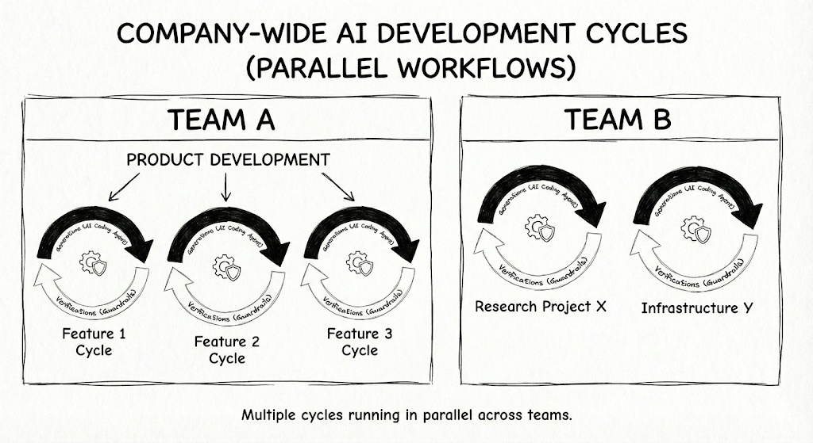
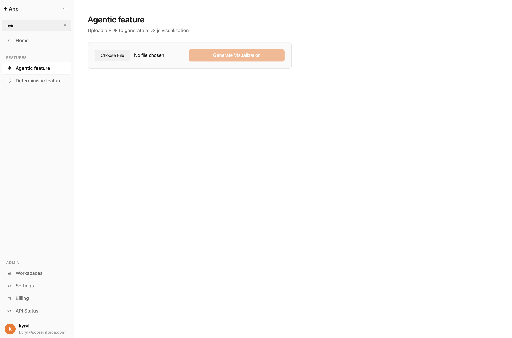
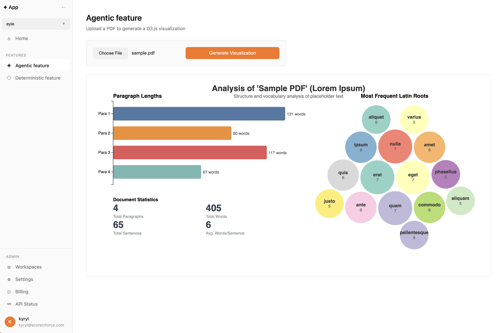
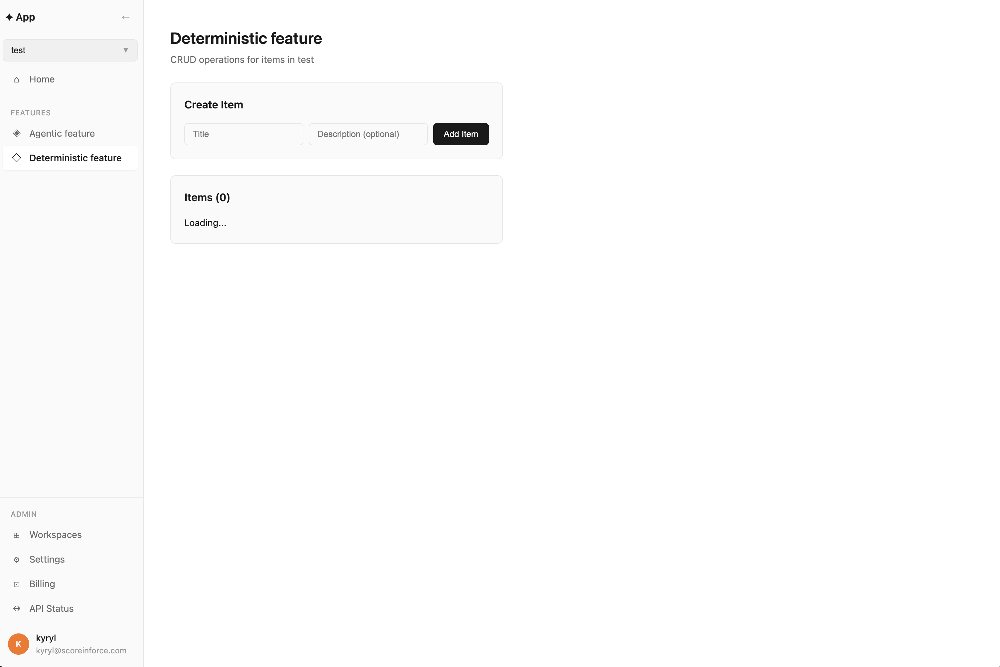
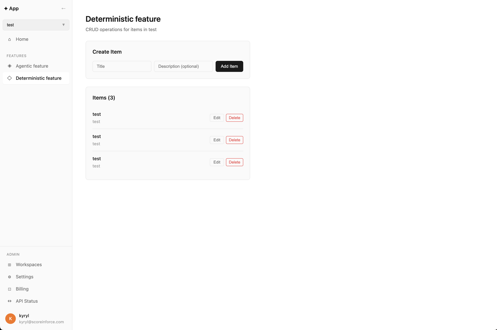

# AI Engineering Product Template

## TLDR: 

Meet the reusable and opinionated AI engineering-first product template—spin up multiple products and features from it, experiment in parallel, all while keeping your agents on the leash: https://github.com/kyryl-opens-ml/ai-engineering/tree/ai-product-template/blog-posts/ai-product-template

## Goal: 

There are several things I want to do:

- Build products fast
- Experiment with features
- Use multiple agents to work for me in parallel, for hours, days, weeks.
- Run 10/100/1000 coding agents in parallel without them stepping on each other's toes
- Go beyond "vibe-coded" POCs
- Actually run this in production

Aka have self-driving software. That sounds wonderful and marketing promises me this, but empirical reality, however, says this is not possible yet (at least for me). Very quickly, your product can become a "hot mess."

So there are several principles I follow to make this possible:

Principles:

- Prioritize simplicity (always)
- Test, test, and test again. Integration tests and agent evaluation are first-class citizens in any design.
- Focus on security.
- Implement guardrails.
- Perform rigorous verification for any change.
- Maintain a good overview of agents.

Long story short: From generations to verifications loop - success is good verifications I am confident about.

And company strategy view - verification at scale for multiple products, teams, agents, & features is the main goal! Note this down as one of the main responsibilities of technical leadership.

How do we start with it? My answer - Template! 

## Template:

My current best answer - a custom template - is very slim, simple, testable, extensible and follows the principles I outlined above as much as possible! 

Slim: Agents can now write any features, so you don't need much prebuilt stuff.
Simple: Even a full framework can make things complicated.
Testable: This is critical to prevent a hot mess.
Extensible: Especially extensible in a parallel way.

- Frontend: TypeScript + Vite for the UI: https://github.com/vitejs/vite
- Backend: Python + FastAPI for the API: https://github.com/fastapi
- CI/CD: GitHub Actions https://github.com/features/actions
- LLM: Gemini G3 (text, vision, live API, RAG) + DSPy for proper prompt optimization
- Auth: Supabase  https://github.com/supabase/supabase 
- Database: Postgres https://github.com/postgres/postgres
- Platform: Railway https://railway.app/
- ML: Modal https://modal.com/
- Orchestration: Dagster https://github.com/dagster-io/dagster
- Error Monitoring: Sentry https://github.com/getsentry/sentry
- LLM Monitoring & Evaluation: Braintrust https://braintrust.dev/

A nice bonus to make it really "self-driving software" is that each tool has its own MCP server exposed to agents. (deep dive for infrastructure engineers https://kyrylai.com/2025/05/23/build-a-self-healing-k8s-agent-with-librechat-mcp/)

- Github MCP:  https://github.com/github/github-mcp-server
- GCP MCP:  https://cloud.google.com/blog/products/ai-machine-learning/announcing-official-mcp-support-for-google-services
- Supabase MCP: https://supabase.com/docs/guides/getting-started/mcp
- Postgress MCP: https://github.com/crystaldba/postgres-mcp
- Railway MCP: https://docs.railway.com/reference/mcp-server
- Dagster MCP: https://github.com/kyryl-opens-ml/mcp-server-dagster (deep dive about it https://kyrylai.com/2025/04/09/dagster-llm-orchestration-mcp-server/)
- Sentry MCP: https://github.com/getsentry/sentry-mcp
- Braintrust MCP: https://www.braintrust.dev/docs/reference/mcp

And most important—AI engineering first! What do I mean by this?

- Feature branches - each agent has its own branch. (deep dive https://kyrylai.com/2025/08/04/cursor-railway-vibe-coding-pr-environments/)
- Bulletproof testing & evaluations - CI/CD, customer criteria, end-to-end tests each agent can run on demand.
- Each agent has its own cloud environment and can be verified independently.
- Anyone can contribute to the project: via Slack, Web, API, Custom UI, Editors.

Simple check for it: 
- Could 10 agents run in parallel and produce meaningful results? 
- Do you have evidence to prove AI coding agent output is ready to merge? 

In the case of an enterprise use case, your stack may be more complicated and vary widely, but the core principle—AI engineering first—still holds true in every case.
## Code 

It's here - give it a try! As a starting point I have a very minimal design and two features as examples:

1. Agentic – the user uploads a PDF and the app generates the best visualization for it. Dynamic, non-deterministic, and the artifact is hard to manage/predict.

<table>
  <tr>
    <td></td>
    <td></td>
  </tr>
</table>

It has simple evaluations in the form of integration tests: 

- Does it work? (link https://github.com/kyryl-opens-ml/ai-engineering/blob/ai-product-template/blog-posts/ai-product-template/api/tests/integration/test_agentic_feature.py#L53)
- Does it produce a valid format? (link https://github.com/kyryl-opens-ml/ai-engineering/blob/ai-product-template/blog-posts/ai-product-template/api/tests/integration/test_agentic_feature.py#L67)
- Does another LLM think it's good? (link https://github.com/kyryl-opens-ml/ai-engineering/blob/ai-product-template/blog-posts/ai-product-template/api/tests/integration/test_agentic_feature.py#L90)
- Does it perform well based on labeled data from before? (link https://github.com/kyryl-opens-ml/ai-engineering/blob/ai-product-template/blog-posts/ai-product-template/api/tests/integration/test_agentic_feature.py#L131)

2. Deterministic – simple CRUD on "items" (no AI), just boring stuff (which is hugely valuable).

<table>
  <tr>
    <td></td>
    <td></td>
  </tr>
</table>

CRUD (https://en.wikipedia.org/wiki/Create,_read,_update_and_delete) for items - you've seen it before, and testing it is very straightforward: Arrange-Act-Assert pattern (https://automationpanda.com/2020/07/07/arrange-act-assert-a-pattern-for-writing-good-tests/). This seems easy to add, but I saw multiple times (and honestly I'm guilty of this myself) - if you miss adding it at the right time - the cost of this might be very high. 

Never undervalue this stage, and always ask the agent to add integration tests and make sure to follow TDD!  

Both are important, and both are must-haves. 

- Feature branches - when you add a new feature or build on top of Agentic feature & Deterministic feature - make sure the agent has full availability to have separate environments. 

Based on this you can add new features in parallel, on top of existing ones or combinations. 

## Outcome: 

I am running a reality check of this template and contributing back my findings, opinions, and learnings. 
But so far, this is one of the best ways (at least for me) to ship 10x faster while staying in control! 
 
My main recommendation for engineering leaders—no matter your stack—is to empower AI engineering by defining a set of principles and strong verification mechanisms at the company strategy level, and making sure you are consistently following them.