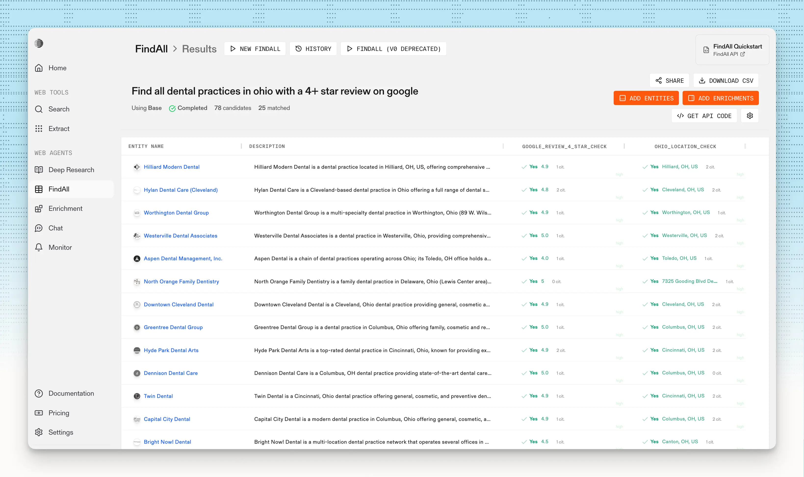
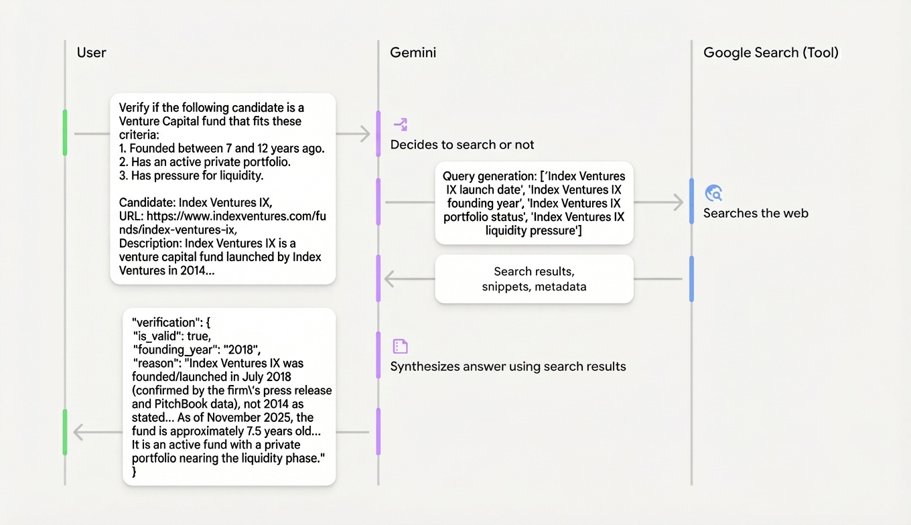

# Building a VC Discovery Engine: Finding Secondary Opportunities with Parallel AI & Gemini 3

## LLMs are Discovery Engines!

One of the most underrated use cases for LLMs is discovery. Even the most AI-skeptical people are excited about this!

Data in private markets is opaque, scattered, and expensive (PitchBook licenses can cost $25k+). But the data is public—it’s just unstructured. LLMs change this.

Information: Venture Capital funds usually have a 10-year lifecycle. If a fund was started between 2013 and 2017 (Vintage 2013-2017), it is now reaching the end of its life. Investors in these funds often want liquidity, making these specific funds prime targets for secondary buyers.

## The Stack

To build this, we are using two main tools:

1. Parallel AI (FindAll): A state-of-the-art agent to scan the web and return structured entities.
2. Gemini 3: The "sharp knife" to validate the results using its Google Search tools.

## Step 1: Generate Candidates

Let's go wide and scan the entire internet to find all secondary funds created between 8 and 12 years ago.

Using the Parallel FindAll API (https://parallel.ai/blog/introducing-findall-api), this doesn't require complex scraping infrastructure.



All it needs is a natural language query:

```
Find all venture capital funds close to 10 years window
```

See the find script: [find.py](find.py)

To run it:

```bash
uv run ./app/find.py --save-to results-simple-base.json
```

The Result:
This request cost $3.04. Parallel returned 183 candidates and automatically filtered them down to 93 matches that fit my specific criteria. To see the raw data, check this file: [results-simple-base.json](./notes/results-simple-base.json)

Unlike a standard search engine that gives me a list of blue links, Parallel gave me 183 structured JSON entities.

## Step 2: Verify

Even though I love FindAll, sometimes it produces noisy results - so we need to validate!

Because I want to have more control and, in the future, augment with my own data, I wrote my own agent to verify results with the help of Gemini 3 Pro (https://ai.google.dev/gemini-api/docs/gemini-3), using Google Search and URL context tools:



The full prompt template looks like this:
```
Verify if the following candidate is a Venture Capital fund that fits these criteria:
1. Founded between 7 and 12 years ago.
2. Has an active private portfolio.
3. Has pressure for liquidity (e.g., approaching end of fund life).

Candidate: {name}
URL: {url}
Description: {description}
Full candidate: {candidate}
```

See the verify script: [verify.py](verify.py)

```
uv run ./app/verify.py --input-file results-simple-base.json --output-file results-simple-base-verify.json
```

The Result:
Total cost of this step: $0.79.
(Note: Verification is cheaper than discovery because we are acting on a targeted list of 93 matches, not scanning the whole web.) To see the verified data, check this file: [results-simple-base-verify.json](./notes/results-simple-base-verify.json)

## Step 3: Visualize

An easy way to understand results is to visualize them. Instead of using custom d3.js functionality, we can just ask Gemini to present this in an interpretable way.

See the visualize script: [visualize.py](visualize.py)

```
uv run ./app/visualize.py --input-file results-simple-base-verify.json
```


## Next

We turned $4.00 of API credits into a lead list that usually requires a $25k subscription.

Now you have a baseline to build a Discovery Engine with Parallel AI and Gemini 3 Pro, which can be extended to more companies, more assets, and more use cases!

Building datasets on demand is finally easy.

Full code with data examples can be found here: https://github.com/kyryl-opens-ml/ai-engineering 
