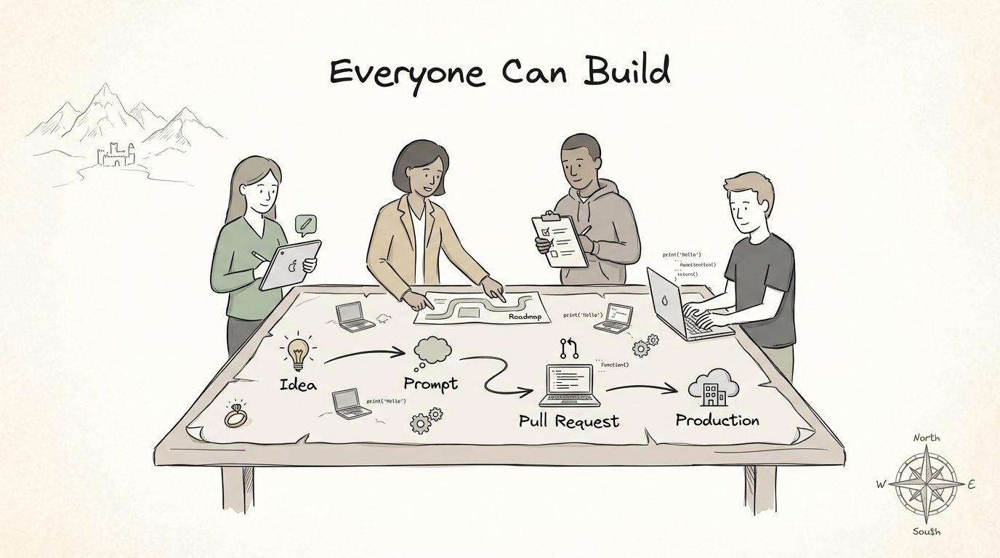
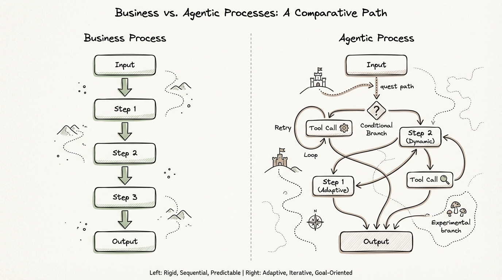
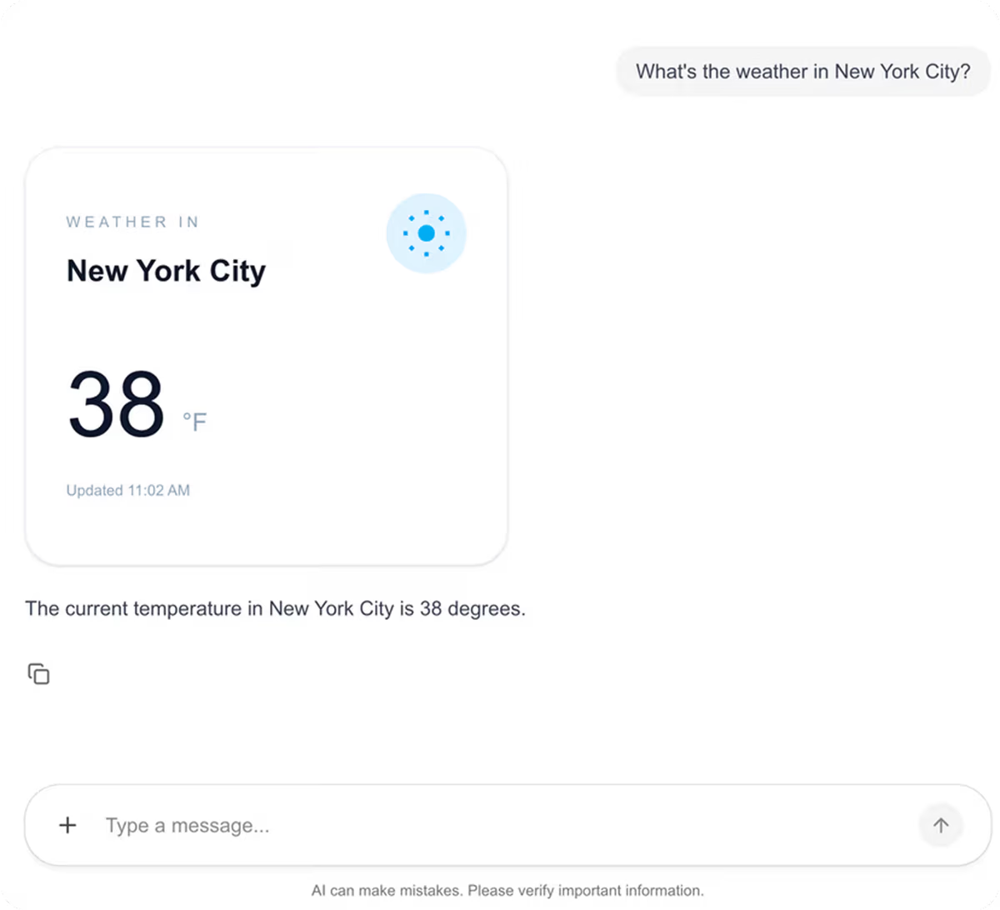
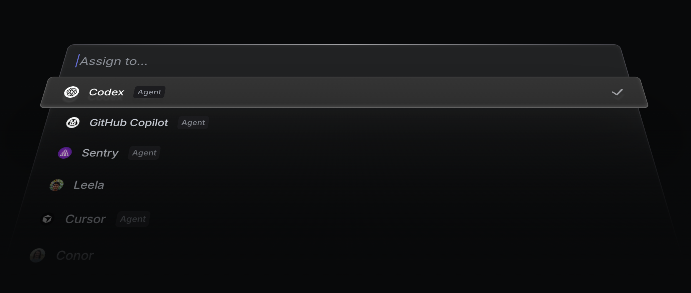
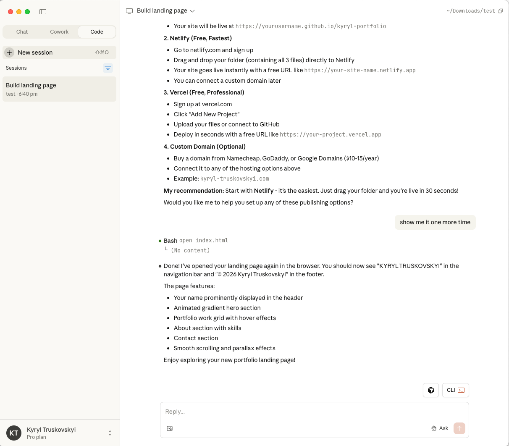
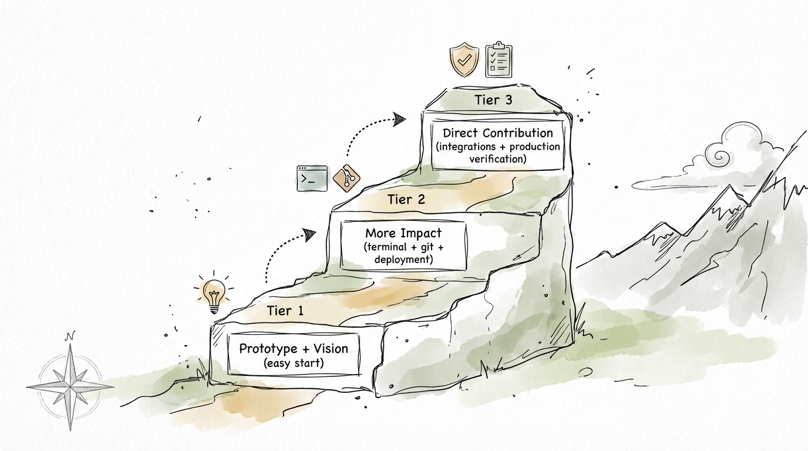

# Everyone Can Build

## TL;DR

- AI should write 100% of your code! 
- Companies that let non-engineers ship safely will compound faster.
- Sofwareer engienring has bring and exited future! 

## Shift! 

### Confession: 

March 10, 2025 Dario Amodei of Anthropic said - "there in three to six months, where AI is writing 90% of the code" https://www.cfr.org/event/ceo-speaker-series-dario-amodei-anthropic I was skeptical, not - it's 100% for me and best enginereirng (and not only engineers). Typing code manually - never again, thanks! 
With next prediciton "we might be 6-12 months away from models doing all of what software engineers do end-to-end" - as evidence shows - mgiht be true as well! 

We have so many actula datapoints about how effectir ai-enables engineerign become, that it's imporssialbe to ignore.

| Claim | Status | Evidence | Notes |
|---|---|---|---|
| Alan case: non-engineers shipped many PRs | Confirmed | Alan post says: `283 pull requests from non-engineers were shipped` | Use exact wording from source |
| METR long-task trend | Confirmed | METR post (March 19, 2025): doubling time around `7 months` | Good anchor chart |
| Anthropic eval shift | Confirmed | Anthropic Engineering (January 21, 2026): Opus 4 and Opus 4.5 matching/outperforming take-home constraints | Great for “narrow tasks” argument |

Add https://techcrunch.com/2026/02/12/spotify-says-its-best-developers-havent-written-a-line-of-code-since-december-thanks-to-ai/

The shift is even bitget when we moved from machine code to compiles! 

See this picture - whel - we dont' ddo this anymore! 

If you have good and well defined taks descripoton - comsider your have a solution. 

But nothing speak better than personal experience - just try it! install Clade Code, Codex, Cursros - anything and build something! 

Who Benefits most

- Engineers: less time on repetitive implementation
- Prototypers/PM/Designers: faster idea-to-proof
- Operators who can steer and orchestateye agents. 

Core skill: ask clearly, instrument outputs, correct early.

## Agent

Why does it happen? It's very easy to state this, but only few people undenrsar code of the reasing: Agents. 

What Is an Agent (Practical Definition)

`Agent = LLM + Actions + Loop`

- `LLM`: reasoning and planning
- `Actions`: tools, shell, APIs, MCP, skills
- `Loop`: iterative execution until goal or stop condition

What Is an Agent (Intuitive Definition)

Imaging simple process to process invoices for example  - step 1 - step 2 - step 3 - it's small it's predictable and one size fit all soltuone. agent solutioen for this use -case can be generated lsit of actions: 

step 1 - step 2 - step 3

but if any complicatiosn assrise 

step 1 - step 2 - step 3 - step 4 - step 5

and it can do branching and iteration, etc etc. 
For each input: agent would realise examply one uniqe instance of simple busienss process, but it would be tailoer to specific input and surcumstantece. aka from "one size fit all" to " tailor-made"

and what are the most successuf agents otu there: coding! becase it way easier to vefiry code (running or now, testst are passing or not, compiled or now, does softate do wah you want or now)

## Future

So how does the futue would look and how to prepseser eyouself! Here are several my preducitons

1. Shit team to become "agent tech leads"

This is the futuref of sofare neingering: see new job descriotion [https://github.com/kyryl-opens-ml/ai-engineering/blob/main/blog-posts/agent-tech-lead/JobDescription.md]. Product builikded job would be manage and suport codign agent. one who would be able to do it more efficien - would have more success.

2. Make sure other agetns are first class citiceon of your product: 

There is limites numver of potentil custoemrs for oyur busienss, thete are unlimited nubmer of agentic custeomr for the business. Exploadign TAM but focusong on agetn. you clearn hot goign to build every single one, but you can become their provides for data, serive, etc etc.

3. Generative UI
Stcture product as data platform - your data lauer are based and moat. Ui and presnetaiotn layer are goign to be defiendna nd write on demant and on the fly! 

https://research.google/blog/generative-ui-a-rich-custom-visual-interactive-user-experience-for-any-prompt/

4. Self-Driving SaaS

Software moves from “assist me” to “advance work proactively.”

`TODO: Add your rule: what can auto-merge vs what must require human approval.`

5. Build on Top of Agent SDKs

The next wave is not just using agents, but wrapping them with domain workflows, eval loops, and org-specific controls.

6. Sandboxes as Infrastructure

1x value -> 100x agents -> 100,000x sandbox executions

Examples:
- https://www.together.ai/code-sandbox
- https://modal.com/docs/guide/sandboxes
- https://www.daytona.io/
- https://e2b.dev/

the more efficne  and secure your exectiong enivner for coding agetn - the fast delivert! 

## Strategy

As any businesss you need to adapt and embrase this shift! my recommendation is to  build stratefy for mthe get go and replay on 3 simple tiers! 

1. `Tier 1: Prototype + Vision`

Make sure everoyn use AI coding for new works - prototyping, demos, poc, visualizaiton. Instead wriing PRD etc - jsut build demo and show how it owuld look like! 

- Tools: AI Studio, Lovable, Bolt
- Goal: communicate product intent quickly
- Output: clickable prototype + feedback

Metric to track here: how many ideas you validated! 

2. `Tier 2: More Impact`

Demo & validations are good - but you need to move ai enginerign to congrbe into core product - stand using tools for your team, make sure tehy have access to good amout of tokens and 

- Tools: Claude Code, Codex, Gemini CLI, Cursos 
- Requires: terminal, git workflow, deployment basics
- Output: real features with review pipeline

Metric to track here: development productivity! 

3. `Tier 3: Direct Contribution`

This one is the most advance one, but give you most benefirst - have a highway of ai generatete code into your applicaiton! 

- Integrations: Slack, web app, task trackers, CI/CD
- Requires: verification, ownership model, guardrails
- Output: trusted agentic contribution in production

Metric to track here: custome (time to solve bug, time to recovery, number of contibuteion by non tech team)! 

## References

Core talk references:
- https://alan.com/en/blog/discover-alan/a/everyone-can-build
- https://metr.org/blog/2025-03-19-measuring-ai-ability-to-complete-long-tasks/
- https://www.anthropic.com/engineering/AI-resistant-technical-evaluations
- 
- https://linear.app/now/self-driving-saas
- https://www.youtube.com/watch?v=TqC1qOfiVcQ
- https://openai.com/codex/
- https://code.claude.com/docs/en/overview
- https://modelcontextprotocol.io/docs/getting-started/intro

Suggested reading from your notes:
- https://builders.ramp.com/post/why-we-built-our-background-agent
- https://www.benedict.dev/closing-the-software-loop
- https://www.greptile.com/blog/ai-code-review-bubble
- https://openai.com/index/unrolling-the-codex-agent-loop/
- https://zed.dev/blog/on-programming-with-agents
- https://simonwillison.net/2026/Jan/19/scaling-long-running-autonomous-coding/
- https://simonwillison.net/2026/Jan/12/claude-cowork/
- https://www.anthropic.com/engineering/demystifying-evals-for-ai-agents
- https://blog.silennai.com/claude-code
- https://www.oneusefulthing.org/p/claude-code-and-what-comes-next

Love this! Not my "wow moment" example, but 2 reads I am going through right now:

Spotify bragging about AI coding:

Spotify shipped a ton of stuff and beat revenue while saying - nobody wrote code by hand since December!
https://techcrunch.com/2026/02/12/spotify-says-its-best-developers-havent-written-a-line-of-code-since-december-thanks-to-ai/

We should have claud code in our slack! 

Try it with https://huggingface.co/zai-org/GLM-5 - claims it's as good as Claude but open weight.

Wow, just check 

My biggest and most recent wow moment was about orchestrator for subagents: when an agent runs subprocesses, monitors, manages, etc. I was super curious to understand how it works - one company is publishing about it in detail: https://www.kimi.com/blog/kimi-k2-5.html (check 2. Agent Swarm)