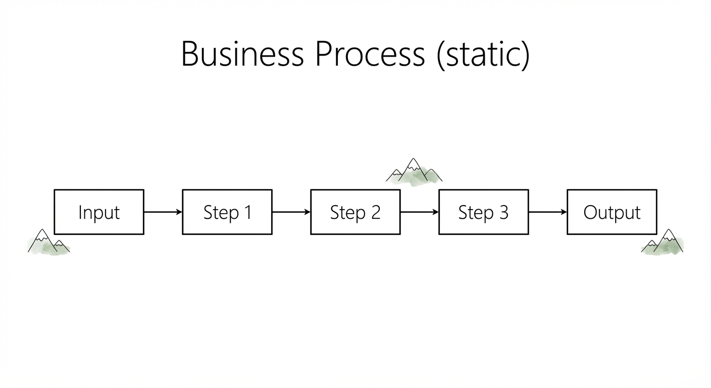
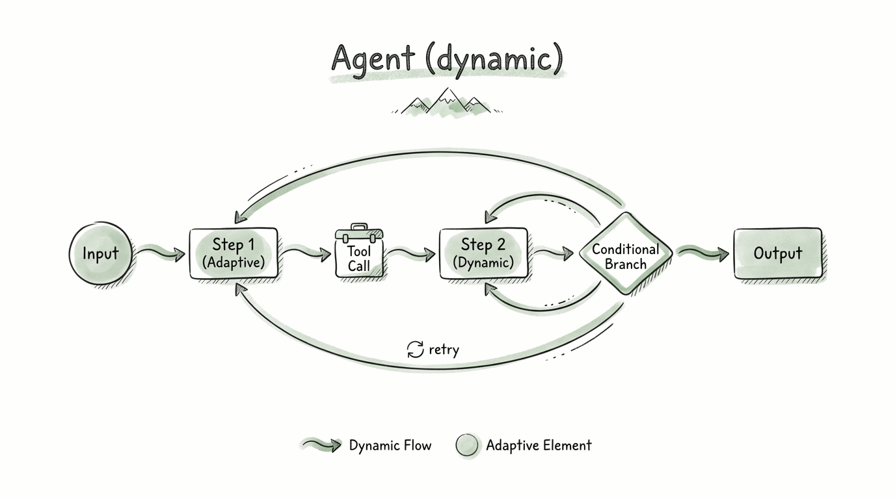
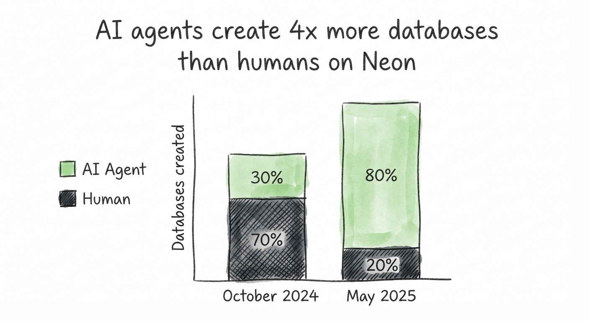
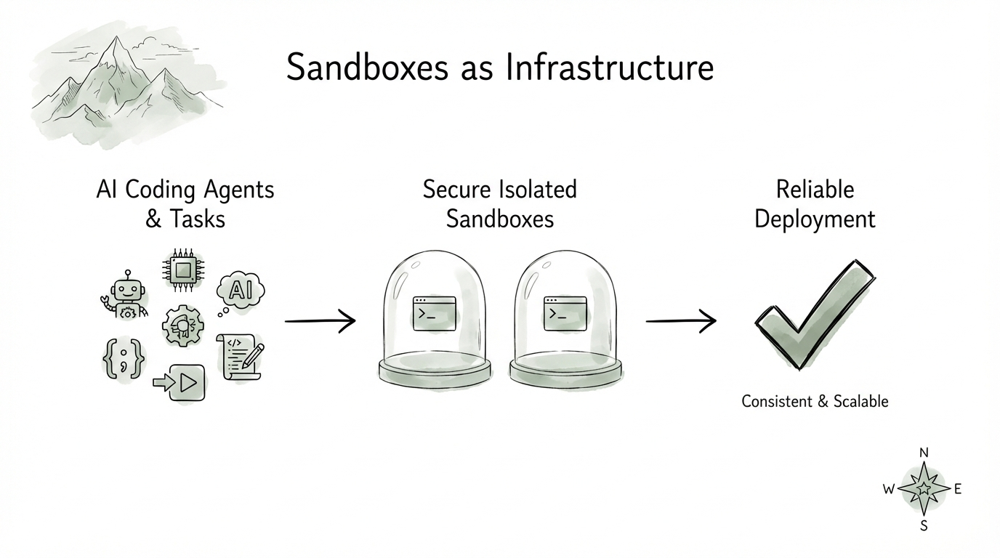

# Everyone Should Build

## TL;DR

- AI should write 100% of your code.
- Software engineering has a bright and exciting future.
- Build AI engineering strategy for your company.

## Shift!

Confession:

On March 10, 2025, Dario Amodei of Anthropic said, "there in three to six months, where AI is writing 90% of the code" ([source](https://www.cfr.org/event/ceo-speaker-series-dario-amodei-anthropic)). I was skeptical; now it's effectively 100% for me and many top engineers (and not only engineers). Typing code manually: never again, thanks. With the next prediction, "we might be 6-12 months away from models doing all of what software engineers do end-to-end," as evidence shows, this might be true as well.

We have so many actual datapoints about how effective AI-enabled engineering has become, that it's impossible to ignore.

| Company | Claim | Source |
|---|---|---|
| Alan | 283 pull requests from non-engineers were shipped | [alan.com](https://alan.com/en/blog/discover-alan/a/everyone-can-build) |
| METR | AI capability on long tasks doubles roughly every 7 months | [metr.org (March 2025)](https://metr.org/blog/2025-03-19-measuring-ai-ability-to-complete-long-tasks/) |
| Anthropic | Opus 4 and Opus 4.5 matching or outperforming take-home evaluation constraints | [Anthropic Engineering (January 2026)](https://www.anthropic.com/engineering/AI-resistant-technical-evaluations) |
| Anthropic | Opus 4.6 agent team built a 100,000-line C compiler capable of compiling the Linux kernel | [Anthropic Engineering (February 2026)](https://www.anthropic.com/engineering/building-c-compiler) |
| Spotify | Best developers haven't written a single line of code since December; shipped 50+ features in 2025 | [TechCrunch (February 2026)](https://techcrunch.com/2026/02/12/spotify-says-its-best-developers-havent-written-a-line-of-code-since-december-thanks-to-ai/) |

The shift is even bigger than when we moved from machine code to compilers!

See this picture - well - we don't do this anymore!

If you have a good and well-defined task description - consider you have a solution.

But nothing speaks better than personal experience - just try it! Install Claude Code, Codex, Cursor - anything and build something!

## Who Benefits Most

- Engineers: less time on repetitive implementation
- Prototypers/PM/Designers: faster idea-to-proof
- Operators who can steer and orchestrate agents

Core skill: ask clearly, instrument outputs, correct early.

## Coding Agent

Why does it happen? It's very easy to state this, but only few people understand the core of the reasoning: Agents. 

### What Is an Agent (Practical Definition)

`Agent = LLM + Actions + Loop`

- `LLM`: reasoning and planning
- `Actions`: tools, shell, APIs, MCP, skills
- `Loop`: iterative execution until goal or stop condition

If some of your actions involve writing and executing code, you can call it a coding agent.

### What Is an Agent (Intuitive Definition)

Imagine a simple invoice process: step 1 -> step 2 -> step 3. It's small, predictable, and mostly one-size-fits-all. An agent solution for this use case can be a generated list of actions:

But if any complications arise, the agent adapts: branching, adding steps, and iterating as needed.

For each input, the agent would realize exactly one unique instance of a simple business process, tailored to the specific input and circumstances. AKA: from "one size fits all" to "tailor-made".

And what are the most successful agents out there? Coding. It's way easier to verify code (running or not, tests passing or not, compiled or not, and whether software does what you want). Now imagine each agent might have its own agent and so on; this already exists and works really well: [open example: K2.5 Agent Swarm](https://www.kimi.com/blog/kimi-k2-5.html), [Claude example](https://code.claude.com/docs/en/agent-teams).

## Future

So how does the future look and how to prepare yourself! Here are several of my predictions:

1. "Agent Tech Leads"

Everyone becomes an agent tech lead - aka agent orchestrator.

This is the future of software engineering: see this [new job description](https://github.com/kyryl-opens-ml/ai-engineering/blob/main/blog-posts/agent-tech-lead/JobDescription.md). The product builder's job would be to manage and support coding agents. Those who can do it more efficiently will have more success.

2. Make sure other agents are first class citizens of your product

Agent TAM > Human TAM

There is a limited number of potential customers for your business, but there are unlimited numbers of agentic customers for the business. Exploding TAM by focusing on agents. You clearly are not going to build every single one, but you can become their provider for data, service, etc. [This is already happening](https://www.databricks.com/blog/databricks-neon). 

3. Generative UI

Structure product as data platform - your data layer is the base and moat. UI and presentation layer are going to be defined and written on demand and on the fly!

[Generative UI at Google Research](https://research.google/blog/generative-ui-a-rich-custom-visual-interactive-user-experience-for-any-prompt/)

4. Self-Driving SaaS

Software that runs itself, set up a feedback loop process for your users and most of the contributions would be done automatically.

[Self-Driving SaaS at Linear](https://linear.app/now/self-driving-saas)

5. Sandboxes as Infrastructure

Thesis is very simple: 1x value -> 100x coding agents -> 100,000x sandbox executions

Services:
1. Together AI Code: https://www.together.ai/code-sandbox
2. Modal Sandboxes: https://modal.com/docs/guide/sandboxes
3. Daytona: https://www.daytona.io/
4. E2B: https://e2b.dev/
5. Cloudflare Sandbox: https://developers.cloudflare.com/sandbox/

DIY:
1. K8S (too broad): https://github.com/kubernetes/kubernetes
2. Firecracker (just VM): https://github.com/firecracker-microvm/firecracker
3. Docker: https://docs.docker.com/ai/sandboxes/

The more efficient and secure your execution environment for coding agents - the faster the delivery!

## Strategy

As any business, you need to adapt and embrace this shift! My recommendation is to build a strategy from the get-go and rely on 3 simple tiers!

1. `Tier 1: Prototype + Vision`

Make sure everyone uses AI coding for new work - prototyping, demos, POCs, visualization. Instead of writing PRDs etc - just build a demo and show how it would look like!

- Tools: AI Studio, Lovable, Bolt
- Goal: communicate product intent quickly
- Output: clickable prototype + feedback

Metric to track here: how many ideas you validated!

2. `Tier 2: More Impact`

Demos & validations are good - but you need to move AI engineering to converge into the core product - start using tools for your team, make sure they have access to a good amount of tokens.

- Tools: Claude Code, Codex, Gemini CLI, Cursor
- Requires: terminal, git workflow, deployment basics
- Output: real features with review pipeline

Metric to track here: development productivity!

3. `Tier 3: Direct Contribution`

This one is the most advanced, but gives you the most benefit - have a highway of AI-generated code into your application!

- Integrations: Slack, web app, task trackers, CI/CD
- Requires: verification, ownership model, guardrails
- Output: trusted agentic contribution in production

Metric to track here: customer metrics (time to solve bug, time to recovery, number of contributions by non-tech team)!

If you are planning to transform your company with AI-first coding, feel free to contact me to get help and set this up for your specific context: https://kyrylai.com/

Cheers!
