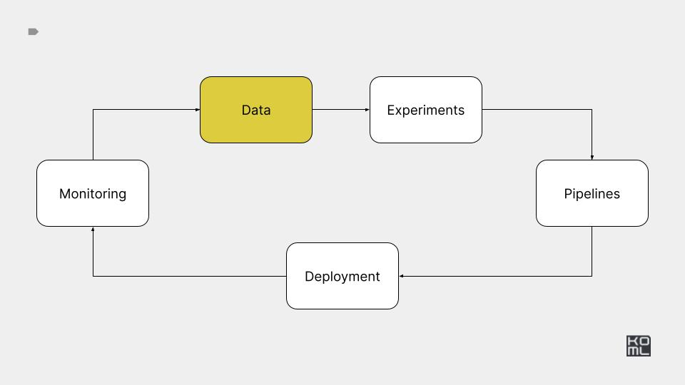
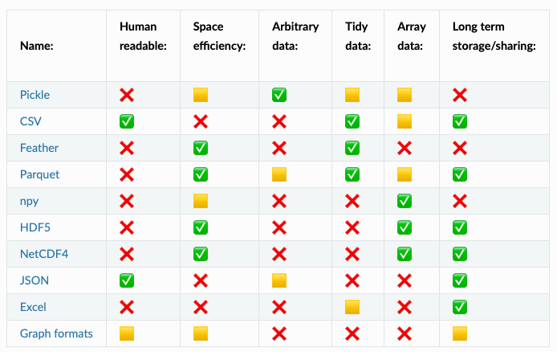

# Module 2



## Overview

This module covers data storage and processing. You'll deploy MinIO locally,
benchmark data formats and explore vector databases.

## Practice

In this module you'll experiment with storage options, implement a MinIO
client, and benchmark data ingestion and inference performance.

### Key tasks

- Deploy MinIO locally with Docker and Kubernetes.
- Build a CRUD Python client with tests.
- Benchmark Pandas storage formats.
- Measure inference speed using multiple workers.

***

# H3: Data storage & processing

## Reading list:

- [Data engineer roadmap](https://github.com/datastacktv/data-engineer-roadmap)
- [Minio using Kubernetes](https://github.com/kubernetes/examples/tree/master/staging/storage/minio)
- [What Goes Around Comes Around... And Around...](https://db.cs.cmu.edu/papers/2024/whatgoesaround-sigmodrec2024.pdf)
- [Small Big Data: using NumPy and Pandas when your data doesn't fit ](https://www.youtube.com/watch?v=8pFnrr0NnwY)
- [How to Choose the Right Python Concurrency API](https://superfastpython.com/python-concurrency-choose-api/)
- [Articles: Speed up your data science and scientific computing code](https://pythonspeed.com/datascience/#memory)
- [Data formats with Pandas and Numpy](https://aaltoscicomp.github.io/python-for-scicomp/data-formats/)
- [An Empirical Evaluation of Columnar Storage Formats](https://arxiv.org/pdf/2304.05028.pdf)
- [ML⇄DB Seminar Series — Fall 2023](https://db.cs.cmu.edu/seminar2023/)
- [High Performance I/O For Large Scale Deep Learning](https://arxiv.org/pdf/2001.01858.pdf)
- [Announcing CPP-based S3 IO DataPipes](https://pytorch.org/blog/announcing-cpp/)
- [Efficient PyTorch I/O library for Large Datasets, Many Files, Many GPUs](https://pytorch.org/blog/efficient-pytorch-io-library-for-large-datasets-many-files-many-gpus/)
- [AIStore: scalable storage for AI applications](https://github.com/NVIDIA/aistore)
- [Book: Designing Data-Intensive Applications by Martin Kleppmann](https://www.oreilly.com/library/view/designing-data-intensive-applications/9781491903063/ch04.html)
- [Book: The Data Engineering Cookbook](https://github.com/andkret/Cookbook)
- [Course: CMU Database Systems](https://15445.courses.cs.cmu.edu/fall2023/)
- [Course: Advanced Database Systems](https://15721.courses.cs.cmu.edu/spring2024/)

## Task:

- PR1: Write README instructions detailing how to deploy MinIO with the following options: Local, Docker, Kubernetes (K8S)-based.
- PR2: Develop a CRUD Python client for MinIO and accompany it with comprehensive tests.
- PR3: Write code to benchmark various Pandas formats in terms of data saving/loading, focusing on load time and save time.
- PR4: Create code to benchmark inference performance using single and multiple processes, and report the differences in time.
- PR6: Write code for transforming your dataset into a vector format, and utilize VectorDB for ingestion and querying.
- Google Doc: Update your proposal by adding a section on data storage and processing.

## Criteria:

- 6 PRs are merged
- Description of data section, storage and processing, in the google doc.


# H4: Data labeling & validation

## Reading list:

- [How to Write Data Labeling/Annotation Guidelines](https://eugeneyan.com/writing/labeling-guidelines/)
- [How to Develop Annotation Guidelines](https://nilsreiter.de/blog/2017/howto-annotation)
- [Label Studio](https://github.com/HumanSignal/label-studio)
- [Argilla](https://github.com/argilla-io/argilla)
- [Open Source Data Annotation & Labeling Tools](https://github.com/zenml-io/awesome-open-data-annotation)
- [Cleanlab detect issues in a ML dataset.](https://github.com/cleanlab/cleanlab)
- [Deepchecks](https://github.com/deepchecks/deepchecks)
- [Data generation](https://github.com/tatsu-lab/stanford_alpaca?tab=readme-ov-file#data-generation-process)

## Task:

- Google doc containing dataset labeling section: Estimate costs and time based on your experience labeling ~50 samples, provide instructions for future data labeling, and add a flow for data enrichment in production.
- PR1: Write code to deploy a labeling tool (e.g., Label Studio, Argilla), including README instructions.
- PR2 (optional): Write code to generate a synthetic dataset with ChatGPT.
- PR3 (optional): Write code to test your data after labeling (can use Cleanlab or Deepchecks).

## Criteria:

- 3 PRs are merged. 
- Description of data section, labeling and versions, in the google doc.

---

## Reference implementation

---

# Minio

## Install libraries

```bash
uv sync
```

## Docker setup

```bash
docker run -it -p 9000:9000 -p 9001:9001 quay.io/minio/minio server /data --console-address ":9001"
```

## Kubernetes setup

Create kind cluster

```bash
kind create cluster --name ml-in-production
```

Run k9s

```bash
k9s -A
```

Deploy

```bash
kubectl create -f minio_storage/minio-standalone-dev.yaml
```

Access UI and API

```bash
kubectl port-forward --address=0.0.0.0 pod/minio 9000:9000
kubectl port-forward --address=0.0.0.0 pod/minio 9001:9001
```

see [this issue](https://github.com/minio/console/issues/2539) about UI access.

## S3 access to Minio

You can use Minio via AWS CLI

```bash
export AWS_ACCESS_KEY_ID=minioadmin
export AWS_SECRET_ACCESS_KEY=minioadmin
export AWS_ENDPOINT_URL=http://127.0.0.1:9000
```

AWS CLI

```bash
aws s3 ls
aws s3api create-bucket --bucket test
aws s3 cp --recursive . s3://test/
```

## Minio Client

Run unit tests with minio client.

```bash
pytest -ss ./minio_storage/test_minio_client.py
```

# Pandas profiling

<https://aaltoscicomp.github.io/python-for-scicomp/data-formats/>




# CVS inference performance

Run experiments.

```bash
python processing/inference_example.py run-single-worker --inference-size 10000000
python processing/inference_example.py run-pool --inference-size 10000000
python processing/inference_example.py run-ray --inference-size 10000000
```

Results.

| Name of Inference    | Time (seconds)      |
|----------------------|---------------------|
| Inference 1 worker   | 12.64  |
| Inference 16 workers (ThreadPoolExecutor) | 0.85  |
| Inference 16 workers (ProcessPoolExecutor) | 4.03  |
| Inference with Ray   | 2.19  |


# Vector Databases

Create database.

```bash
python vector-db/rag_cli_application.py create-new-vector-db --table-name test --number-of-documents 300
```

Query database.

```bash
python vector-db/rag_cli_application.py query-existing-vector-db  --query 'complex query' --table-name test
```

Storage [diagram](https://lancedb.github.io/lancedb/concepts/storage/)


## Labeling with Argilla

```bash
docker run -it --rm --name argilla -p 6900:6900 argilla/argilla-quickstart:v2.0.0rc1
```

User/Password you can find [here](https://github.com/argilla-io/argilla/blob/v2.0.0rc1/argilla-server/docker/quickstart/Dockerfile#L60-L62).

Alternatives on: [K8S](https://github.com/argilla-io/argilla/tree/develop/examples/deployments/k8s) or [Railway](https://railway.app/template/KNxfha?referralCode=_Q3XIe)

Create simple dataset:

```bash
uv run ./labeling/create_dataset.py
```

Create synthetic dataset:

```bash
uv run ./labeling/create_dataset_synthetic.py
```

## MCP with DuckDB

```

```

## Updated design doc

[Google doc](https://docs.google.com/document/d/1dEzWd3pPozmU3AhMXjW3xcONUeNJee53djilN1A-wR8/edit)
