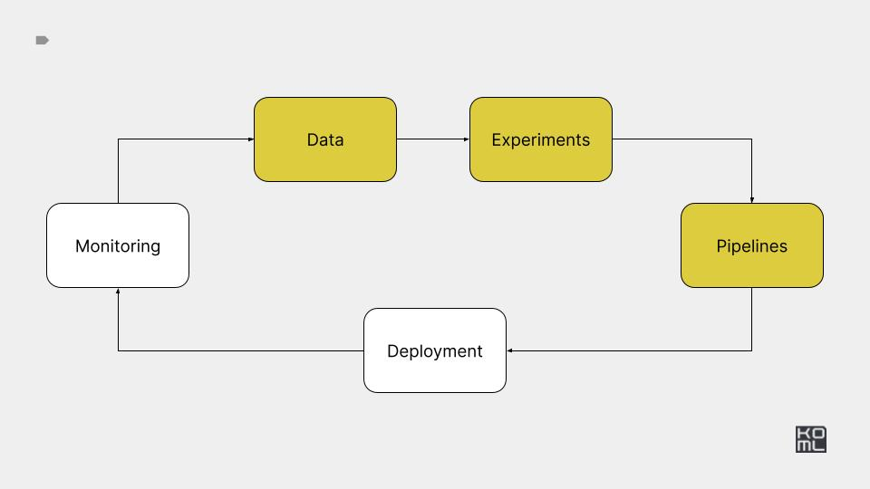

# Module 4



## Overview

This module demonstrates pipeline orchestration using Kubeflow and
Dagster.

## Practice

[Practice task](./PRACTICE.md)

---

## Reference implementation

---

# Setup

Create kind cluster

```bash
kind create cluster --name ml-in-production
```

Run k9s

```bash
k9s -A
```


# Kubeflow pipelines

Install

```bash
export WANDB_PROJECT=****************
export WANDB_API_KEY=****************
export PIPELINE_VERSION=2.2.0
kubectl apply -k "github.com/kubeflow/pipelines/manifests/kustomize/cluster-scoped-resources?ref=$PIPELINE_VERSION"
kubectl wait --for condition=established --timeout=60s crd/applications.app.k8s.io
kubectl apply -k "github.com/kubeflow/pipelines/manifests/kustomize/env/dev?ref=$PIPELINE_VERSION"
```


Access UI and minio

```bash
kubectl port-forward --address=0.0.0.0 svc/minio-service 9000:9000 -n kubeflow
kubectl port-forward --address=0.0.0.0 svc/ml-pipeline-ui 3000:80 -n kubeflow
```

Create training job.

```bash
python ./kubeflow_pipelines/kfp_training_pipeline.py http://0.0.0.0:3000
```

Create inference job.

```bash
python  kubeflow_pipelines/kfp_inference_pipeline.py http://0.0.0.0:3000
```


### References

- [Create, use, pass, and track ML artifacts](https://www.kubeflow.org/docs/components/pipelines/v2/data-types/artifacts/#new-pythonic-artifact-syntax)
- [Vertex AI](https://cloud.google.com/vertex-ai/docs/pipelines/introduction)


# Dagster


Setup

```bash
mkdir ./dagster_pipelines/dagster-home
export DAGSTER_HOME=$PWD/dagster_pipelines/dagster-home
export WANDB_PROJECT=****************
export WANDB_API_KEY=****************
```

Deploy modal functions

```bash
MODAL_FORCE_BUILD=1 modal deploy ./dagster_pipelines/text2sql_functions.py
```

Run Dagster

```bash
dagster dev -f dagster_pipelines/text2sql_pipeline.py -p 3000 -h 0.0.0.0
```

### References:

- [Introducing Asset Checks](https://dagster.io/blog/dagster-asset-checks)
- [Anomaly Detection](https://dagster.io/glossary/anomaly-detection)


## Updated design doc

[Google doc](https://docs.google.com/document/d/1j9-RFCrLRQy54TsywHxvje56EuntAbUbSlw_POsWl5Q/edit?usp=sharing)
