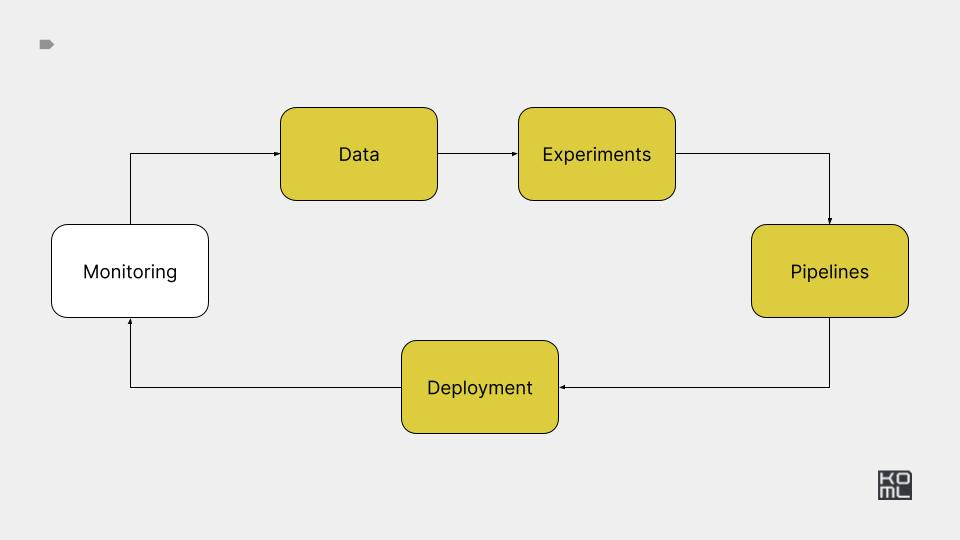

# Module 5



## Overview

This module walks through deploying APIs and UIs for your models and
integrating inference servers like Triton and vLLM.

## Practice

Create web UIs and APIs for your model and compare different inference servers.

### Key tasks

- Build Streamlit and Gradio interfaces with tests.
- Implement a FastAPI server.
- Deploy the API and UI to Kubernetes.
- Experiment with Seldon, KServe and Triton.


***

# H9: API serving

## Reading list:

- [CS 329S Lecture 8. Model Deployment](https://docs.google.com/document/d/1hNuW6bqWYZjlwpit_8W1cu7kllb-jTfy3Liof1GJWug/edit#heading=h.kp1fg79091xd)
- [Machine Learning Systems Design](https://docs.google.com/presentation/d/1U_zKs19VLJKnGE02JDRnzxJ8lgeVF22WSZ_GrA646fY/edit#slide=id.p)
- [APIs for Model Serving](https://madewithml.com/courses/mlops/api/)
- [RESTful API Design Tips from Experience](https://github.com/peterboyer/restful-api-design-tips)
- [Developing Restful APIs: A Comprehensive Set of Guidelines by Zalando](https://github.com/zalando/restful-api-guidelines)
- [Create an app Streamlit](https://docs.streamlit.io/get-started/tutorials/create-an-app)
- [Gradio Quickstart](https://www.gradio.app/guides/quickstart) 
- [Top 6 Kubernetes Deployment Strategies and How to Choose](https://codefresh.io/learn/kubernetes-deployment/top-6-kubernetes-deployment-strategies-and-how-to-choose/)

## Task:

- PR1: Write a Streamlit UI for serving your model, with tests and CI integration.
- PR2: Write a Gradio UI for serving your model, with tests and CI integration.
- PR3: Write a FastAPI server for your model, with tests and CI integration.
- PR4: Write a Kubernetes deployment YAML (Deployment, Service) for your model's API.
- PR5: Write a Kubernetes deployment YAML (Deployment, Service) for your model's UI (Streamlit, Gradio).
- Google doc update with a model serving plan for your ML model.

## Criteria:

- 5 PRs merged
- Serving plan in the google doc.

# H10: Inference servers

## Reading list:

- [Machine learning system design pattern](https://github.com/mercari/ml-system-design-pattern)
- [Seldon Core v2](https://docs.seldon.io/projects/seldon-core/en/v2/contents/about/index.html)
- [TorchServe](https://pytorch.org/serve/index.html)
- [Triton Inference Server](https://github.com/triton-inference-server/server)
- [Ray Serve](https://docs.ray.io/en/latest/serve/index.html)
- [SageMaker Inference Toolkit](https://github.com/aws/sagemaker-inference-toolkit)
- [Overview of getting predictions on Vertex AI](https://cloud.google.com/vertex-ai/docs/predictions/overview)
- [Qwak Model Serving](https://www.qwak.com/platform/model-serving)
- [ModalLab Fast inference with vLLM (Mistral 7B)](https://modal.com/docs/examples/vllm_inference)
- [Large Language Model Text Generation Inference](https://github.com/huggingface/text-generation-inference?tab=readme-ov-file#run-falcon)
- [Easy, fast, and cheap LLM serving for everyone](https://github.com/vllm-project/vllm?tab=readme-ov-file)
- [Multi-LoRA inference server that scales to 1000s of fine-tuned LLMs](https://github.com/predibase/lorax?tab=readme-ov-file)
- [Book: Machine Learning Systems with TinyML](https://harvard-edge.github.io/cs249r_book/)

## Task:

- PR1: Write code for Seldon API deployment of your model, including tests.
- PR2: Write code for KServe API integration with your model, including tests.
- PR3: Write code for Triton Inference Server deployment, incorporating tests.
- PR4: Write code for Ray deployment, complete with tests.
- PR5 (optional): Write code for LLM deployment using TGI, vLLM, and LoRAX.
- PR6 (optional): Write code for LLM deployment with ModalLab.
- Update the Google document on model serving, outlining options and comparisons between custom servers and inference servers. Decide and explain which solution you will use and why.

## Criteria:

- 6 PRs merged
- Serving comparisons and conclusion in the google doc.

---

## Reference implementation

---


# Setup

Create kind cluster

```bash
kind create cluster --name ml-in-production
```

Run k9s

```bash
k9s -A
```


# Setup 


```
export WANDB_API_KEY='your key here'
kubectl create secret generic wandb --from-literal=WANDB_API_KEY=$WANDB_API_KEY
```

# Streamlit 

Run locally: 

```
make run_app_streamlit
```


Deploy k8s: 

```
kubectl create -f k8s/app-streamlit.yaml
kubectl port-forward --address 0.0.0.0 svc/app-streamlit 8080:8080
```

# Fast API

Run locally: 

```
make run_fast_api
```

Deploy k8s: 

```
kubectl create -f k8s/app-fastapi.yaml
kubectl port-forward --address 0.0.0.0 svc/app-fastapi 8080:8080
```


# Test 

```
curl -X POST -H "Content-Type: application/json" -d @data-samples/samples.json http://0.0.0.0:8080/predict
```

```
pytest -ss ./tests
```

# Triton Inference Server 

```
make run_pytriton
```


# KServe 

Install KServe

```
curl -s "https://raw.githubusercontent.com/kserve/kserve/release-0.13/hack/quick_install.sh" | bash
```

Deploy custom model

```
kubectl create -f ./k8s/kserve-inferenceserver.yaml
```

Port forward via istio

```
kubectl port-forward --namespace istio-system svc/istio-ingressgateway 8080:80
```

Call API 

```
curl -v -H "Host: custom-model.default.example.com" -H "Content-Type: application/json" "http://localhost:8080/v1/models/custom-model:predict" -d @data-samples/kserve-input.json
```


# Serving LLMs via vLLM


Run server 

```
mkdir -p vllm-storage
export VLLM_ALLOW_RUNTIME_LORA_UPDATING=True
vllm serve microsoft/Phi-3-mini-4k-instruct --dtype auto --max-model-len 512 --enable-lora --gpu-memory-utilization 0.8 --download-dir ./vllm-storage
```


Run client 

Get list of models:

```
python serving-llm/client.py list-of-models
```


Add custom adapter:

```
python serving-llm/client.py load-from-registry truskovskiyk/ml-in-production-practice/modal_generative_example:latest sql-default-model
python serving-llm/client.py load-adapter sql-default-model ./sql-default-model
python serving-llm/client.py list-of-models
```


Test client:

```
python serving-llm/client.py test-client microsoft/Phi-3-mini-4k-instruct
python serving-llm/client.py test-client sql-default-model
```


Deploy 

Run K8S with GPUs

```
curl -LO https://storage.googleapis.com/minikube/releases/latest/minikube_latest_amd64.deb
sudo dpkg -i minikube_latest_amd64.deb
minikube start --driver docker --container-runtime docker --gpus all
```

Create deployment 

```
kubectl create -f ./k8s/vllm-inference.yaml
kubectl port-forward --address 0.0.0.0 svc/app-vllm 8000:8000
kubectl logs <POD> -c model-loader
kubectl logs <POD> -c app-vllm
```


## Updated design doc

[Google doc](https://docs.google.com/document/d/1ZCnnsnHHiDkc3FgK2XBVur9W7nkDA7SKoPd1pGa-irQ/edit?usp=sharing)
